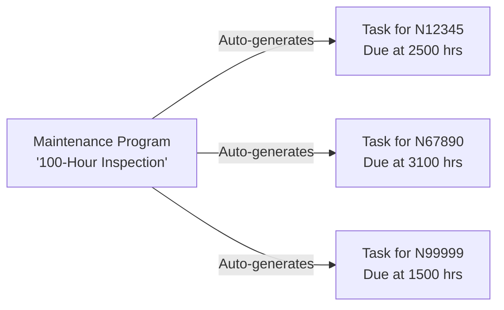

# AMSS Orientation Guide

**Version:** 1.0
**Last Updated:** December 27, 2025
**Applies To:** AMSS v1.x
**Audience:** All Users (Maintenance Planners, Mechanics, Compliance Officers, Fleet Managers, System Administrators)
**Review Date:** March 27, 2026

---

## Table of Contents

### Part I: Understanding AMSS
1. [What is AMSS and Why It Exists](#part-i-understanding-amss)
2. [Who Uses AMSS](#who-uses-amss-the-five-roles)
3. [Mental Model: How the System Thinks](#mental-model-how-the-system-thinks)
4. [Regulatory Context](#regulatory-context)

### Part II: Getting Started
5. [Access & Login](#part-ii-getting-started)
6. [Understanding Your Dashboard](#understanding-your-dashboard)
7. [Basic Concepts](#basic-concepts)

### Part III: How to Use This Documentation
8. [Learning Mode vs Reference Mode](#part-iii-how-to-use-this-documentation)
9. [Finding What You Need](#finding-what-you-need)
10. [Additional Resources](#additional-resources)

---

## Part I: Understanding AMSS

### What is AMSS and Why It Exists

**AMSS (Aircraft Maintenance Scheduling System)** is a production-grade software platform that helps aviation organizations ensure aircraft safety and regulatory compliance through systematic maintenance tracking and scheduling.

#### The Aircraft Maintenance Challenge

Aircraft maintenance is:
- **Complex:** Each aircraft requires hundreds of maintenance tasks with varying schedules (flight hours, calendar days, engine cycles)
- **Highly Regulated:** FAA Part 91/135/121 and EASA regulations require complete documentation and audit trails
- **Safety-Critical:** Missed inspections can lead to airworthiness violations, accidents, and regulatory penalties
- **Resource-Intensive:** Coordinating mechanics, parts, hangar space, and aircraft availability is challenging

Traditional approaches using spreadsheets, paper logbooks, and disconnected systems lead to:
- ❌ Missed maintenance deadlines
- ❌ Compliance violations and FAA findings
- ❌ Lost audit trails ("Who signed off on this task?")
- ❌ Parts shortages discovered too late
- ❌ Aircraft grounded unexpectedly

#### How AMSS Solves It

AMSS provides a **centralized, automated system** that:

✅ **Automates Task Scheduling**
You define a maintenance program once (e.g., "100-hour inspection"), and AMSS automatically generates individual tasks for every aircraft in your fleet, calculating when each task is due based on current flight hours, calendar time, or cycles.

✅ **Tracks Compliance with Complete Audit Trails**
Every action is logged: who created a task, who started it, which parts were used, who signed off on compliance items, and when. This creates a complete, immutable audit trail for FAA/EASA inspections.

✅ **Manages Parts Inventory**
Parts are automatically reserved when a task starts, preventing double-booking. The system tracks which parts were used on which aircraft, creating traceability required for regulatory compliance.

✅ **Delivers Real-Time Notifications**
External systems (like your ERP, notification service, or operations dashboard) receive instant webhooks when tasks become due, parts run low, or compliance issues arise.

✅ **Generates Reports for Auditors**
Compliance officers can instantly generate reports showing all maintenance performed on an aircraft, who performed it, and when - exactly what FAA and EASA inspectors need.

✅ **Scales Reliably**
Deployed on Kubernetes with monitoring (Prometheus/Grafana), automatic recovery, and disaster recovery procedures. Built for production use with rate limiting, authentication, and role-based access control.

---

### Who Uses AMSS: The Five Roles

AMSS implements role-based access control (RBAC) with five distinct user roles. Each role has specific permissions and responsibilities:

#### 1. **Maintenance Planner** (`scheduler` role)

**Who they are:**
Scheduler/planners responsible for defining maintenance programs and scheduling work.

**What they do in AMSS:**
- Add aircraft to the fleet
- Create maintenance programs (e.g., "100-hour inspection", "Annual inspection")
- Review automatically generated tasks
- Assign tasks to mechanics
- Plan parts requirements
- Generate fleet maintenance status reports

**A day in the life:**
A planner arrives in the morning, checks which tasks are coming due in the next 7 days, assigns tasks to available mechanics, verifies that required parts are in stock, and updates aircraft flight hours from the previous day's operations.

**Guide to read:** [02_MAINTENANCE_PLANNER.md](02_MAINTENANCE_PLANNER.md)

---

#### 2. **Mechanic/Technician** (`mechanic` role)

**Who they are:**
Licensed A&P (Airframe & Powerplant) mechanics or technicians who physically perform maintenance work.

**What they do in AMSS:**
- View assigned maintenance tasks
- Start tasks (changes status from "scheduled" to "in progress")
- Reserve required parts from inventory
- Complete tasks with notes and photos
- Sign off on compliance items
- Record work performed

**A day in the life:**
A mechanic clocks in, opens AMSS to see today's assigned tasks, starts the "50-hour oil change" task on aircraft N12345, reserves the oil filter and oil from parts inventory, performs the work, uploads a photo of the new filter, signs the digital compliance checklist, and completes the task.

**Guide to read:** [03_MECHANIC_TECHNICIAN.md](03_MECHANIC_TECHNICIAN.md)

---

#### 3. **Compliance Officer/Auditor** (`auditor` role)

**Who they are:**
Compliance officers, quality assurance personnel, or internal auditors responsible for regulatory adherence.

**What they do in AMSS:**
- Generate compliance reports for FAA/EASA inspections
- Review audit logs to verify who performed maintenance
- Check compliance item sign-offs
- Investigate overdue maintenance across the fleet
- Prepare data for annual audits
- Respond to regulatory data requests

**A day in the life:**
A compliance officer receives an FAA inspection notice for aircraft N12345. They log into AMSS, generate a complete maintenance history report from the last 2 years, export it to PDF, verify all compliance items are signed, and provide it to the FAA inspector within 24 hours.

**Guide to read:** [04_COMPLIANCE_OFFICER.md](04_COMPLIANCE_OFFICER.md)

---

#### 4. **Fleet Manager** (`tenant_admin` role)

**Who they are:**
Operations managers, chief pilots, or fleet managers responsible for aircraft availability and maintenance costs.

**What they do in AMSS:**
- Monitor fleet-wide maintenance status dashboards
- Review aircraft availability (which aircraft are in maintenance vs operational)
- Analyze maintenance costs by aircraft or program
- Track mechanic workload distribution
- Configure webhook integrations with ERP systems
- Import/export fleet data in bulk

**A day in the life:**
A fleet manager starts the day reviewing the maintenance dashboard: 15 aircraft operational, 2 in maintenance, 3 with tasks due this week. They notice aircraft N99999 has had unusually high maintenance costs this quarter, so they drill down to see which programs are driving the cost.

**Guide to read:** [05_FLEET_MANAGER.md](05_FLEET_MANAGER.md)

---

#### 5. **System Administrator** (`admin` role)

**Who they are:**
IT administrators or system admins responsible for setting up and maintaining the AMSS system itself.

**What they do in AMSS:**
- Create new organizations (tenants) in the system
- Manage user accounts (create users, assign roles, reset passwords)
- Configure system settings (retention policies, rate limits)
- Monitor system health and performance
- Review system audit logs
- Manage backups and disaster recovery

**A day in the life:**
A system admin receives a request to onboard a new airline to AMSS. They create the organization, create the first admin user for that airline, send login credentials securely, and configure webhook URLs for their ERP integration.

**Guide to read:** [01_SYSTEM_ADMINISTRATOR.md](01_SYSTEM_ADMINISTRATOR.md)

---

### Mental Model: How the System Thinks

To use AMSS effectively, you need to understand its core concepts and how they relate to each other. Think of AMSS as a **three-layer system**:

#### Layer 1: The Foundation (Organizations & Aircraft)

```
Organization (Your airline/operator)
    └── Users (Planners, Mechanics, etc.)
    └── Aircraft (N12345, N67890, ...)
    └── Parts Inventory
```

**Organization:**
Your airline or maintenance organization. All data in AMSS is scoped to your organization (multi-tenant isolation). You can't see other organizations' data.

**Aircraft:**
Individual aircraft tracked by tail number (e.g., N12345). Each aircraft has:
- Current flight hours (e.g., 2,450 hours)
- Current cycles (takeoff/landing count, e.g., 1,800 cycles)
- Status: `operational`, `maintenance`, or `grounded`

#### Layer 2: Programs → Tasks (The Automation Core)

This is **the key concept** that makes AMSS powerful:



**Maintenance Program:**
A **template or rule** that defines recurring maintenance. Examples:
- "100-hour inspection" (every 100 flight hours)
- "Annual inspection" (every 365 calendar days)
- "Engine overhaul" (every 2000 hours or 5 years, whichever comes first)

You create a program **once**, and AMSS automatically generates individual tasks for every applicable aircraft.

**Maintenance Task:**
An **individual work order** for a specific aircraft. Tasks have:
- **State:** `scheduled` → `in_progress` → `completed` (or `cancelled`)
- **Assigned mechanic:** Who is responsible
- **Due date/hours:** When it must be completed
- **Parts requirements:** What parts are needed
- **Compliance items:** Checklist of regulatory requirements

**The Magic:** When you update aircraft flight hours (e.g., after a day of flying), AMSS automatically checks if any new tasks are now due and generates them. You don't have to manually create hundreds of tasks.

#### Layer 3: Execution (Tasks → Parts → Compliance)

```
Task Lifecycle:
1. scheduled (planner creates or system auto-generates)
2. in_progress (mechanic starts work)
3. completed (mechanic finishes and signs off)
```

**The Execution Flow:**
1. **Mechanic starts task** → Aircraft must be `grounded` (safety rule)
2. **Mechanic reserves parts** → Parts locked in inventory (prevents double-booking)
3. **Mechanic performs work** → Adds notes, photos
4. **Mechanic signs compliance items** → Digital signature, immutable
5. **Mechanic completes task** → All parts marked "used", audit log created, next task auto-generated

**The Audit Trail:**
Every step is logged:
- Who started the task (User ID, timestamp)
- Which parts were reserved (Part serial numbers)
- Who signed off on compliance (User ID, timestamp, cannot be changed)
- Who completed the task (User ID, timestamp, notes)

This creates a **complete, immutable audit trail** for FAA/EASA inspections.

---

### Regulatory Context

AMSS is designed to help you comply with aviation maintenance regulations. Understanding the regulatory requirements helps you use the system effectively.

#### FAA Regulations (United States)

**14 CFR Part 91.417 - Maintenance Records**
Requires aircraft owners/operators to maintain records of:
- Description of work performed
- Date of completion
- Signature and certificate number of person performing the work
- Return to service signature

**How AMSS helps:**
Every completed task in AMSS captures all required information. The audit log provides the complete record. You can export maintenance history reports directly for FAA inspections.

**14 CFR Part 91.409 - Inspections**
Requires annual inspections (Part 91) and 100-hour inspections (if aircraft is used for hire).

**How AMSS helps:**
Create maintenance programs for "Annual Inspection" (365 days) and "100-Hour Inspection" (100 flight hours). AMSS automatically generates tasks when due.

**14 CFR Part 43 - Maintenance, Preventive Maintenance, Rebuilding, and Alteration**
Specifies who can perform maintenance (A&P mechanics, repair stations).

**How AMSS helps:**
Role-based access control ensures only users with `mechanic` role can complete tasks. Each completion is tied to the mechanic's user account (traceable to their A&P certificate).

#### EASA Regulations (European Union)

**EASA Part-M (Continuing Airworthiness)**
Defines continuing airworthiness management requirements, including maintenance scheduling and record keeping.

**How AMSS helps:**
Provides centralized maintenance scheduling and comprehensive audit trails meeting Part-M Subpart C requirements.

**EASA Part-145 (Maintenance Organizations)**
Specifies requirements for approved maintenance organizations.

**How AMSS helps:**
Digital compliance checklists and non-repudiation (signed compliance items cannot be modified) support Part-145 quality systems.

#### Audit Trail Retention

**FAA Requirement:** Maintenance records must be retained for 1 year (routine maintenance) or until the work is repeated or superseded.

**EASA Requirement:** Maintenance records must be retained for at least 3 years.

**AMSS Default:** Audit logs are retained for **7 years** (configurable by organization). All audit logs are **append-only** (cannot be modified or deleted).

**WARNING:** Deleting aircraft, tasks, or users does **not** delete their audit logs. The audit trail remains intact for regulatory compliance.

---

## Part II: Getting Started

### Access & Login

#### Web Interface

AMSS is accessed via a web browser. Your system administrator will provide:
- **URL:** The AMSS web application URL (e.g., `https://amss-api-uat.duckdns.org`)
- **Email:** Your user account email
- **Initial Password:** Temporary password (you'll be required to change it on first login)

**Login Steps:**
1. Navigate to the AMSS URL in your web browser
2. Enter your email address
3. Enter your password
4. Click "Login"
5. If this is your first login, you'll be prompted to change your password

**Password Requirements:**
- Minimum 8 characters
- Must contain: uppercase letter, lowercase letter, number, special character
- Cannot be a previously used password

**Forgot Password:**
Contact your system administrator or use the "Forgot Password" link (if enabled) to reset your password.

#### API Access (Advanced)

For developers or integrations, AMSS provides REST and gRPC APIs. See [API_GUIDE.md](../API_GUIDE.md) for details.

**NOTE:** Most users will use the web interface, not the API directly.

---

### Understanding Your Dashboard

When you first log in, you'll see your **role-specific dashboard**. The dashboard shows different information depending on your role:

#### Maintenance Planner Dashboard

```
┌─────────────────────────────────────────────────────────┐
│ AMSS - Maintenance Planner Dashboard                    │
├─────────────────────────────────────────────────────────┤
│                                                          │
│ Tasks Due This Week: 12                                │
│ Overdue Tasks: 2 ⚠️                                     │
│ Aircraft Operational: 15 | In Maintenance: 2            │
│                                                          │
│ [Create Program] [Add Aircraft] [Assign Tasks]          │
│                                                          │
│ Upcoming Tasks:                                          │
│  ━━━━━━━━━━━━━━━━━━━━━━━━━━━━━━━━━━━━━━━━━━━━━━━━━━│
│  N12345 - 100-Hour Inspection - Due in 3 days          │
│  N67890 - Oil Change - Due in 5 days                   │
│  N99999 - Annual Inspection - OVERDUE by 2 days ⚠️     │
│                                                          │
└─────────────────────────────────────────────────────────┘
```

**Key sections:**
- **Summary Cards:** Quick stats (tasks due, overdue, aircraft status)
- **Action Buttons:** Common tasks you perform
- **Task List:** Upcoming maintenance sorted by due date

#### Mechanic Dashboard

```
┌─────────────────────────────────────────────────────────┐
│ AMSS - Mechanic Dashboard                               │
├─────────────────────────────────────────────────────────┤
│                                                          │
│ My Assigned Tasks Today: 4                              │
│ In Progress: 1 | Scheduled: 3                           │
│                                                          │
│ Tasks Assigned to Me:                                   │
│  ━━━━━━━━━━━━━━━━━━━━━━━━━━━━━━━━━━━━━━━━━━━━━━━━━━│
│  🔵 N12345 - Oil Change (In Progress)                  │
│     Started: 2 hours ago | Parts Reserved: ✅           │
│     [View Details] [Complete Task]                      │
│                                                          │
│  ⚪ N67890 - 100-Hour Inspection (Scheduled)            │
│     Due: Today at 16:00 | Parts: Pending ⚠️            │
│     [Start Task]                                         │
│                                                          │
└─────────────────────────────────────────────────────────┘
```

**Key sections:**
- **My Tasks:** Only tasks assigned to you
- **Status Indicators:** In progress (🔵), scheduled (⚪), completed (✅)
- **Quick Actions:** Start, complete, or view task details

#### Compliance Officer Dashboard

```
┌─────────────────────────────────────────────────────────┐
│ AMSS - Compliance Dashboard                             │
├─────────────────────────────────────────────────────────┤
│                                                          │
│ Compliance Rate: 98.5% ✅                               │
│ Unsigned Compliance Items: 3 ⚠️                        │
│ Overdue Inspections: 1 🔴                               │
│                                                          │
│ [Generate FAA Report] [Review Audit Logs] [Export]      │
│                                                          │
│ Recent Audit Activity:                                   │
│  ━━━━━━━━━━━━━━━━━━━━━━━━━━━━━━━━━━━━━━━━━━━━━━━━━━│
│  Dec 27, 10:30 - John Doe completed "Oil Change" N12345 │
│  Dec 27, 09:15 - Jane Smith signed compliance item      │
│  Dec 27, 08:00 - Admin created new organization         │
│                                                          │
└─────────────────────────────────────────────────────────┘
```

**Key sections:**
- **Compliance Metrics:** Overall compliance rate, issues
- **Audit Stream:** Real-time feed of system activity
- **Report Generation:** Quick access to compliance reports

#### Fleet Manager Dashboard

```
┌─────────────────────────────────────────────────────────┐
│ AMSS - Fleet Manager Dashboard                          │
├─────────────────────────────────────────────────────────┤
│                                                          │
│ Fleet Status:   15 Operational | 2 Maintenance | 0 AOG  │
│ Utilization:    87% average flight hours this month     │
│ Costs (MTD):    $45,230 in parts and labor             │
│                                                          │
│ [View Cost Report] [Configure Webhooks] [Import CSV]    │
│                                                          │
│ Aircraft Availability (Next 7 Days):                    │
│  ━━━━━━━━━━━━━━━━━━━━━━━━━━━━━━━━━━━━━━━━━━━━━━━━━━│
│  Mon: 16/17 available (N12345 in maintenance)           │
│  Tue: 17/17 available                                   │
│  Wed: 15/17 available (N67890, N99999 scheduled)        │
│                                                          │
└─────────────────────────────────────────────────────────┘
```

**Key sections:**
- **Fleet Overview:** Operational status across all aircraft
- **Business Metrics:** Costs, utilization, availability
- **Forecasting:** Upcoming maintenance impact on operations

---

### Basic Concepts

Before diving into specific workflows, you should understand these core AMSS concepts:

#### Organizations and Tenants

**Organization (Tenant):**
Your airline or maintenance organization. AMSS is multi-tenant, meaning multiple organizations can use the same system, but their data is completely isolated.

**What this means for you:**
- You only see your organization's aircraft, tasks, and users
- You cannot accidentally access another organization's data
- If you're a system admin, you can manage multiple organizations

**Example:**
"ABC Airlines" is one organization. "XYZ Charter" is another. A mechanic at ABC Airlines cannot see XYZ Charter's aircraft or tasks.

#### Aircraft Registration Tracking

**Aircraft:**
Individual aircraft tracked by tail number (registration number).

**Key Attributes:**
- **Tail Number:** Unique identifier (e.g., N12345, G-ABCD)
- **Model:** Aircraft type (e.g., Cessna 172, Boeing 737-800)
- **Current Flight Hours:** Total flight hours since new (e.g., 2,450 hours)
- **Current Cycles:** Total takeoff/landing cycles (e.g., 1,800 cycles)
- **Status:** `operational`, `maintenance`, or `grounded`

**Why it matters:**
Many maintenance programs are based on flight hours or cycles. When you update an aircraft's flight hours, AMSS automatically checks if new maintenance is due.

**CAUTION:** Flight hours and cycles can only increase, never decrease. If you enter a lower value, the system will reject it (data integrity protection).

#### Maintenance Programs vs Tasks

This is the **most important concept** in AMSS. Understanding the difference will help you use the system effectively.

**Maintenance Program:**
A **recurring rule or template** that defines maintenance requirements.

**Attributes:**
- **Name:** E.g., "100-Hour Inspection", "Annual Inspection", "Oil Change"
- **Interval Type:** `flight_hours`, `calendar`, or `cycles`
- **Interval Value:** How often it recurs (e.g., 100 hours, 365 days, 500 cycles)
- **Aircraft:** Which aircraft this applies to (can be all aircraft or specific ones)

**Example:**
"100-Hour Inspection" program:
- Interval Type: `flight_hours`
- Interval Value: `100`
- Applies to: All Cessna 172 aircraft

**Maintenance Task:**
An **individual work order** generated from a program for a specific aircraft.

**Attributes:**
- **Aircraft:** Which aircraft (e.g., N12345)
- **Program:** Which program generated it (e.g., "100-Hour Inspection")
- **State:** `scheduled`, `in_progress`, `completed`, or `cancelled`
- **Due Date/Hours:** When it must be completed (e.g., by 2500 flight hours)
- **Assigned Mechanic:** Who will perform the work

**Example:**
"100-Hour Inspection for N12345":
- Aircraft: N12345
- Program: "100-Hour Inspection"
- State: `scheduled`
- Due at: 2500 flight hours
- Assigned to: John Doe (mechanic)

**The Relationship:**
```
ONE Program → MANY Tasks (one per aircraft)

"100-Hour Inspection" program
    └── Task for N12345 (due at 2500 hrs)
    └── Task for N67890 (due at 3100 hrs)
    └── Task for N99999 (due at 1500 hrs)
```

**Why this matters:**
- **Planners** create programs (the rule)
- **System** auto-generates tasks (individual work orders)
- **Mechanics** execute tasks (the actual work)

#### Parts vs Inventory Items

AMSS tracks parts using a **two-level system**:

**Part Definition:**
A catalog entry or template for a type of part.

**Attributes:**
- **Name:** E.g., "Oil Filter - Lycoming IO-360"
- **Category:** E.g., "Filters", "Electrical", "Avionics"
- **Manufacturer:** E.g., "Champion Aerospace"

**Part Item:**
A physical instance of a part definition with a unique serial number.

**Attributes:**
- **Serial Number:** Unique ID (e.g., SN-12345)
- **Status:** `in_stock`, `used`, or `disposed`
- **Expiry Date:** For time-limited parts (e.g., sealants, composites)

**The Relationship:**
```
ONE Part Definition → MANY Part Items

"Oil Filter - Lycoming IO-360" definition
    └── Part Item SN-12345 (in_stock)
    └── Part Item SN-12346 (in_stock)
    └── Part Item SN-12347 (used on N12345, Dec 27)
```

**Why this matters:**
- **Part Definition** = "What kind of part"
- **Part Item** = "Which specific instance"
- When a mechanic uses a part, the **Part Item** status changes to `used` and is permanently linked to the task/aircraft (traceability for regulations)

#### Compliance Tracking

**Compliance Item:**
A checklist item representing a specific regulatory or quality requirement that must be verified during maintenance.

**Attributes:**
- **Description:** What must be checked (e.g., "Torque verified to spec", "AD compliance verified")
- **Result:** `pending`, `pass`, or `fail`
- **Sign-Off:** User who signed, timestamp

**Example:**
For an "Oil Change" task, compliance items might include:
1. "Oil level checked after engine run" - Result: `pass` - Signed by: John Doe
2. "Filter inspected for metal particles" - Result: `pass` - Signed by: John Doe
3. "Torque on drain plug verified to 35 ft-lbs" - Result: `pass` - Signed by: John Doe

**Why it matters:**
- **FAA/EASA require** documented compliance with maintenance procedures
- **Cannot complete a task** until all compliance items are signed off
- **Once signed, compliance items are immutable** (cannot be changed - regulatory requirement)

**NOTE:** If a compliance item result is `fail`, the task cannot be completed until the issue is resolved and re-checked.

---

## Part III: How to Use This Documentation

### Learning Mode vs Reference Mode

This documentation is designed to serve **two different reading modes**:

#### Learning Mode (Read Cover-to-Cover)

**When to use:** You're new to AMSS or learning a new area of the system.

**How to read:**
1. Start with this Orientation Guide (you're reading it now!)
2. Read the guide for your role cover-to-cover (e.g., [03_MECHANIC_TECHNICIAN.md](03_MECHANIC_TECHNICIAN.md))
3. Follow along with the examples
4. Try each workflow in a test environment (if available)

**Goal:** Build a mental model of how the system works and what's possible.

---

#### Reference Mode (Jump to Specific Scenarios)

**When to use:** You know what you want to accomplish and need quick steps.

**How to use:**
1. Identify your goal (e.g., "I need to complete a maintenance task")
2. Jump to the relevant guide and scenario (e.g., Mechanic Guide → Scenario 4: Complete Task)
3. Follow the checklist and steps
4. Refer to troubleshooting if you encounter errors

**Goal:** Get the job done quickly without reading everything.

---

### Finding What You Need

#### I'm a... Where do I start?

| Your Role | Start Here |
|-----------|------------|
| **Maintenance Planner / Scheduler** | [02_MAINTENANCE_PLANNER.md](02_MAINTENANCE_PLANNER.md) |
| **Mechanic / Technician** | [03_MECHANIC_TECHNICIAN.md](03_MECHANIC_TECHNICIAN.md) |
| **Compliance Officer / Auditor** | [04_COMPLIANCE_OFFICER.md](04_COMPLIANCE_OFFICER.md) |
| **Fleet Manager / Operations** | [05_FLEET_MANAGER.md](05_FLEET_MANAGER.md) |
| **System Administrator / IT** | [01_SYSTEM_ADMINISTRATOR.md](01_SYSTEM_ADMINISTRATOR.md) |
| **I need quick answers** | [06_QUICK_REFERENCE.md](06_QUICK_REFERENCE.md) |

#### I want to... Which scenario?

| Goal | Go To |
|------|-------|
| **Add a new aircraft to the fleet** | Planner Guide → Scenario 1: Add Aircraft |
| **Create a recurring inspection program** | Planner Guide → Scenario 3: Create Maintenance Program |
| **Complete work I'm assigned** | Mechanic Guide → Scenario 4: Complete Task |
| **Reserve parts for a task** | Mechanic Guide → Scenario 3: Reserve Parts |
| **Generate an FAA compliance report** | Compliance Guide → Scenario 1: Generate Compliance Report |
| **Check who completed a specific task** | Compliance Guide → Scenario 2: Review Audit Logs |
| **See fleet-wide maintenance status** | Fleet Manager Guide → Scenario 1: View Fleet Status |
| **Import aircraft from a CSV file** | Fleet Manager Guide → Scenario 5: Import Fleet Data |
| **Create a new user account** | System Admin Guide → Scenario 2: User Management |
| **Set up webhook notifications** | Fleet Manager Guide → Scenario 7: Configure Webhooks |

#### I'm getting an error... Where do I look?

1. **Check the Troubleshooting section** of your role-specific guide
2. **Check the Quick Reference** troubleshooting guide: [06_QUICK_REFERENCE.md → Part III](06_QUICK_REFERENCE.md#part-iii-troubleshooting-guide)
3. **Check the API Guide** error reference: [API_GUIDE.md → Troubleshooting](../API_GUIDE.md#troubleshooting)
4. **Contact your system administrator** if the error persists

---

### Additional Resources

#### For All Users

- **[AMSS README](../../README.md)** - Project overview, architecture diagrams, quick start
- **[Quick Reference Guide](06_QUICK_REFERENCE.md)** - Glossary, FAQs, cheat sheets

#### For Developers and Integrators

- **[Developer Onboarding Guide](../DEVELOPER_GUIDE.md)** - System architecture, code organization, development workflows
- **[API & Integration Guide](../API_GUIDE.md)** - REST API reference, webhook setup, CSV imports
- **[Failure Modes & Recovery](../FAILURE_MODES.md)** - Disaster recovery, operational procedures

#### For System Operators

- **[Failure Modes & Recovery](../FAILURE_MODES.md)** - Complete runbook for operational issues
- **[Architecture Diagrams](../architecture-diagrams.md)** - System architecture and data model

#### External Resources

**FAA Regulations:**
- [14 CFR Part 91 - General Operating and Flight Rules](https://www.ecfr.gov/current/title-14/chapter-I/subchapter-F/part-91)
- [14 CFR Part 43 - Maintenance, Preventive Maintenance, Rebuilding, and Alteration](https://www.ecfr.gov/current/title-14/chapter-I/subchapter-C/part-43)

**EASA Regulations:**
- [EASA Part-M (Continuing Airworthiness)](https://www.easa.europa.eu/en/document-library/regulations/commission-regulation-eu-no-13212014)

---

## Next Steps

Now that you understand the basics of AMSS, proceed to your role-specific guide:

- **[System Administrator Guide](01_SYSTEM_ADMINISTRATOR.md)** - Set up organizations and users
- **[Maintenance Planner Guide](02_MAINTENANCE_PLANNER.md)** - Create programs and schedule maintenance
- **[Mechanic/Technician Guide](03_MECHANIC_TECHNICIAN.md)** - Execute maintenance tasks
- **[Compliance Officer Guide](04_COMPLIANCE_OFFICER.md)** - Generate reports and audit trails
- **[Fleet Manager Guide](05_FLEET_MANAGER.md)** - Monitor fleet status and integrations

---

**Questions or Feedback?**
Contact your system administrator or submit feedback through your organization's support channel.

**Document Version:** 1.0
**Last Updated:** December 27, 2025
**Next Review:** March 27, 2026
