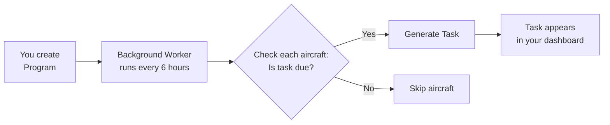

# AMSS Maintenance Planner Guide

**Version:** 1.0
**Last Updated:** December 27, 2025
**Applies To:** AMSS v1.x
**Audience:** Maintenance Planners, Schedulers (`scheduler` role)
**Review Date:** March 27, 2026

---

## Table of Contents

### Part I: Orientation
1. [Your Role in Maintenance Operations](#part-i-orientation)
2. [Your Daily Workflow](#your-daily-workflow)
3. [Mental Model: Programs Auto-Generate Tasks](#mental-model-programs-auto-generate-tasks)

### Part II: Fleet Management
4. [Scenario 1: Add Aircraft to Fleet](#scenario-1-add-aircraft-to-fleet)
5. [Scenario 2: Update Aircraft Hours and Cycles](#scenario-2-update-aircraft-hours-and-cycles)

### Part III: Maintenance Program Setup
6. [Scenario 3: Create Maintenance Program](#scenario-3-create-maintenance-program)
7. [Scenario 4: Link Program to Specific Aircraft](#scenario-4-link-program-to-specific-aircraft)
8. [Scenario 5: Review Auto-Generated Tasks](#scenario-5-review-auto-generated-tasks)
9. [Scenario 6: Modify Program Intervals](#scenario-6-modify-program-intervals)

### Part IV: Task Scheduling & Assignment
10. [Scenario 7: Review Upcoming Tasks](#part-iv-task-scheduling--assignment)
11. [Scenario 8: Assign Tasks to Mechanics](#scenario-8-assign-tasks-to-mechanics)
12. [Scenario 9: Handle Overdue Tasks](#scenario-9-handle-overdue-tasks)
13. [Scenario 10: Defer Maintenance with Approval](#scenario-10-defer-maintenance-with-approval)

### Part V: Parts Planning
14. [Scenario 11: Plan Parts Requirements](#part-v-parts-planning)
15. [Scenario 12: Check Parts Availability](#scenario-12-check-parts-availability)
16. [Scenario 13: Create Parts Replenishment Orders](#scenario-13-create-parts-replenishment-orders)

### Part VI: Reporting
17. [Scenario 14: Generate Fleet Maintenance Status Report](#part-vi-reporting)
18. [Scenario 15: Export Compliance Data](#scenario-15-export-compliance-data)

---

## Part I: Orientation

### Your Role in Maintenance Operations

As a maintenance planner (scheduler), you are the **orchestrator** of aircraft maintenance operations. You ensure:
- Aircraft are safe and airworthy
- Maintenance happens on schedule (not too early, never late)
- Mechanics have clear work assignments
- Required parts are available when needed
- Regulatory compliance is maintained (FAA/EASA)
- Operations can plan around maintenance windows

**Your Core Responsibilities:**

1. **Fleet Management**
   - Register new aircraft in AMSS
   - Maintain accurate flight hours and cycle counts
   - Track aircraft status (operational, maintenance, grounded)

2. **Program Definition**
   - Create maintenance programs based on manufacturer requirements and regulations
   - Define intervals (flight hours, calendar days, cycles)
   - Specify which aircraft each program applies to

3. **Task Scheduling**
   - Review auto-generated tasks (AMSS creates them from programs)
   - Assign tasks to mechanics
   - Coordinate maintenance windows with operations
   - Handle overdue or deferred maintenance

4. **Resource Planning**
   - Ensure required parts are in inventory
   - Forecast parts needs based on upcoming tasks
   - Coordinate with procurement for parts orders

5. **Reporting**
   - Generate fleet maintenance status reports
   - Provide data to operations for aircraft availability planning
   - Support compliance officers with audit data

**What AMSS Does for You:**

✅ **Automates Task Generation**
You define a maintenance program once (e.g., "100-Hour Inspection"), and AMSS automatically generates tasks for every aircraft in your fleet when they become due.

✅ **Calculates Due Dates Automatically**
Based on current flight hours, cycles, or calendar dates, AMSS determines exactly when each task is due.

✅ **Alerts You to Upcoming Maintenance**
Dashboard shows tasks due in the next 7 days, overdue tasks, and allows filtering/prioritization.

✅ **Prevents Missed Inspections**
Background workers continuously monitor aircraft hours and generate tasks as needed.

✅ **Maintains Complete Audit Trails**
Every program created, task generated, and assignment made is logged for regulatory compliance.

---

### Your Daily Workflow

A typical day as a maintenance planner using AMSS:

#### Morning (7:00 AM - 9:00 AM)

**1. Review Dashboard**
- Log into AMSS
- Check "Tasks Due This Week" summary
- Identify overdue tasks (red indicators) - highest priority
- Review aircraft status (how many operational vs in maintenance)

**2. Update Aircraft Flight Hours**
- Receive previous day's flight log from operations
- Update each aircraft's flight hours and cycles in AMSS
- **System Response:** AMSS automatically checks if new tasks are now due and generates them

**3. Review New Tasks**
- Check if AMSS generated any new tasks overnight or after hours update
- Verify tasks are correctly generated (aircraft, program, due date)

#### Mid-Morning (9:00 AM - 12:00 PM)

**4. Assign Tasks to Mechanics**
- Review mechanics' current workload
- Assign upcoming tasks (today and next 2-3 days)
- Consider:
  - Mechanic availability
  - Required certifications (e.g., avionics work requires avionics tech)
  - Aircraft location (avoid having mechanic drive to remote airport)
  - Parts availability

**5. Coordinate with Operations**
- Identify aircraft that need to be grounded for maintenance
- Provide operations team with aircraft availability forecast
- Negotiate maintenance windows ("Can we have N12345 from 8am-2pm tomorrow?")

#### Afternoon (12:00 PM - 4:00 PM)

**6. Parts Planning**
- Review parts requirements for upcoming tasks (next 7 days)
- Check inventory levels
- Create parts orders for items out of stock
- Coordinate with procurement team

**7. Handle Issues**
- Respond to mechanics who encounter problems:
  - Parts unavailable → Find substitute or expedite order
  - Task complexity higher than expected → Reassign or add mechanic
  - Compliance failures → Create follow-up tasks
- Reschedule tasks if aircraft availability changes

#### End of Day (4:00 PM - 5:00 PM)

**8. Review and Plan Ahead**
- Check tomorrow's scheduled tasks (are mechanics assigned? parts available?)
- Review next week's upcoming tasks
- Update fleet maintenance status report for management
- Coordinate any overdue tasks (escalate if needed)

---

### Mental Model: Programs Auto-Generate Tasks

**This is the MOST IMPORTANT concept** for planners. Understanding this will make AMSS intuitive.

#### The One-to-Many Relationship

```
ONE Maintenance Program → MANY Tasks (one per aircraft)

Example:
"100-Hour Inspection" Program
    ├─ Task for N12345 (due at 2500 hours)
    ├─ Task for N67890 (due at 3100 hours)
    ├─ Task for N99999 (due at 1500 hours)
    └─ Task for N55555 (due at 4200 hours)
```

**Key Insight:** You don't create individual tasks manually (tedious and error-prone). Instead:
1. You create the **program** (the rule/template)
2. AMSS automatically creates **tasks** (individual work orders) for each aircraft

#### How Auto-Generation Works



**Example Scenario:**

**Monday 8:00 AM:** You create a maintenance program:
- Name: "100-Hour Inspection"
- Interval Type: `flight_hours`
- Interval Value: `100`
- Applies to: All Cessna 172 aircraft

**Monday 8:05 AM (background worker runs):**
- AMSS checks all Cessna 172 aircraft in your fleet
- Aircraft N12345: Current hours = 2,450. Last inspection at 2,400. → **Due now!** → Task generated
- Aircraft N67890: Current hours = 3,050. Last inspection at 3,000. → **Due now!** → Task generated
- Aircraft N99999: Current hours = 1,450. Last inspection at 1,400. → **Due now!** → Task generated

**Monday 8:06 AM:**
- You see 3 new tasks in your dashboard (one for each aircraft)
- You assign them to mechanics

**Tuesday 8:00 AM:** Operations reports N12345 flew 10 hours yesterday
- You update N12345 hours: 2,450 → 2,460
- Background worker runs → No new tasks (next 100-hour not due yet)

**10 days later:** N12345 now at 2,500 hours
- You update hours
- Background worker runs → Next 100-hour task generated (due at 2,600 hours)

#### Why This Matters

**Without AMSS (manual tracking):**
- ❌ You must manually track every aircraft's hours
- ❌ You must manually calculate when next inspection is due
- ❌ You must manually create tasks for each aircraft
- ❌ High risk of missed inspections (human error)

**With AMSS (automated):**
- ✅ You create the program once
- ✅ AMSS monitors aircraft hours automatically
- ✅ Tasks auto-generate when due
- ✅ Zero missed inspections (system-enforced)

**NOTE:** Background workers run every 6 hours. If you need a task generated immediately (e.g., after updating aircraft hours), you can manually trigger task generation (see Scenario 5).

---

## Part II: Fleet Management

### Scenario 1: Add Aircraft to Fleet

**GOAL:** Register a new aircraft in AMSS so maintenance programs can be applied to it.

**WHEN TO USE:**
- Your organization acquires a new aircraft
- Aircraft transfers from another operator
- Initial AMSS setup (importing existing fleet)

**PRE-CONDITIONS:**
- [ ] You have `scheduler` or `admin` role
- [ ] Aircraft documentation available (registration, logbooks, current hours/cycles)
- [ ] Aircraft is not already in AMSS (check for duplicates first)

**HAPPY PATH:**

1. **Navigate to Aircraft Management**
   - Click "Fleet" in main menu
   - Click "+ Add Aircraft" button
   - **System Response:** "Add New Aircraft" form opens

2. **Enter Required Information**
   - **Tail Number** (registration): E.g., "N12345", "G-ABCD"
     - Must be unique (AMSS enforces this)
     - Case-insensitive (N12345 = n12345)
   - **Model**: E.g., "Cessna 172", "Boeing 737-800", "Airbus A320"
   - **Serial Number**: Manufacturer serial number (for warranty/AD tracking)
   - **Capacity Slots**: Max concurrent tasks (usually 2-4)
     - Example: Small aircraft = 2 (max 2 mechanics working simultaneously)
     - Example: Large aircraft = 8 (multiple zones can be worked)

3. **Enter Current Maintenance Counters**
   - **Flight Hours Total**: Current Hobbs or tach hours (e.g., 2,450.5)
   - **Cycles Total**: Takeoff/landing count (e.g., 1,800)
   - **Last Maintenance Date**: When last inspection was performed (for calendar-based programs)
   - **NOTE:** These are critical - all program calculations depend on accurate starting values

4. **Set Initial Status**
   - **Status**: Select from dropdown
     - `operational`: Aircraft is flyable and in service
     - `maintenance`: Currently undergoing maintenance
     - `grounded`: Not airworthy (waiting for parts, repairs, etc.)
   - Most new aircraft start as `operational`

5. **Optional: Add Notes**
   - Special considerations (e.g., "Avionics upgrade pending", "High-time engine")
   - Maintenance history notes
   - Location (if multi-base operation)

6. **Click "Create Aircraft"**
   - **System Response:** Validates all fields
     - ✅ Tail number is unique
     - ✅ Flight hours and cycles are positive numbers
     - ✅ Required fields filled in
   - If validation passes:
     - Aircraft created with unique ID
     - Appears in "Fleet" list
     - Audit log entry created

7. **Verify Aircraft Created**
   - Search for aircraft by tail number
   - **System Response:** Aircraft details page shows all entered information
   - Status shows as entered (e.g., "operational")

**VERIFICATION:**
✅ Aircraft appears in Fleet list
✅ Tail number, model, hours, cycles match what you entered
✅ Status is correct
✅ You can now apply maintenance programs to this aircraft

**COMMON FAILURES:**

| Symptom | Cause | Recovery |
|---------|-------|----------|
| Error: "Tail number already exists" | Duplicate aircraft in system | Search for existing aircraft; if legitimate duplicate (e.g., typo in old entry), contact admin to delete |
| Error: "Flight hours must be positive" | Entered negative or zero hours | Correct to actual hours from logbook |
| Error: "Invalid tail number format" | Special characters or wrong format | Use only letters, numbers, hyphens (e.g., N12345, not N-12-345) |
| Form won't submit | Required field missing | Check all required fields (marked with *) are filled |

**REGULATORY NOTE:** Aircraft registration in AMSS does not satisfy FAA registration requirements (FAA Form 8050-1). This is internal maintenance tracking only.

**RELATED SCENARIOS:**
- Next: [Scenario 2: Update Aircraft Hours](#scenario-2-update-aircraft-hours-and-cycles) (daily operation)
- Next: [Scenario 3: Create Maintenance Program](#scenario-3-create-maintenance-program) (apply programs to this aircraft)
- See also: [Fleet Manager Guide - Scenario 5: Import Fleet Data via CSV](05_FLEET_MANAGER.md#scenario-5-import-fleet-data-via-csv) (bulk import)

---

### Scenario 2: Update Aircraft Hours and Cycles

**GOAL:** Record flight operations data (hours and cycles) from the previous day, which triggers AMSS to check if new maintenance is due.

**WHEN TO USE:**
- Daily (typically each morning after receiving previous day's flight logs)
- After each flight (if real-time tracking)
- After receiving monthly/weekly reports from operations

**PRE-CONDITIONS:**
- [ ] You have `scheduler` or `admin` role
- [ ] Flight log data available (hours flown, cycles performed)
- [ ] Aircraft exists in AMSS

**HAPPY PATH:**

1. **Obtain Flight Log Data**
   - Receive from operations team (email, flight log system, pilot reports)
   - Example format:
     ```
     N12345: 8.5 hours, 4 cycles (flights: KBOS→KJFK, KJFK→KBOS, KBOS→KDCA, KDCA→KBOS)
     N67890: 0 hours (aircraft not flown today)
     N99999: 12.3 hours, 6 cycles
     ```

2. **Navigate to Aircraft Details**
   - Go to "Fleet" → Search for aircraft (e.g., "N12345")
   - Click on aircraft row
   - **System Response:** Aircraft details page opens

3. **Click "Update Hours/Cycles"**
   - Button in top-right of aircraft details page
   - **System Response:** "Update Maintenance Counters" dialog opens

4. **Enter New Total Hours and Cycles**
   - **Current values shown:**
     - Flight Hours: 2,450.5
     - Cycles: 1,800
   - **Enter new totals** (NOT the increment):
     - New Flight Hours: 2,459.0 (2,450.5 + 8.5)
     - New Cycles: 1,804 (1,800 + 4)
   - **CAUTION:** Enter total hours, not hours flown today

5. **Add Update Notes** (recommended)
   - Example: "Dec 27 operations: 8.5 hours, 4 cycles"
   - Helps with audit trail and troubleshooting

6. **Click "Update"**
   - **System Response:** Validates input
     - ✅ New hours ≥ old hours (cannot decrease - data integrity check)
     - ✅ New cycles ≥ old cycles
     - ✅ Reasonable increment (e.g., not +1000 hours in one day - likely typo)
   - If validation passes:
     - Aircraft hours/cycles updated
     - Audit log entry created with your user ID and timestamp
     - **Background worker triggered** (checks if new tasks are now due)

7. **Wait for Background Processing** (5-30 seconds)
   - **System Response:** Background worker runs
     - Checks all maintenance programs linked to this aircraft
     - Calculates if any tasks are now due based on new hours/cycles
     - Generates new tasks if due

8. **Check for New Tasks**
   - Go to "Tasks" → Filter by aircraft "N12345"
   - **System Response:** Shows all tasks for this aircraft
   - Look for newly generated tasks (created timestamp = just now)

**VERIFICATION:**
✅ Aircraft hours and cycles updated to new values
✅ Audit log shows update with your name and timestamp
✅ If maintenance was due, new task(s) appear in task list

**COMMON FAILURES:**

| Symptom | Cause | Recovery |
|---------|-------|----------|
| Error: "Flight hours cannot decrease" | Entered hours less than current | Check flight log - did you enter increment instead of total? Correct to actual new total |
| Error: "Unreasonable increment" | Entered 2,450 → 3,450 (1000 hours in one day - impossible) | Double-check flight log data; likely typo (maybe 2,550?) |
| Hours updated but no new tasks | No programs linked to aircraft, or no programs due yet | Expected behavior - tasks only generate when actually due |
| Error: "Aircraft not found" | Wrong tail number | Verify tail number spelling (case-insensitive but must match) |

**BEST PRACTICES:**

✅ **Update Daily:** Even if aircraft didn't fly (enter same hours as yesterday - creates audit trail)
✅ **Use Consistent Format:** Always use total hours (not increments) to avoid confusion
✅ **Add Notes:** Brief note helps troubleshooting later ("No flight today", "Ferry flight to maintenance base")
✅ **Verify Accuracy:** Double-check flight log data before entering (errors compound over time)
❌ **Don't Guess:** If flight data unavailable, wait for accurate data (regulatory compliance requires precision)

**AUTOMATION OPTION:**
If your organization has a flight operations system, you can integrate it with AMSS via API to automatically update hours/cycles. See [API_GUIDE.md - Aircraft Updates](../API_GUIDE.md) for details.

**REGULATORY NOTE:** Accurate flight hours/cycles are required for 14 CFR Part 91.417 maintenance record compliance. AMSS audit logs provide evidence of when hours were updated and by whom.

**RELATED SCENARIOS:**
- Previous: [Scenario 1: Add Aircraft](#scenario-1-add-aircraft-to-fleet)
- Next: [Scenario 5: Review Auto-Generated Tasks](#scenario-5-review-auto-generated-tasks)
- See also: [Scenario 3: Create Maintenance Program](#scenario-3-create-maintenance-program) (programs use hours/cycles for calculations)

---

## Part III: Maintenance Program Setup

### Scenario 3: Create Maintenance Program

**GOAL:** Define a recurring maintenance requirement (e.g., "100-Hour Inspection") that automatically generates tasks for aircraft when due.

**WHEN TO USE:**
- New aircraft type added to fleet (create all applicable programs)
- New regulatory requirement (FAA AD, manufacturer service bulletin)
- Organization policy change (e.g., changing oil change interval from 50 to 25 hours)

**PRE-CONDITIONS:**
- [ ] You have `scheduler` or `admin` role
- [ ] You have manufacturer maintenance manual or regulatory requirement documentation
- [ ] You understand the interval type (hours, calendar, or cycles)

**HAPPY PATH:**

1. **Gather Program Requirements**
   - **From where:**
     - Manufacturer maintenance manual (e.g., Cessna 172 Maintenance Manual Section 5)
     - FAA regulations (14 CFR Part 91.409 - Annual inspections)
     - Airworthiness Directives (ADs)
     - Service Bulletins (SBs)
   - **What you need:**
     - Exact name of inspection/task
     - Interval type (hours, days, or cycles)
     - Interval value (e.g., 100 hours, 365 days, 500 cycles)
     - Applicability (which aircraft models)

2. **Navigate to Programs**
   - Click "Maintenance Programs" in main menu
   - Click "+ Create Program" button
   - **System Response:** "Create Maintenance Program" form opens

3. **Enter Program Details**

   **Basic Information:**
   - **Name**: Descriptive name (e.g., "100-Hour Inspection", "Annual Inspection", "Oil Change")
     - Must be unique within your organization
     - Use consistent naming (helps reporting and filtering)
   - **Description**: Detailed description
     - Example: "Comprehensive inspection per 14 CFR Part 91.409 and Cessna Service Manual"
     - Include reference to manual section (e.g., "Per MM Section 5-10")

   **Interval Configuration:**
   - **Interval Type**: Select from dropdown
     - `flight_hours`: Based on Hobbs/tach hours (e.g., every 100 hours)
     - `calendar`: Based on calendar time (e.g., every 365 days / 12 months)
     - `cycles`: Based on takeoff/landing cycles (e.g., every 500 cycles)
   - **Interval Value**: Number
     - For `flight_hours`: Hours (e.g., 100, 50, 25)
     - For `calendar`: Days (e.g., 365 for annual, 30 for monthly)
     - For `cycles`: Number of cycles (e.g., 500, 1000)

   **Example 1: 100-Hour Inspection**
   - Name: "100-Hour Inspection"
   - Interval Type: `flight_hours`
   - Interval Value: `100`

   **Example 2: Annual Inspection**
   - Name: "Annual Inspection"
   - Interval Type: `calendar`
   - Interval Value: `365` (days)

   **Example 3: Landing Gear Overhaul**
   - Name: "Landing Gear Overhaul"
   - Interval Type: `cycles`
   - Interval Value: `10000`

4. **Optional: Parts Requirements**
   - Click "Add Required Parts"
   - Search for parts in inventory (e.g., "Oil Filter")
   - Specify quantity needed
   - **System Response:** Parts will be auto-reserved when mechanics start tasks
   - **NOTE:** You can skip this and add parts later

5. **Optional: Compliance Checklist**
   - Click "Add Compliance Item"
   - Enter description (e.g., "Verify torque on cylinder bolts per MM Section 71-00-00")
   - **System Response:** Mechanics must sign off on these items to complete tasks
   - **Best Practice:** Add regulatory requirements here (AD compliance, etc.)

6. **Select Aircraft Applicability**

   **Option A: Apply to All Aircraft**
   - Select "All aircraft in organization"
   - **Use when:** Program applies universally (e.g., Annual Inspection)

   **Option B: Apply to Specific Aircraft**
   - Select "Specific aircraft only"
   - Click "Select Aircraft"
   - **System Response:** Shows list of all aircraft
   - Check boxes for applicable aircraft
   - **Use when:** Program is model-specific (e.g., "Cessna 172 Oil Change" only for 172s)

   **Option C: Apply to Aircraft by Model**
   - Select "All aircraft matching model"
   - Enter model name (e.g., "Cessna 172")
   - **System Response:** Applies to all current and future 172s
   - **Use when:** Model-specific but you don't want to select each aircraft individually

7. **Set Program Status**
   - **Active**: Program will generate tasks (default)
   - **Inactive**: Program exists but won't generate tasks (use for discontinued programs)
   - Most new programs: Select "Active"

8. **Click "Create Program"**
   - **System Response:** Validates all fields
     - ✅ Name is unique
     - ✅ Interval type and value are valid
     - ✅ At least one aircraft selected
   - If validation passes:
     - Program created with unique ID
     - Appears in "Maintenance Programs" list
     - Audit log entry created
     - **Background worker will check for due tasks within 6 hours**

9. **Verify Program Created**
   - Search for program by name in Programs list
   - **System Response:** Program details page shows all entered information
   - Check: Interval type, interval value, aircraft applicability

**VERIFICATION:**
✅ Program appears in Programs list
✅ Interval configuration is correct
✅ Aircraft applicability is correct
✅ Status is "Active"
✅ (Within 6 hours) Tasks will be generated for any aircraft where this program is currently due

**COMMON FAILURES:**

| Symptom | Cause | Recovery |
|---------|-------|----------|
| Error: "Program name already exists" | Duplicate program name | Use unique name (e.g., add aircraft model: "Cessna 172 - 100-Hour Inspection") |
| Error: "Interval value must be positive" | Entered 0 or negative | Correct to actual interval (e.g., 100, not 0) |
| Error: "No aircraft selected" | Forgot to select applicability | Go back and select aircraft |
| Program created but no tasks generated | Tasks not due yet, or will be generated within 6 hours | Expected behavior - tasks only generate when actually due |

**ADVANCED: Combining Interval Types (Whichever Comes First)**

Some regulations require maintenance "every 100 hours OR 12 months, whichever comes first" (e.g., FAA Part 91 inspections).

**How to implement:**
1. Create TWO programs:
   - "100-Hour Inspection (Hours)"
     - Interval Type: `flight_hours`, Value: `100`
   - "100-Hour Inspection (Calendar)"
     - Interval Type: `calendar`, Value: `365`
2. Both will generate tasks independently
3. Whichever comes first triggers task
4. After completing task, both programs reset

**CAUTION:** This creates more tasks but ensures regulatory compliance.

**RELATED SCENARIOS:**
- Next: [Scenario 4: Link Program to Specific Aircraft](#scenario-4-link-program-to-specific-aircraft)
- Next: [Scenario 5: Review Auto-Generated Tasks](#scenario-5-review-auto-generated-tasks)
- See also: [Scenario 6: Modify Program Intervals](#scenario-6-modify-program-intervals)

---

### Scenario 4: Link Program to Specific Aircraft

**GOAL:** Apply an existing maintenance program to one or more additional aircraft (or remove it from aircraft where it no longer applies).

**WHEN TO USE:**
- New aircraft added to fleet (apply all relevant programs)
- Aircraft model changes (different programs needed)
- Regulatory change (AD applies to specific serial number range)

**PRE-CONDITIONS:**
- [ ] Program already exists in AMSS
- [ ] Aircraft exists in AMSS
- [ ] You have `scheduler` or `admin` role

**HAPPY PATH:**

1. **Navigate to Program Details**
   - Go to "Maintenance Programs"
   - Search for program (e.g., "100-Hour Inspection")
   - Click on program row
   - **System Response:** Program details page opens

2. **Go to "Aircraft" Tab**
   - Click "Aircraft" tab
   - **System Response:** Shows list of aircraft currently linked to this program

3. **Add Aircraft**
   - Click "+ Add Aircraft" button
   - **System Response:** Aircraft selection dialog opens
   - Shows all aircraft NOT currently linked to this program

4. **Select Aircraft to Add**
   - Check boxes for aircraft to add (can select multiple)
   - Example: Adding "100-Hour Inspection" to newly acquired N12345
   - Click "Add Selected"
   - **System Response:**
     - Aircraft added to program's aircraft list
     - Audit log entry created
     - **Background worker will check if tasks are due for these aircraft**

5. **Verify Link**
   - Aircraft now appears in program's "Aircraft" list
   - **System Response:** Shows aircraft tail number, model, current hours/cycles

**VERIFICATION:**
✅ Aircraft appears in program's linked aircraft list
✅ Within 6 hours, tasks will be generated if program is due for this aircraft

**REMOVING AIRCRAFT FROM PROGRAM:**

**When to remove:**
- Aircraft sold/retired from fleet
- Program no longer applicable (model change, regulatory exemption)

**Steps:**
1. Go to Program Details → "Aircraft" tab
2. Find aircraft to remove
3. Click "Remove" button next to aircraft
4. Confirm removal
5. **System Response:**
   - Aircraft removed from program's list
   - **Existing tasks NOT deleted** (historical data preserved)
   - **Future tasks NOT generated** for this aircraft

**COMMON FAILURES:**

| Symptom | Cause | Recovery |
|---------|-------|----------|
| Aircraft not in selection list | Aircraft already linked to program | Check "Aircraft" tab - it may already be there |
| Error: "Cannot remove - active tasks exist" | Aircraft has in-progress tasks for this program | Complete or cancel active tasks first |

**RELATED SCENARIOS:**
- Previous: [Scenario 3: Create Maintenance Program](#scenario-3-create-maintenance-program)
- Next: [Scenario 5: Review Auto-Generated Tasks](#scenario-5-review-auto-generated-tasks)

---

### Scenario 5: Review Auto-Generated Tasks

**GOAL:** View tasks that AMSS automatically created from maintenance programs and verify they are correct.

**WHEN TO USE:**
- After creating a new program (check if tasks generated)
- After updating aircraft hours (check if new tasks created)
- Daily review (see upcoming work)
- Troubleshooting (verify task generation logic working correctly)

**PRE-CONDITIONS:**
- [ ] At least one maintenance program exists
- [ ] Programs are linked to aircraft
- [ ] Aircraft hours/cycles are up-to-date

**HAPPY PATH:**

1. **Navigate to Tasks Dashboard**
   - Click "Tasks" in main menu
   - **System Response:** Shows all tasks in system (scheduled, in-progress, completed)

2. **Filter to See Recently Generated Tasks**
   - Click "Filter" button
   - Select "Created Date: Last 24 hours"
   - **System Response:** Shows only tasks created in last 24 hours
   - These are likely auto-generated tasks

3. **Review Task Details**
   - For each task, verify:
     - **Aircraft**: Correct tail number
     - **Program**: Correct maintenance program
     - **Due Date/Hours**: Calculation is correct
       - For flight_hours programs: Aircraft current hours + interval
       - For calendar programs: Last completion date + interval days
       - For cycles programs: Aircraft current cycles + interval
     - **Status**: Should be `scheduled` (newly created)
     - **Assigned Mechanic**: Likely "Unassigned" (you assign them)

4. **Example Verification:**

   **Program:** "100-Hour Inspection"
   - Interval: 100 flight_hours

   **Aircraft:** N12345
   - Current hours: 2,450
   - Last 100-hour at: 2,400

   **Generated Task:**
   - Name: "100-Hour Inspection - N12345"
   - Due at: 2,500 hours (2,400 + 100)
   - Status: `scheduled`

   **Verification:** ✅ Correct (due at 2,500 hours as expected)

5. **Check for Missing Tasks**
   - If you expect a task but don't see it:
     - **Cause 1:** Background worker hasn't run yet (runs every 6 hours)
     - **Cause 2:** Task already exists (check "All Tasks" view - may have been generated earlier)
     - **Cause 3:** Program is inactive
     - **Cause 4:** Aircraft not linked to program

6. **Manually Trigger Task Generation** (if needed)
   - If you need immediate task generation (can't wait 6 hours):
   - Go to "Maintenance Programs" → Select program → Click "Generate Tasks Now"
   - **System Response:**
     - Runs task generation immediately for this program
     - Shows how many tasks were created
   - **Use sparingly:** Background worker handles this automatically

**VERIFICATION:**
✅ All expected tasks generated
✅ Due dates/hours calculated correctly
✅ Tasks linked to correct aircraft and programs
✅ No duplicate tasks (same aircraft + program + due date)

**COMMON ISSUES:**

| Symptom | Cause | Recovery |
|---------|-------|----------|
| No tasks generated | Program is inactive OR aircraft hours not yet triggering due date | Check program status; verify aircraft hours are up-to-date |
| Duplicate tasks | Task generation ran twice | Delete duplicate (keep the one with earlier created date) |
| Wrong due date | Program interval incorrect OR aircraft hours incorrect | Verify program interval setting; verify aircraft hours in system |
| Task for wrong aircraft | Program linked to wrong aircraft | Edit program aircraft list |

**UNDERSTANDING TASK GENERATION LOGIC:**

**For flight_hours programs:**
```
Due Hours = (Last Completion Hours OR Aircraft Entry Hours) + Interval

Example:
Last 100-hour: 2,400 hours
Interval: 100
Due Hours = 2,400 + 100 = 2,500 hours

Task generates when: Aircraft current hours ≥ (Due Hours - Early Start Window)
```

**For calendar programs:**
```
Due Date = (Last Completion Date OR Aircraft Entry Date) + Interval Days

Example:
Last annual: Jan 1, 2025
Interval: 365 days
Due Date = Jan 1, 2026

Task generates when: Current date ≥ (Due Date - 30 days early)
```

**RELATED SCENARIOS:**
- Previous: [Scenario 3: Create Maintenance Program](#scenario-3-create-maintenance-program)
- Previous: [Scenario 2: Update Aircraft Hours](#scenario-2-update-aircraft-hours-and-cycles)
- Next: [Scenario 7: Review Upcoming Tasks](#part-iv-task-scheduling--assignment)
- Next: [Scenario 8: Assign Tasks to Mechanics](#scenario-8-assign-tasks-to-mechanics)

---

### Scenario 6: Modify Program Intervals

**GOAL:** Update an existing maintenance program's interval (e.g., change oil change from 50 hours to 25 hours).

**WHEN TO USE:**
- Manufacturer revises recommended interval (service bulletin)
- Regulatory change (new AD interval)
- Organization policy change (more conservative interval)
- Discovered program interval was entered incorrectly

**PRE-CONDITIONS:**
- [ ] Program exists in AMSS
- [ ] You have `scheduler` or `admin` role
- [ ] You have documentation justifying the interval change (regulatory, manufacturer, etc.)

**HAPPY PATH:**

1. **Navigate to Program Details**
   - Go to "Maintenance Programs"
   - Search for program (e.g., "Oil Change")
   - Click on program row
   - **System Response:** Program details page opens

2. **Click "Edit Program"**
   - Button in top-right
   - **System Response:** Edit form opens with current values pre-filled

3. **Modify Interval**
   - Change **Interval Value** (e.g., 50 → 25)
   - Or change **Interval Type** (e.g., `flight_hours` → `calendar`)
   - **NOTE:** Changing interval does NOT affect existing tasks (only future tasks)

4. **Add Change Notes** (recommended)
   - Enter reason for change
   - Example: "Per Service Bulletin 2025-12, reducing oil change interval from 50 to 25 hours"
   - Helps with audit trail

5. **Click "Save Changes"**
   - **System Response:** Validates changes
     - ✅ New interval value is positive
     - ✅ Interval type is valid
   - If validation passes:
     - Program updated
     - Audit log entry created
     - **Future tasks will use new interval**
     - **Existing tasks unchanged** (completed tasks remain historical record)

6. **Verify Program Updated**
   - Program details page shows new interval
   - Audit log shows change (old value → new value, who changed it, when)

7. **Regenerate Tasks** (if needed)
   - If you want existing `scheduled` tasks recalculated with new interval:
     - Click "Regenerate Tasks"
     - **System Response:** Recalculates due dates for all scheduled tasks
     - **CAUTION:** This affects tasks already assigned to mechanics

**VERIFICATION:**
✅ Program interval updated to new value
✅ Audit log shows change
✅ Future tasks will use new interval
✅ (Optional) Existing scheduled tasks recalculated if you regenerated

**COMMON FAILURES:**

| Symptom | Cause | Recovery |
|---------|-------|----------|
| Error: "Interval value must be positive" | Entered 0 or negative | Correct to positive number |
| Existing tasks still show old due dates | Didn't regenerate tasks | Expected if you didn't click "Regenerate Tasks" - existing tasks keep original due dates |
| Error: "Cannot edit - active tasks exist" | Some AMSS configurations lock programs with active tasks | Complete or cancel active tasks first, then edit |

**CAUTION - REGULATORY IMPLICATIONS:**

**Making interval shorter (e.g., 50 hours → 25 hours):**
- ✅ **Safe:** More conservative, more frequent maintenance
- Regulatory compliance: Generally allowed without issue

**Making interval longer (e.g., 25 hours → 50 hours):**
- ⚠️ **Caution:** Less frequent maintenance
- Regulatory compliance: **Must be approved** by FAA/manufacturer
- Document approval in change notes
- If not approved, do NOT make this change

**WARNING:** Extending intervals beyond manufacturer/FAA requirements may violate airworthiness regulations. Always verify regulatory approval before lengthening intervals.

**RELATED SCENARIOS:**
- Previous: [Scenario 3: Create Maintenance Program](#scenario-3-create-maintenance-program)
- See also: [Scenario 5: Review Auto-Generated Tasks](#scenario-5-review-auto-generated-tasks) (verify new interval working)

---

## Part IV: Task Scheduling & Assignment

### Scenario 7: Review Upcoming Tasks

**GOAL:** Identify which maintenance tasks are due in the near future to plan work assignments and coordinate with operations.

**WHEN TO USE:**
- Daily (morning review)
- Weekly planning meetings
- Before assigning work to mechanics
- Coordinating maintenance windows with operations

**PRE-CONDITIONS:**
- [ ] Tasks have been generated (either manually or by background worker)
- [ ] Aircraft hours are up-to-date
- [ ] You have `scheduler` or `admin` role

**HAPPY PATH:**

1. **Navigate to Tasks Dashboard**
   - Click "Tasks" in main menu
   - **System Response:** Shows all tasks with default filter (all statuses)

2. **Apply Time-Based Filter**
   - Click "Filter" dropdown
   - Select "Due Date: Next 7 days"
   - **System Response:** Shows only tasks due within next week
   - Tasks sorted by due date (soonest first)

3. **Review Task List**
   - For each task, note:
     - **Aircraft**: Tail number
     - **Task Name**: What needs to be done
     - **Due Date/Hours**: When it's due
     - **Status**: `scheduled` (not started), `in_progress` (being worked), `completed`
     - **Assigned Mechanic**: Who's responsible (or "Unassigned")
     - **Priority Indicators**:
       - 🔴 Red: Overdue (past due date/hours)
       - 🟡 Yellow: Due within 48 hours
       - 🟢 Green: Due within 7 days
       - ⚪ White: Future (beyond 7 days)

4. **Group Tasks by Aircraft**
   - Click "Group By: Aircraft"
   - **System Response:** Tasks grouped by tail number
   - Helps identify which aircraft have multiple tasks (can coordinate downtime)

5. **Identify Priorities**
   - **Highest Priority** (address today):
     - Overdue tasks (red)
     - Tasks due today or tomorrow (yellow)
     - Aircraft grounded waiting for maintenance
   - **Medium Priority** (assign this week):
     - Tasks due within 7 days
   - **Low Priority** (monitor):
     - Tasks due beyond 7 days

6. **Coordinate with Operations**
   - For high-priority tasks:
     - Contact operations: "We need to ground N12345 tomorrow for 100-hour inspection (4-6 hours downtime)"
     - Confirm aircraft availability window
     - Update task scheduled time if needed

**VERIFICATION:**
✅ You have a clear picture of upcoming maintenance
✅ High-priority tasks identified
✅ Operations coordinated for aircraft downtime
✅ Ready to assign tasks to mechanics

**BEST PRACTICES:**

✅ **Review Daily:** Check upcoming tasks every morning
✅ **Look Ahead 7 Days:** Don't just focus on today - plan the week
✅ **Coordinate Early:** Give operations 24-48 hours notice for aircraft downtime
✅ **Group Work:** If multiple tasks due on same aircraft, schedule together (save downtime)
✅ **Monitor Overdue:** Overdue tasks are regulatory violations - address immediately

**RELATED SCENARIOS:**
- Next: [Scenario 8: Assign Tasks to Mechanics](#scenario-8-assign-tasks-to-mechanics)
- Next: [Scenario 9: Handle Overdue Tasks](#scenario-9-handle-overdue-tasks)
- See also: [Scenario 5: Review Auto-Generated Tasks](#scenario-5-review-auto-generated-tasks)

---

### Scenario 8: Assign Tasks to Mechanics

**GOAL:** Assign scheduled maintenance tasks to specific mechanics so they know what work to perform.

**WHEN TO USE:**
- After reviewing upcoming tasks (Scenario 7)
- Daily work assignment
- When new tasks are generated

**PRE-CONDITIONS:**
- [ ] Tasks exist in `scheduled` status
- [ ] Mechanics exist in system with `mechanic` role
- [ ] You know mechanics' qualifications and availability
- [ ] You have `scheduler` or `admin` role

**HAPPY PATH:**

1. **Select Task to Assign**
   - From Tasks list, click on unassigned task
   - **System Response:** Task details page opens
   - Check task details:
     - Aircraft
     - Work required
     - Estimated time
     - Required certifications (if any)

2. **Verify Aircraft Availability**
   - Check aircraft status (should be or will be `grounded`)
   - Confirm with operations if not already grounded

3. **Choose Appropriate Mechanic**
   - Consider:
     - **Qualifications**: Does mechanic have required certifications?
       - Example: Avionics work requires avionics technician
       - Example: Annual inspection requires A&P license
     - **Availability**: Is mechanic already assigned to other tasks?
     - **Workload**: How many tasks does mechanic currently have?
     - **Location**: Is mechanic at same base as aircraft?

4. **Assign Mechanic**
   - Click "Assign Mechanic" button
   - **System Response:** Mechanic selection dialog opens
   - Shows list of all mechanics with their:
     - Name
     - Current workload (number of assigned tasks)
     - Qualifications/certifications
   - Select mechanic from list
   - Click "Assign"

5. **Set Scheduled Time** (optional but recommended)
   - Enter scheduled start time (e.g., "Dec 28, 2025 08:00")
   - Enter estimated duration (e.g., "4 hours")
   - **System Response:** Task now shows scheduled time window

6. **Add Assignment Notes** (optional)
   - Example: "Coordinate with operations - aircraft available 8am-2pm"
   - Example: "Parts reserved - ready to start"
   - Notes visible to mechanic

7. **Confirm Assignment**
   - **System Response:**
     - Task status remains `scheduled`
     - Assigned mechanic field shows mechanic's name
     - Mechanic receives notification (if configured)
     - Task appears in mechanic's "My Assigned Tasks" dashboard
     - Audit log entry created

**VERIFICATION:**
✅ Task shows assigned mechanic name
✅ Mechanic can see task in their dashboard
✅ Scheduled time is set (if applicable)
✅ Aircraft is or will be available during scheduled time

**REASSIGNING TASKS:**

**When to reassign:**
- Mechanic unavailable (sick, vacation, reassigned)
- Different skills needed
- Workload balancing

**Steps:**
1. Go to task details
2. Click "Reassign Mechanic"
3. Select new mechanic
4. Add notes explaining reassignment
5. **System Response:** Task reassigned, both mechanics notified

**COMMON FAILURES:**

| Symptom | Cause | Recovery |
|---------|-------|----------|
| Error: "Mechanic not found" | Mechanic account doesn't exist or is inactive | Contact admin to create/activate mechanic account |
| Error: "Cannot assign - task already in progress" | Task was started by another mechanic | Check task status; if legitimate, let mechanic continue |
| Mechanic says they don't see task | Notification not sent OR mechanic didn't refresh dashboard | Ask mechanic to refresh; verify assignment in task details |

**BEST PRACTICES:**

✅ **Assign 1-2 Days Ahead:** Give mechanics time to prepare
✅ **Balance Workload:** Don't overload one mechanic while others idle
✅ **Match Skills:** Assign based on qualifications (avionics, engines, etc.)
✅ **Coordinate:** Ensure aircraft will be available during scheduled time
✅ **Communicate:** Add notes with special instructions or coordination needs
❌ **Don't Assign Too Early:** Assigning tasks weeks in advance causes confusion if priorities change

**RELATED SCENARIOS:**
- Previous: [Scenario 7: Review Upcoming Tasks](#scenario-7-review-upcoming-tasks)
- Next: [Mechanic Guide - Scenario 2: Start Task](03_MECHANIC_TECHNICIAN.md#scenario-2-start-a-maintenance-task)
- See also: [Scenario 9: Handle Overdue Tasks](#scenario-9-handle-overdue-tasks)

---

### Scenario 9: Handle Overdue Tasks

**GOAL:** Address maintenance tasks that are past their due date (regulatory compliance issue).

**WHEN TO USE:**
- When dashboard shows overdue tasks (red indicators)
- During daily review
- Before regulatory audit
- When operations asks "Is aircraft airworthy?"

**PRE-CONDITIONS:**
- [ ] Tasks exist with status `scheduled` and due date/hours in the past
- [ ] You have `scheduler` or `admin` role

**HAPPY PATH:**

1. **Identify Overdue Tasks**
   - Go to Tasks dashboard
   - Click filter: "Status: Overdue"
   - **System Response:** Shows all tasks past their due date/hours
   - Tasks marked with 🔴 red indicator

2. **Assess Each Overdue Task**
   - For each overdue task, determine:
     - **How overdue?** (1 day vs 30 days - severity)
     - **Why overdue?**
       - Aircraft unavailable (operational needs)
       - Parts unavailable
       - Mechanic unavailable
       - Task was missed (oversight)
     - **Airworthiness impact:**
       - 🔴 Critical: Aircraft NOT airworthy (annual inspection, AD compliance)
       - 🟡 Warning: Aircraft airworthy but approaching non-compliance
       - 🟢 Minor: Organizational standard, not regulatory

3. **Take Immediate Action Based on Severity**

   **If CRITICAL (Aircraft Not Airworthy):**
   - **Ground Aircraft Immediately**
     - Update aircraft status to `grounded`
     - Notify operations: "N12345 NOT AIRWORTHY - do not fly"
   - **Assign Highest Priority**
     - Assign to mechanic today
     - Expedite parts if needed
     - Work overtime if necessary
   - **Document Justification**
     - Add task notes: "Aircraft grounded - overdue annual inspection"
     - Create incident report if required by organization

   **If WARNING (Approaching Non-Compliance):**
   - **Schedule Within 48 Hours**
     - Assign to mechanic
     - Coordinate with operations for downtime window
     - Verify parts available
   - **Monitor Closely**
     - Check status daily until complete

   **If MINOR (Organizational Standard):**
   - **Schedule Normal Priority**
     - Assign when mechanic available
     - Coordinate with operations normally
   - **Review Process**
     - Why did this become overdue? Process improvement needed?

4. **Coordinate with Operations**
   - Inform operations of maintenance status
   - Example: "N12345 annual inspection is 5 days overdue - aircraft must be grounded until complete (estimated 2 days)"
   - Negotiate maintenance window

5. **Assign or Expedite**
   - If not assigned: Assign to mechanic immediately
   - If assigned but not started: Contact mechanic - when can you start?
   - If parts unavailable: Expedite parts order (overnight shipping if critical)

6. **Monitor Until Complete**
   - Check task status hourly or daily (depending on severity)
   - Remove blockers as they arise
   - Update operations on progress

7. **Document Resolution**
   - Once task completed:
     - Verify completion in AMSS
     - Update aircraft status back to `operational` (if safe)
     - Notify operations aircraft is airworthy
   - Add notes explaining delay

**VERIFICATION:**
✅ All overdue tasks have action plan
✅ Critical tasks assigned and in-progress
✅ Operations notified of aircraft status
✅ Non-airworthy aircraft grounded

**PREVENTING OVERDUE TASKS:**

**Best Practices:**
✅ **Review Dashboard Daily:** Catch tasks before they become overdue
✅ **Assign Early:** Assign tasks when they appear (don't wait until due date)
✅ **Monitor Parts:** Ensure required parts in stock before task due
✅ **Coordinate Proactively:** Give operations 2-3 days notice for maintenance windows
✅ **Plan for Delays:** Buffer time for unexpected issues

**WARNING - REGULATORY IMPLICATIONS:**

**Flying with overdue maintenance:**
- ✅ **Allowed (sometimes):** If maintenance is organizational standard (oil change every 25 hours) and regulations allow 50 hours
- ❌ **NOT ALLOWED:** If maintenance is regulatory requirement (annual inspection, AD compliance)

**14 CFR Part 91.405:** No person may operate an aircraft that has not been maintained in accordance with applicable regulations.

**Consequences of flying non-airworthy aircraft:**
- FAA enforcement action (certificate suspension, fines)
- Insurance claims denied
- Criminal liability if accident occurs
- Reputational damage

**When in Doubt:** Ground the aircraft until compliance officer or POI (Principal Operations Inspector) confirms airworthiness.

**RELATED SCENARIOS:**
- Previous: [Scenario 7: Review Upcoming Tasks](#scenario-7-review-upcoming-tasks)
- Next: [Scenario 10: Defer Maintenance](#scenario-10-defer-maintenance-with-approval)
- See also: [Compliance Guide - Investigate Overdue Maintenance](04_COMPLIANCE_OFFICER.md)

---

### Scenario 10: Defer Maintenance with Approval

**GOAL:** Postpone a scheduled maintenance task beyond its due date with proper authorization and documentation.

**WHEN TO USE:**
- Operational emergency (aircraft needed for critical mission)
- Parts unavailable (backorder from manufacturer)
- FAA or manufacturer allows deferral under specific conditions

**PRE-CONDITIONS:**
- [ ] Written approval from appropriate authority:
  - FAA approval (for regulatory deferrals)
  - Chief maintenance officer or accountable manager
  - Engineering approval (for technical deferrals)
- [ ] Deferral is legally allowed (not all maintenance can be deferred)
- [ ] You have `scheduler` or `admin` role

**HAPPY PATH:**

1. **Verify Deferral Is Allowed**
   - Check regulations:
     - ✅ **Can defer:** Non-essential equipment per MEL (Minimum Equipment List)
     - ✅ **Can defer:** Manufacturer allows deferral with placards
     - ❌ **Cannot defer:** Annual inspection (14 CFR Part 91.409)
     - ❌ **Cannot defer:** Mandatory Airworthiness Directives (ADs)
     - ❌ **Cannot defer:** Critical safety systems

2. **Obtain Written Approval**
   - Request deferral from:
     - Chief maintenance officer
     - FAA (for regulatory deferrals - submit FAA Form 337 or similar)
     - Engineering department (for technical deferrals)
   - Approval must include:
     - Specific task being deferred
     - New due date/hours
     - Conditions of deferral (placards, operational limitations)
     - Signature of approving authority

3. **Navigate to Task Details**
   - Find task to defer
   - Click on task to open details page

4. **Click "Defer Task"**
   - Button in task actions menu
   - **System Response:** "Defer Task" dialog opens

5. **Enter Deferral Information**
   - **New Due Date/Hours**: When task must be completed
     - Example: Original due 2500 hours → Defer to 2600 hours
     - Example: Original due Dec 28, 2025 → Defer to Jan 28, 2026
   - **Approval Reference**: Who approved and reference number
     - Example: "CMO Approval #2025-12-27-001"
     - Example: "FAA Form 337 dated Dec 27, 2025"
   - **Deferral Reason**: Why deferral is necessary
     - Example: "Parts on backorder from manufacturer (ETA Jan 15)"
     - Example: "Aircraft needed for emergency medical transport"
   - **Conditions**: Any operational limitations
     - Example: "Placard: Do not operate in IMC until repair complete"
     - Example: "Maximum altitude 10,000 ft MSL"

6. **Attach Approval Documentation**
   - Click "Upload Approval Document"
   - Upload signed approval (PDF, image)
   - **System Response:** Document attached to task

7. **Click "Defer Task"**
   - **System Response:** Validates deferral
     - ✅ New due date is in future (not past)
     - ✅ Approval reference provided
     - ✅ Deferral reason documented
   - If validation passes:
     - Task due date updated
     - Deferral status flagged (shows "Deferred" badge)
     - Audit log entry created (permanent record)
     - Approval document attached

8. **Update Aircraft Logbooks** (Outside AMSS)
   - FAA requires deferral documented in aircraft logbook
   - Make logbook entry:
     - "Maintenance task [name] deferred per [authority] until [date]"
     - Reference approval document
     - Sign and date
   - **NOTE:** AMSS does not replace paper logbook requirements

9. **Notify Operations**
   - Inform operations of deferral and any operational limitations
   - Example: "N12345 has deferred landing gear inspection - placard installed, do not exceed 10,000 ft"

10. **Monitor Deferred Task**
    - Deferred tasks appear in special "Deferred Tasks" view
    - Review weekly to ensure not forgotten
    - Assign mechanic when new due date approaches

**VERIFICATION:**
✅ Task shows new due date
✅ "Deferred" badge visible
✅ Approval document attached
✅ Audit log shows deferral (who, when, why)
✅ Operations notified of limitations

**COMMON FAILURES:**

| Symptom | Cause | Recovery |
|---------|-------|----------|
| Error: "Cannot defer - no approval provided" | Didn't enter approval reference | Add approval reference and re-submit |
| Error: "New due date must be in future" | Entered past date | Correct to future date |
| Error: "This task type cannot be deferred" | Task is regulatory requirement (e.g., annual) | Cannot defer - must complete or ground aircraft |
| FAA inspector questions deferral | Insufficient documentation | Provide approval document and logbook entry |

**CAUTION - REGULATORY COMPLIANCE:**

**Deferral does NOT mean "skip maintenance"**
- Deferred tasks MUST be completed by new due date
- Operational limitations MUST be followed
- Aircraft logbook MUST be updated
- Approval MUST be obtained BEFORE deferral

**Illegal Deferrals:**
- ❌ Deferring annual inspection (no exception - 14 CFR Part 91.409)
- ❌ Deferring mandatory ADs (unless AD allows deferral with specific conditions)
- ❌ Deferring without approval ("I'll just skip it this month")
- ❌ Deferring beyond approved limit

**Consequences:**
- FAA enforcement action
- Aircraft not airworthy (cannot fly legally)
- Insurance voided
- Certificate suspension/revocation

**WARNING:** Only defer maintenance when absolutely necessary and legally allowed. When in doubt, consult compliance officer or FAA POI.

**RELATED SCENARIOS:**
- Previous: [Scenario 9: Handle Overdue Tasks](#scenario-9-handle-overdue-tasks)
- See also: [Compliance Guide - Respond to FAA Data Request](04_COMPLIANCE_OFFICER.md)

---

## Part V: Parts Planning

### Scenario 11: Plan Parts Requirements

**GOAL:** Forecast which parts will be needed for upcoming maintenance tasks to ensure they're in stock when mechanics need them.

**WHEN TO USE:**
- Weekly planning (look ahead 2-4 weeks)
- After reviewing upcoming tasks
- Before quarterly parts procurement
- When budgeting for maintenance costs

**PRE-CONDITIONS:**
- [ ] Maintenance programs have parts requirements defined
- [ ] Tasks exist for upcoming maintenance
- [ ] You have `scheduler` role

**HAPPY PATH:**

1. **Generate Parts Forecast Report**
   - Go to "Reports" → "Parts Forecast"
   - Select time horizon: "Next 30 days"
   - **System Response:** Generates report showing:
     - Which tasks are scheduled in next 30 days
     - Which parts each task requires
     - Current inventory levels for each part
     - Projected shortfalls (parts needed but not in stock)

2. **Review Report**
   - Example output:
     ```
     Task: 100-Hour Inspection - N12345 (Due: Jan 5, 2026)
       Required Parts:
       - Oil Filter (Qty: 1) - ✅ In Stock: 5
       - Oil (Qty: 6 quarts) - ✅ In Stock: 24 quarts
       - Spark Plugs (Qty: 4) - ⚠️ In Stock: 2 (SHORT 2)

     Task: Annual Inspection - N67890 (Due: Jan 10, 2026)
       Required Parts:
       - Various filters (Qty: 3) - ✅ In Stock: 10
       - Gaskets (Qty: 12) - ❌ In Stock: 0 (SHORT 12)
     ```

3. **Identify Shortfalls**
   - Parts marked ⚠️ or ❌ need to be ordered
   - Prioritize by task due date (soonest first)

4. **Check Lead Times**
   - For each part on backorder:
     - Contact supplier or check inventory system
     - Determine lead time (how long to receive after ordering)
     - Example: Spark plugs - 3-5 business days
     - Example: Specialty avionics part - 6-8 weeks (long lead time!)

5. **Create Parts Order List**
   - Document parts to order:
     - Part name and number
     - Quantity needed (+ buffer stock)
     - Supplier
     - Estimated cost
     - Urgency (driven by task due date)

6. **Coordinate with Procurement**
   - Send parts order list to procurement/purchasing team
   - For urgent parts: Request expedited shipping
   - For long lead-time parts: Order immediately (don't wait)

7. **Track Parts Orders**
   - Monitor order status
   - Update AMSS inventory when parts arrive
   - Notify mechanics when critical parts received

**VERIFICATION:**
✅ All parts for next 30 days tasks identified
✅ Shortfalls documented and order created
✅ Lead times considered (urgent parts expedited)
✅ Procurement team has order list

**BEST PRACTICES:**

✅ **Plan Ahead:** Forecast 30-60 days out (accounts for long lead times)
✅ **Buffer Stock:** Order 10-20% more than minimum (account for damage, rework)
✅ **Track Costs:** Maintain parts cost database for budgeting
✅ **Vendor Relationships:** Maintain good relationship with suppliers for expedited orders
✅ **Alternative Sources:** Identify backup suppliers for critical parts
❌ **Don't Wait:** Don't wait until task is due to check parts availability

**RELATED SCENARIOS:**
- Next: [Scenario 12: Check Parts Availability](#scenario-12-check-parts-availability)
- Next: [Scenario 13: Create Parts Replenishment Orders](#scenario-13-create-parts-replenishment-orders)
- See also: [Mechanic Guide - Parts Management](03_MECHANIC_TECHNICIAN.md#part-iii-parts-management)

---

### Scenario 12: Check Parts Availability

**GOAL:** Verify that required parts are in stock before assigning a task to a mechanic (prevents delays).

**WHEN TO USE:**
- Before assigning tasks to mechanics
- When mechanic asks "Are parts ready?"
- Before scheduling aircraft downtime

**PRE-CONDITIONS:**
- [ ] Task exists with parts requirements defined
- [ ] You have access to parts inventory

**HAPPY PATH:**

1. **Open Task Details**
   - Navigate to specific task (e.g., "100-Hour Inspection - N12345")
   - Click on task to open details page

2. **Go to "Parts" Tab**
   - Click "Parts" tab
   - **System Response:** Shows required parts list
     - Part name
     - Quantity required
     - Current inventory status

3. **Check Each Part**
   - For each required part:
     - ✅ **Green "In Stock"**: Sufficient quantity available
       - Example: Oil Filter - Required: 1, In Stock: 5
     - ⚠️ **Yellow "Low Stock"**: Available but below reorder threshold
       - Example: Spark Plugs - Required: 4, In Stock: 4 (order more soon)
     - ❌ **Red "Out of Stock"**: Insufficient quantity
       - Example: Gasket - Required: 2, In Stock: 0

4. **Handle Out of Stock Parts**
   - If any parts are out of stock:
     - Click "Order Parts" (if integrated with procurement)
     - OR contact procurement manually
     - Determine lead time
     - **DO NOT assign task until parts arrive** (wastes mechanic time)

5. **Reserve Parts** (optional - can wait until mechanic starts)
   - If parts are in stock and task is imminent:
     - Click "Reserve All Parts"
     - **System Response:** Parts reserved for this task (prevents other tasks from using them)
     - Parts status changes to `reserved`

6. **Verify Readiness**
   - All parts show ✅ or ⚠️ (low stock acceptable if sufficient quantity)
   - If all ready: Task can be assigned to mechanic

**VERIFICATION:**
✅ All required parts in stock or reserved
✅ If out of stock, parts ordered and lead time known
✅ Mechanic won't start task only to discover parts unavailable

**BEST PRACTICES:**

✅ **Check Before Assigning:** Always verify parts before assigning task
✅ **Communicate:** Tell mechanic "Parts reserved - ready to start"
✅ **Buffer Stock:** Maintain buffer stock of common parts (oil filters, spark plugs)
❌ **Don't Assume:** Don't assume parts are available without checking

**RELATED SCENARIOS:**
- Previous: [Scenario 11: Plan Parts Requirements](#scenario-11-plan-parts-requirements)
- Next: [Scenario 13: Create Parts Replenishment Orders](#scenario-13-create-parts-replenishment-orders)
- See also: [Mechanic Guide - Scenario 3: Reserve Parts](03_MECHANIC_TECHNICIAN.md#scenario-3-reserve-required-parts)

---

### Scenario 13: Create Parts Replenishment Orders

**GOAL:** Order parts to replenish inventory when stock runs low.

**WHEN TO USE:**
- After parts forecast (Scenario 11) identifies shortfalls
- When inventory drops below reorder threshold
- Quarterly or monthly procurement cycles

**PRE-CONDITIONS:**
- [ ] You have identified parts to order
- [ ] You have supplier information
- [ ] You have budget approval (if required)

**HAPPY PATH:**

1. **Generate Reorder Report**
   - Go to "Parts Inventory" → "Reorder Report"
   - **System Response:** Shows parts below reorder threshold:
     - Part name
     - Current stock level
     - Reorder threshold (minimum stock level)
     - Recommended order quantity
     - Preferred supplier

2. **Review and Prioritize**
   - Prioritize by:
     - **Critical Parts** (aircraft grounded waiting)
     - **High Usage Parts** (common consumables like oil, filters)
     - **Long Lead Time Parts** (order early)
     - **Low Priority** (nice to have but not urgent)

3. **Create Purchase Order** (Outside AMSS)
   - AMSS does not handle purchase orders directly
   - Use organization's procurement system or manual PO
   - Include:
     - Part name and manufacturer part number
     - Quantity
     - Supplier
     - Delivery address (hangar, warehouse)
     - Expected delivery date
     - PO number for tracking

4. **Track Order in AMSS** (optional)
   - Go to parts inventory
   - Click "Track Incoming Order"
   - Enter PO number, expected delivery date, quantity
   - **System Response:** Creates pending inventory receipt

5. **Receive Parts**
   - When parts arrive:
     - Go to "Parts Inventory" → "Receive Parts"
     - Enter:
       - Part name
       - Quantity received
       - Serial numbers (for serialized parts)
       - Expiry dates (for time-limited parts)
       - PO number
     - **System Response:**
       - Inventory level updated
       - Parts status set to `in_stock`
       - Pending order marked complete

6. **Notify Mechanics**
   - If parts were on backorder for specific task:
     - Notify assigned mechanic: "Spark plugs arrived - you can start task now"

**VERIFICATION:**
✅ Parts ordered from supplier
✅ Expected delivery dates tracked
✅ Upon receipt, inventory updated in AMSS
✅ Mechanics notified when critical parts arrive

**BEST PRACTICES:**

✅ **Reorder Thresholds:** Set appropriate minimums (e.g., always keep 5 oil filters in stock)
✅ **Bulk Discounts:** Order in bulk when cost-effective (but consider shelf life)
✅ **Multiple Suppliers:** Have backup suppliers for critical parts
✅ **Track Costs:** Record part costs for budgeting and cost analysis
✅ **Inspect on Receipt:** Verify part numbers, quantities, condition before accepting delivery
❌ **Don't Stockpile:** Avoid over-ordering (parts expire, capital tied up)

**RELATED SCENARIOS:**
- Previous: [Scenario 11: Plan Parts Requirements](#scenario-11-plan-parts-requirements)
- Previous: [Scenario 12: Check Parts Availability](#scenario-12-check-parts-availability)
- See also: [Fleet Manager Guide - Bulk Operations](05_FLEET_MANAGER.md)

---

## Part VI: Reporting

### Scenario 14: Generate Fleet Maintenance Status Report

**GOAL:** Create a comprehensive report showing maintenance status across the entire fleet for management review.

**WHEN TO USE:**
- Weekly management meetings
- Monthly operational reviews
- Before budget planning
- When operations asks "Can we fly the fleet this weekend?"

**PRE-CONDITIONS:**
- [ ] Aircraft and tasks exist in AMSS
- [ ] Data is up-to-date (hours updated, tasks assigned)
- [ ] You have `scheduler` role

**HAPPY PATH:**

1. **Navigate to Reports**
   - Click "Reports" in main menu
   - Click "Fleet Maintenance Status"
   - **System Response:** Report generation form opens

2. **Select Report Parameters**
   - **Date Range**: "Current status" (default) or specific period
   - **Aircraft Filter**: All aircraft OR specific models
   - **Include**: Check boxes for sections to include
     - ☑ Aircraft status summary (operational vs maintenance vs grounded)
     - ☑ Upcoming tasks (next 7/30 days)
     - ☑ Overdue tasks
     - ☑ Parts shortfalls
     - ☑ Mechanic workload

3. **Generate Report**
   - Click "Generate Report"
   - **System Response:** Compiles data (may take 30-60 seconds)
   - Report displays on screen

4. **Review Report Sections**

   **Section 1: Fleet Status Summary**
   ```
   Total Aircraft: 17
   ✅ Operational:  15 (88%)
   🔧 Maintenance:   2 (12%)
   🔴 Grounded:      0 (0%)
   ```

   **Section 2: Upcoming Maintenance (Next 30 Days)**
   ```
   Tasks Due: 24
   - Week 1:  8 tasks
   - Week 2:  6 tasks
   - Week 3:  5 tasks
   - Week 4:  5 tasks

   By Type:
   - 100-Hour Inspections: 10
   - Oil Changes: 8
   - Annual Inspections: 3
   - Other: 3
   ```

   **Section 3: Overdue Tasks** (if any)
   ```
   ⚠️ 2 Overdue Tasks:
   - N12345: Annual Inspection (5 days overdue) - AIRCRAFT GROUNDED
   - N67890: Oil Change (2 days overdue) - Parts on order
   ```

   **Section 4: Parts Requirements**
   ```
   Parts Needed (Next 30 Days):
   - Oil Filters: 12 (In Stock: 8, Short: 4)
   - Spark Plugs: 16 (In Stock: 16, ✅ Sufficient)
   - Gaskets: 6 (In Stock: 0, Short: 6) - ORDER URGENTLY
   ```

   **Section 5: Mechanic Workload**
   ```
   John Doe:     6 assigned tasks (2 in-progress, 4 scheduled)
   Jane Smith:   4 assigned tasks (1 in-progress, 3 scheduled)
   Bob Johnson:  2 assigned tasks (0 in-progress, 2 scheduled)
   ```

5. **Export Report**
   - Click "Export" button
   - Select format: PDF, Excel, or CSV
   - **System Response:** Downloads report file
   - Share with management, operations, or file for records

6. **Interpret for Management**
   - **Key Metrics to Highlight:**
     - Fleet availability: "15 of 17 aircraft available this week (88%)"
     - Overdue status: "2 overdue tasks, 1 aircraft grounded"
     - Upcoming downtime: "3 aircraft need annual inspections in next 30 days"
     - Parts issues: "6 gaskets needed urgently for week 3 tasks"

**VERIFICATION:**
✅ Report shows current fleet status accurately
✅ All aircraft accounted for
✅ Upcoming maintenance identified
✅ Overdue tasks highlighted (if any)
✅ Management has actionable information

**BEST PRACTICES:**

✅ **Generate Weekly:** Regular reports help identify trends
✅ **Share Proactively:** Don't wait for management to ask
✅ **Highlight Issues:** Call out overdue tasks, parts shortages, grounded aircraft
✅ **Forecast Impact:** "3 aircraft down next week will reduce fleet capacity by 18%"
✅ **Track Trends:** Compare month-over-month (is maintenance increasing?)

**RELATED SCENARIOS:**
- Next: [Scenario 15: Export Compliance Data](#scenario-15-export-compliance-data)
- See also: [Fleet Manager Guide - Dashboards](05_FLEET_MANAGER.md)

---

### Scenario 15: Export Compliance Data

**GOAL:** Export maintenance records for regulatory audits, compliance officers, or FAA inspections.

**WHEN TO USE:**
- FAA or EASA inspection request
- Internal compliance audit
- Insurance audit
- Before selling aircraft (maintenance records transfer)

**PRE-CONDITIONS:**
- [ ] Compliance officer or auditor requests specific data
- [ ] You know date range and aircraft scope
- [ ] You have `scheduler` or `auditor` role

**HAPPY PATH:**

1. **Receive Data Request**
   - Example request: "FAA inspector needs all maintenance records for N12345 from Jan 1, 2024 to present"
   - Note required:
     - Aircraft (specific tail number or all)
     - Date range
     - Data types (tasks, parts, audit logs, compliance sign-offs)

2. **Navigate to Compliance Export**
   - Go to "Reports" → "Compliance Export"
   - **System Response:** Export form opens

3. **Select Export Parameters**
   - **Aircraft**: Select specific aircraft (N12345) or "All aircraft"
   - **Date Range**: Start and end dates
     - Example: Jan 1, 2024 to Dec 27, 2025
   - **Include**:
     - ☑ All completed tasks (with completion dates, mechanic names)
     - ☑ All compliance sign-offs (digital signatures, timestamps)
     - ☑ Parts usage (which parts used on which aircraft)
     - ☑ Audit logs (who did what, when)
     - ☑ Program definitions (what maintenance requirements exist)

4. **Select Export Format**
   - **PDF** (human-readable, for inspectors)
     - Formatted report with tables, summaries
   - **Excel/CSV** (for data analysis)
     - Raw data, can filter and pivot
   - **JSON** (for system integration)
     - Machine-readable

5. **Generate Export**
   - Click "Generate Export"
   - **System Response:** Compiles data (may take 1-5 minutes for large datasets)
   - Progress indicator shows "Compiling X of Y tasks..."

6. **Download Export**
   - **System Response:** Export ready, download link appears
   - Click "Download"
   - File downloads to your computer

7. **Review Export Before Providing**
   - Open file and verify:
     - ✅ All requested aircraft included
     - ✅ Date range correct
     - ✅ Tasks show completion dates, mechanic signatures
     - ✅ Compliance items show signed-off status
     - ✅ Audit logs show complete history
     - ❌ No sensitive data excluded (AMSS includes everything - good for compliance)

8. **Provide to Auditor**
   - Email or hand deliver export file
   - Example cover: "Attached are all maintenance records for N12345 from Jan 1, 2024 to present, including all tasks, compliance sign-offs, and audit logs per your request."

**VERIFICATION:**
✅ Export contains all requested data
✅ Date range is correct
✅ Format is acceptable to auditor
✅ Digital signatures and timestamps included

**REGULATORY NOTE:**

**What FAA/EASA Inspectors Look For:**
- ✅ Complete maintenance history (no gaps)
- ✅ Mechanic signatures (or digital equivalent)
- ✅ Compliance with ADs (airworthiness directives)
- ✅ Proper return-to-service entries
- ✅ Parts traceability (serial numbers tracked)

**AMSS Compliance Features:**
- ✅ **Immutable Audit Logs**: Cannot be altered or deleted (regulatory requirement)
- ✅ **Digital Signatures**: Legally equivalent to handwritten per FAA Order 8900.1
- ✅ **Complete Traceability**: Every part used is linked to aircraft, task, mechanic, timestamp
- ✅ **7-Year Retention**: Exceeds FAA/EASA minimum requirements

**CAUTION:** While AMSS provides excellent electronic records, some inspectors may still request paper logbooks. Ensure aircraft logbooks are also up-to-date and match AMSS records.

**RELATED SCENARIOS:**
- Previous: [Scenario 14: Fleet Status Report](#scenario-14-generate-fleet-maintenance-status-report)
- See also: [Compliance Guide - Respond to FAA Data Request](04_COMPLIANCE_OFFICER.md)

---

## Summary

You've completed the Maintenance Planner User Guide. You should now understand:

✅ **Your role** as the orchestrator of aircraft maintenance operations
✅ **Fleet management** (adding aircraft, updating hours/cycles)
✅ **Program setup** (creating programs that auto-generate tasks)
✅ **Task scheduling** (reviewing, assigning, handling overdue tasks)
✅ **Parts planning** (forecasting, checking availability, ordering)
✅ **Reporting** (fleet status, compliance exports)

**Key Takeaways:**
- Programs auto-generate tasks (one program → many tasks)
- Update aircraft hours daily to trigger automatic task generation
- Assign tasks 1-2 days ahead to give mechanics time to prepare
- Check parts availability before assigning tasks
- Address overdue tasks immediately (regulatory compliance)
- Generate weekly fleet status reports for management

**Related Guides:**
- [Orientation Guide](00_ORIENTATION.md) - Basic concepts refresher
- [Mechanic Guide](03_MECHANIC_TECHNICIAN.md) - Understand mechanic perspective
- [Compliance Guide](04_COMPLIANCE_OFFICER.md) - Audit and regulatory requirements
- [Quick Reference](06_QUICK_REFERENCE.md) - Cheat sheets and FAQs

**Regulatory References:**
- 14 CFR Part 91.409 - Inspections
- 14 CFR Part 91.417 - Maintenance Records
- 14 CFR Part 43.9 - Maintenance Record Entries
- EASA Part-M - Continuing Airworthiness

---

**Questions or Feedback?**
Contact your system administrator or compliance officer.

**Document Version:** 1.0 (Complete)
**Last Updated:** December 27, 2025
**Next Review:** March 27, 2026
