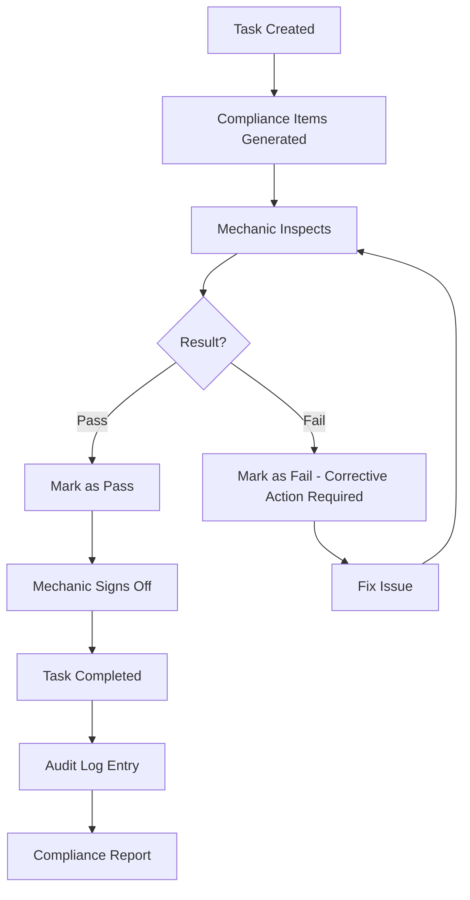

# AMSS User Guide: Compliance Officer

**Version:** 1.0
**Last Updated:** 2024-01-15
**Applies To:** AMSS v1.x
**Audience:** Compliance Officers, Quality Assurance Auditors
**Role:** `auditor`
**Review Date:** Quarterly

---

## Document Overview

This guide is written for **Compliance Officers** and **Quality Assurance Auditors** who are responsible for ensuring regulatory compliance, conducting audits, and preparing for FAA/EASA inspections. You will learn how to generate compliance reports, review audit trails, verify task completion records, and prepare regulatory documentation.

**What you will learn:**
- How to generate compliance reports for FAA/EASA inspections
- How to review audit logs and verify data integrity
- How to check compliance rates and identify risks
- How to investigate overdue maintenance and non-compliance
- How to prepare for annual audits and regulatory data requests

**Prerequisite reading:**
- [00_ORIENTATION.md](./00_ORIENTATION.md) - Understand basic AMSS concepts

---

## Table of Contents

### Part I: Orientation
1. [Your Role as Compliance Officer](#your-role-as-compliance-officer)
2. [Regulatory Framework](#regulatory-framework)
3. [Your Dashboard Overview](#your-dashboard-overview)
4. [Mental Model: Compliance & Audit](#mental-model-compliance--audit)

### Part II: Audit & Reporting
5. [Scenario 1: Generate Compliance Report for FAA Inspection](#scenario-1-generate-compliance-report-for-faa-inspection)
6. [Scenario 2: Review Audit Logs](#scenario-2-review-audit-logs)
7. [Scenario 3: Verify Task Completion Signatures](#scenario-3-verify-task-completion-signatures)
8. [Scenario 4: Check Compliance Rate by Aircraft](#scenario-4-check-compliance-rate-by-aircraft)
9. [Scenario 5: Investigate Overdue Maintenance](#scenario-5-investigate-overdue-maintenance)

### Part III: Regulatory Compliance
10. [Scenario 6: Respond to FAA/EASA Data Request](#scenario-6-respond-to-faaeasa-data-request)
11. [Scenario 7: Prepare for Annual Audit](#scenario-7-prepare-for-annual-audit)

### Part IV: Reference
12. [Error Messages & Recovery](#error-messages--recovery)
13. [Compliance Checklist](#compliance-checklist)
14. [Regulatory References](#regulatory-references)

---

# Part I: Orientation

## Your Role as Compliance Officer

As a **Compliance Officer** (role: `auditor`), you are the guardian of regulatory compliance and data integrity for your aviation organization. Your responsibilities include:

### Primary Responsibilities

1. **Regulatory Compliance Monitoring**
   - Ensure all maintenance activities comply with FAA Part 43, Part 91.417, or EASA Part-M
   - Verify that maintenance records meet retention and traceability requirements
   - Monitor compliance rates and identify non-compliance risks

2. **Audit Trail Verification**
   - Review audit logs for data integrity and accountability
   - Verify that all maintenance actions are properly documented and signed
   - Investigate anomalies or suspicious activity in audit trails

3. **Inspection Preparation**
   - Generate compliance reports for FAA/EASA inspections
   - Prepare documentation packages for regulatory audits
   - Respond to data requests from regulatory authorities

4. **Quality Assurance**
   - Monitor task completion rates and identify trends
   - Review compliance sign-offs for accuracy and completeness
   - Ensure proper parts traceability and documentation

### What You CAN Do (Read-Only Access)

✅ **View all system data** - aircraft, tasks, programs, parts, compliance items
✅ **Generate compliance reports** - summary reports, compliance metrics
✅ **Export audit logs** - CSV exports for regulatory submission
✅ **Review audit trails** - complete history of all system changes
✅ **Verify signatures** - check mechanic sign-offs and timestamps

### What You CANNOT Do

❌ **Modify maintenance data** - tasks, programs, aircraft, parts
❌ **Assign tasks** - scheduling is handled by planners
❌ **Complete tasks** - execution is handled by mechanics
❌ **Delete records** - data integrity is protected
❌ **Override compliance rules** - regulatory requirements are enforced

### A Day in Your Life

**8:00 AM** - Review overnight task completions and compliance sign-offs
**9:00 AM** - Generate weekly compliance summary for management
**10:00 AM** - Investigate flagged overdue maintenance items
**11:00 AM** - Verify audit trail for tasks completed yesterday
**1:00 PM** - Prepare documentation for upcoming FAA inspection
**3:00 PM** - Review compliance trends and identify risk areas
**4:00 PM** - Export audit logs for quarterly backup

---

## Regulatory Framework

AMSS is designed to support compliance with multiple regulatory frameworks. As a Compliance Officer, you must understand which regulations apply to your organization.

### FAA Regulations (United States)

#### 14 CFR Part 43 - Maintenance, Preventive Maintenance, Rebuilding, and Alteration
- **§43.9**: Maintenance record entries - requires signature, certificate number, kind of certificate held
- **§43.11**: Content, form, and disposition of records
- **§43.12**: Maintenance records - must include description of work, date, signature, certificate info

#### 14 CFR Part 91.417 - Maintenance Records
- **§91.417(a)(1)**: Records of maintenance, preventive maintenance, and alterations
- **§91.417(a)(2)**: Records of 100-hour, annual, or other required inspections
- **§91.417(b)**: Retention requirements
  - Current status records: retained and transferred with aircraft
  - Records of inspections: 1 year after work is performed
  - Total time records: permanent retention

#### 14 CFR Part 135/121 - Commercial Operations
- Additional requirements for commercial operators
- Enhanced documentation and audit trail requirements
- More stringent compliance monitoring

### EASA Regulations (European Union)

#### Part-M (Continuing Airworthiness)
- **M.A.305**: Aircraft maintenance programme
- **M.A.306**: Aircraft continuing airworthiness record system
- **M.A.401**: Maintenance organisation approval requirements

#### Part-145 (Maintenance Organisation Approvals)
- **145.A.55**: Maintenance records
- **145.A.60**: Occurrence reporting
- **145.A.65**: Safety and quality policy

### AMSS Compliance Features

AMSS helps you meet these regulatory requirements through:

| Regulatory Requirement | AMSS Feature |
|------------------------|--------------|
| **Signature & Certificate** (§43.9) | Digital compliance sign-offs with user ID and timestamp |
| **Work Description** (§43.11) | Task notes, parts used, compliance items |
| **Immutable Records** (Part-M) | Audit logs with complete change history |
| **Traceability** (§43.12) | Parts linked to tasks, aircraft, mechanics |
| **Retention** (§91.417) | Soft-delete protection, audit log preservation |
| **Inspection Records** (Part 135/121) | Compliance reports with date range filtering |

---

## Your Dashboard Overview

When you log in to AMSS with the `auditor` role, you see a **Compliance Dashboard** optimized for monitoring compliance and preparing for audits.

### Dashboard Widgets

```
╔═══════════════════════════════════════════════════════════════════╗
║                    COMPLIANCE DASHBOARD                           ║
╠═══════════════════════════════════════════════════════════════════╣
║                                                                   ║
║  📊 COMPLIANCE SUMMARY                                           ║
║  ┌─────────────────────────────────────────────────────────────┐ ║
║  │ Compliance Rate: 98.2%                    ⚠️ 3 Pending      │ ║
║  │ Signed Items:    245 / 250                                  │ ║
║  │ Last 30 Days:    ✅ 150 Pass  ⚠️ 5 Fail  ⏳ 3 Pending       │ ║
║  └─────────────────────────────────────────────────────────────┘ ║
║                                                                   ║
║  🔍 RECENT AUDIT ACTIVITY                                        ║
║  ┌─────────────────────────────────────────────────────────────┐ ║
║  │ 2024-01-15 14:32  Task #1234  state_change  john.doe        │ ║
║  │ 2024-01-15 14:28  Task #1234  update       john.doe         │ ║
║  │ 2024-01-15 14:15  Part #5678  update       jane.smith       │ ║
║  └─────────────────────────────────────────────────────────────┘ ║
║                                                                   ║
║  ⚠️  OVERDUE MAINTENANCE                                         ║
║  ┌─────────────────────────────────────────────────────────────┐ ║
║  │ N12345  100-Hour Inspection  Due: 2024-01-10  (5 days late) │ ║
║  │ N67890  Oil Change          Due: 2024-01-12  (3 days late)  │ ║
║  └─────────────────────────────────────────────────────────────┘ ║
║                                                                   ║
║  📈 QUICK ACTIONS                                                ║
║  ┌─────────────────────────────────────────────────────────────┐ ║
║  │ [Generate Compliance Report]  [Export Audit Logs]           │ ║
║  │ [Review Pending Sign-Offs]    [Check Overdue Tasks]         │ ║
║  └─────────────────────────────────────────────────────────────┘ ║
╚═══════════════════════════════════════════════════════════════════╝
```

### Key Metrics Explained

**Compliance Rate**
- Percentage of compliance items that have been signed off
- Formula: `(Signed Items / Total Items) × 100`
- Target: >95% for most aviation operations

**Pending Sign-Offs**
- Compliance items awaiting mechanic signature
- These must be resolved before task can be marked complete
- High pending count may indicate workflow bottlenecks

**Pass/Fail/Pending Counts**
- **Pass**: Compliance item met regulatory requirements
- **Fail**: Compliance item failed inspection (requires corrective action)
- **Pending**: Compliance item created but not yet inspected

**Overdue Maintenance**
- Tasks that are past their scheduled end time but not completed
- ⚠️ **REGULATORY RISK**: May result in aircraft being unairworthy
- Requires immediate investigation and corrective action

---

## Mental Model: Compliance & Audit

Understanding how AMSS tracks compliance and audit data is critical for effective monitoring.

### The Compliance Lifecycle



### Key Concepts

#### 1. Compliance Items vs Tasks

```
ONE Maintenance Task → MANY Compliance Items

Example:
"100-Hour Inspection" Task
    ├─ Compliance Item: Engine oil level check (result: pass, signed)
    ├─ Compliance Item: Brake pad thickness (result: pass, signed)
    ├─ Compliance Item: Tire pressure (result: fail, unsigned)
    └─ Compliance Item: Fuel filter inspection (result: pending, unsigned)
```

**Rules:**
- All compliance items must be signed off before task can be completed
- Mechanics can only sign off their own compliance items
- Once signed, compliance items are immutable (audit trail preserved)

#### 2. Audit Logs - Complete Traceability

Every action in AMSS generates an **audit log entry**:

```
AuditLog {
    ID:            uuid
    OrgID:         uuid
    EntityType:    "task" | "part" | "aircraft" | "program" | "compliance"
    EntityID:      uuid
    Action:        "create" | "update" | "delete" | "state_change"
    UserID:        uuid (who did it)
    RequestID:     uuid (for request correlation)
    IPAddress:     string
    UserAgent:     string
    EntityVersion: int (for optimistic locking)
    Timestamp:     RFC3339
    Details:       map[string]any (before/after values)
}
```

**Regulatory Importance:**
- **Immutable**: Audit logs cannot be edited or deleted
- **Traceable**: Every change linked to specific user, time, IP address
- **Complete**: Includes before/after values for all changes
- **Exportable**: CSV export for regulatory submission

#### 3. Compliance Reporting - Aggregated Metrics

Compliance reports provide **read-only aggregated views** of compliance data:

```
ComplianceReport {
    Total:    250  (total compliance items)
    Pass:     230  (items that passed inspection)
    Fail:     17   (items that failed - corrective action taken)
    Pending:  3    (items awaiting inspection)
    Signed:   247  (items signed off by mechanic)
    Unsigned: 3    (items awaiting signature)
}
```

**Filter Options:**
- **Date Range**: `from` / `to` (RFC3339 timestamps)
- **Result**: `pass` | `fail` | `pending`
- **Signed Status**: `true` | `false`
- **Task ID**: Specific task UUID

---

# Part II: Audit & Reporting

## Scenario 1: Generate Compliance Report for FAA Inspection

**GOAL:** Generate a comprehensive compliance report for an upcoming FAA inspection covering the last 12 months.

**WHEN TO USE:**
- Preparing for FAA/EASA inspector visit
- Monthly/quarterly compliance review for management
- Annual audit preparation
- Investigating compliance trends

**PRE-CONDITIONS:**
- [ ] You have `auditor` or `admin` role
- [ ] You know the date range for the inspection period
- [ ] You have identified any specific aircraft or tasks to focus on

---

### HAPPY PATH: Generate Report for Last 12 Months

**Step 1: Navigate to Compliance Reports**

ACTION: From dashboard, click **"Generate Compliance Report"** or navigate to `/reports/compliance`

SYSTEM RESPONSE:
```
╔═══════════════════════════════════════════════════════════════════╗
║                    COMPLIANCE REPORT GENERATOR                    ║
╠═══════════════════════════════════════════════════════════════════╣
║                                                                   ║
║  Organization: AeroMaintain LLC                                  ║
║  Report Date:  2024-01-15                                        ║
║                                                                   ║
║  FILTERS:                                                        ║
║  ┌─────────────────────────────────────────────────────────────┐ ║
║  │ Date Range:                                                  │ ║
║  │   From: [2023-01-15] (YYYY-MM-DD)                           │ ║
║  │   To:   [2024-01-15] (YYYY-MM-DD)                           │ ║
║  │                                                              │ ║
║  │ Result (optional):                                           │ ║
║  │   [ ] Pass only    [ ] Fail only    [ ] Pending only        │ ║
║  │   [✓] All results                                           │ ║
║  │                                                              │ ║
║  │ Signed Status (optional):                                    │ ║
║  │   [ ] Signed only  [ ] Unsigned only  [✓] All              │ ║
║  │                                                              │ ║
║  │ Task ID (optional): [____________] (leave blank for all)    │ ║
║  └─────────────────────────────────────────────────────────────┘ ║
║                                                                   ║
║  [Generate Report]  [Reset Filters]                             ║
╚═══════════════════════════════════════════════════════════════════╝
```

---

**Step 2: Set Date Range for Last 12 Months**

ACTION: Enter date range
- From: `2023-01-15`
- To: `2024-01-15`
- Leave all other filters as default (All results, All signed status)

API CALL:
```bash
GET /api/v1/reports/compliance?from=2023-01-15T00:00:00Z&to=2024-01-15T23:59:59Z
```

SYSTEM RESPONSE:
```json
{
  "total": 1250,
  "pass": 1180,
  "fail": 65,
  "pending": 5,
  "signed": 1245,
  "unsigned": 5
}
```

SCREEN UPDATE:
```
╔═══════════════════════════════════════════════════════════════════╗
║                      COMPLIANCE REPORT RESULTS                    ║
╠═══════════════════════════════════════════════════════════════════╣
║                                                                   ║
║  Report Period: 2023-01-15 to 2024-01-15                         ║
║  Organization:  AeroMaintain LLC                                 ║
║  Generated:     2024-01-15 10:30:00 UTC                          ║
║                                                                   ║
║  📊 SUMMARY METRICS                                              ║
║  ┌─────────────────────────────────────────────────────────────┐ ║
║  │ Total Compliance Items:        1,250                         │ ║
║  │ Compliance Rate:               99.6%  (1,245 / 1,250)       │ ║
║  │                                                              │ ║
║  │ INSPECTION RESULTS:                                          │ ║
║  │   ✅ Pass:        1,180  (94.4%)                            │ ║
║  │   ❌ Fail:           65  (5.2%)  ⚠️ Corrective Action Taken │ ║
║  │   ⏳ Pending:         5  (0.4%)  ⚠️ Requires Attention      │ ║
║  │                                                              │ ║
║  │ SIGNATURE STATUS:                                            │ ║
║  │   ✅ Signed:     1,245  (99.6%)                             │ ║
║  │   ⚠️  Unsigned:      5  (0.4%)  ⚠️ Requires Sign-Off        │ ║
║  └─────────────────────────────────────────────────────────────┘ ║
║                                                                   ║
║  [Export to PDF]  [Export to CSV]  [Print]                      ║
╚═══════════════════════════════════════════════════════════════════╝
```

---

**Step 3: Interpret Results for FAA Inspector**

✅ **COMPLIANCE RATE: 99.6%**
- Excellent compliance rate (target: >95%)
- 1,245 of 1,250 items properly signed off
- Demonstrates effective quality management system

⚠️ **PENDING ITEMS: 5 (0.4%)**
- These items are awaiting inspection
- Not yet signed off by mechanic
- **ACTION REQUIRED**: Investigate why these are pending

❌ **FAILED ITEMS: 65 (5.2%)**
- Items that initially failed inspection
- **IMPORTANT**: These represent corrective action, not non-compliance
- All failed items should have subsequent "pass" entries after corrective action

---

**Step 4: Export Report for FAA Inspector**

ACTION: Click **"Export to CSV"** button

API CALL:
```bash
GET /api/v1/reports/compliance?from=2023-01-15T00:00:00Z&to=2024-01-15T23:59:59Z&format=csv
```

SYSTEM RESPONSE: Downloads `compliance-report-2024-01-15.csv`

CSV FORMAT:
```csv
id,org_id,task_id,description,result,sign_off_user_id,sign_off_time,created_at
uuid1,org-uuid,task-uuid,"Engine oil level check","pass",mechanic-uuid,"2024-01-10T14:30:00Z","2024-01-10T08:00:00Z"
uuid2,org-uuid,task-uuid,"Brake pad thickness","pass",mechanic-uuid,"2024-01-10T14:35:00Z","2024-01-10T08:00:00Z"
uuid3,org-uuid,task-uuid,"Tire pressure","fail",mechanic-uuid,"2024-01-10T15:00:00Z","2024-01-10T08:00:00Z"
...
```

---

**Step 5: Present Report to FAA Inspector**

✅ **WHAT TO TELL THE INSPECTOR:**

1. **Compliance Rate**: "Our organization maintains a 99.6% compliance rate for the inspection period."

2. **Failed Items**: "The 65 failed items represent our quality control process. All failures were identified during initial inspection and corrective action was taken before task completion."

3. **Pending Items**: "The 5 pending items are from tasks currently in progress. These will be signed off before tasks are marked complete."

4. **Audit Trail**: "All compliance sign-offs are digitally signed with mechanic ID and timestamp. We can provide complete audit logs for any specific item."

5. **Retention**: "All compliance records are retained in accordance with 14 CFR §91.417(b). Electronic records are backed up daily."

---

### COMMON FAILURES

| Symptom | Cause | Recovery |
|---------|-------|----------|
| **"Forbidden: auditor role required"** | Your user account does not have `auditor` or `admin` role | Contact system administrator to assign correct role |
| **"No data returned"** | Date range has no completed tasks | Verify date range is correct; check that tasks exist in that period |
| **Low compliance rate (<90%)** | Many unsigned compliance items | Use Scenario 3 to identify unsigned items and follow up with mechanics |
| **High "pending" count** | Tasks in progress with incomplete inspections | Use Scenario 5 to investigate tasks stuck in `in_progress` state |
| **Export fails or empty file** | No data matches filters | Remove filters and retry; check date range format (RFC3339) |

---

### VERIFICATION

✅ **How to confirm success:**

1. **Report Generated**: CSV file downloads successfully
2. **Metrics Make Sense**: Total = Pass + Fail + Pending
3. **Compliance Rate Calculated**: Signed / Total ≈ expected value
4. **Date Range Correct**: Report covers requested time period
5. **Inspector Satisfied**: Report meets FAA/EASA documentation requirements

---

### RELATED SCENARIOS

→ **Next Step**: [Scenario 2: Review Audit Logs](#scenario-2-review-audit-logs) - Verify specific compliance item signatures
→ **Investigation**: [Scenario 5: Investigate Overdue Maintenance](#scenario-5-investigate-overdue-maintenance) - Follow up on pending items
→ **Annual Audit**: [Scenario 7: Prepare for Annual Audit](#scenario-7-prepare-for-annual-audit) - Complete audit preparation

---

## Scenario 2: Review Audit Logs

**GOAL:** Review audit logs to verify data integrity, investigate specific actions, or prepare for regulatory audit.

**WHEN TO USE:**
- Investigating suspicious activity or data anomalies
- Verifying who made specific changes and when
- Preparing for FAA/EASA audit (demonstrating traceability)
- Responding to security incidents
- Monthly audit log review (quality assurance)

**PRE-CONDITIONS:**
- [ ] You have `auditor` or `admin` role
- [ ] You know what you're looking for (entity type, user, date range, etc.)
- [ ] You understand audit log structure (see [Mental Model](#mental-model-compliance--audit))

---

### HAPPY PATH: Review Task State Changes for Specific Aircraft

**Scenario Context:** You need to verify all maintenance state changes for aircraft N12345 in the last month for an FAA inspector.

---

**Step 1: Navigate to Audit Logs**

ACTION: From dashboard, click **"Export Audit Logs"** or navigate to `/audit-logs`

SYSTEM RESPONSE:
```
╔═══════════════════════════════════════════════════════════════════╗
║                        AUDIT LOG VIEWER                           ║
╠═══════════════════════════════════════════════════════════════════╣
║                                                                   ║
║  FILTERS:                                                        ║
║  ┌─────────────────────────────────────────────────────────────┐ ║
║  │ Entity Type:  [task ▼]  (task, aircraft, part, program...)  │ ║
║  │ Entity ID:    [____________] (UUID - optional)              │ ║
║  │ User ID:      [____________] (UUID - optional)              │ ║
║  │ Action:       [All ▼]  (create, update, delete, state_change)│ ║
║  │                                                              │ ║
║  │ Date Range:                                                  │ ║
║  │   From: [2023-12-15T00:00:00Z]                             │ ║
║  │   To:   [2024-01-15T23:59:59Z]                             │ ║
║  │                                                              │ ║
║  │ Limit:  [100 ▼]  Offset: [0]                               │ ║
║  └─────────────────────────────────────────────────────────────┘ ║
║                                                                   ║
║  [Search]  [Export to CSV]  [Reset Filters]                     ║
╚═══════════════════════════════════════════════════════════════════╝
```

---

**Step 2: Filter for Task State Changes**

ACTION:
1. Set **Entity Type**: `task`
2. Set **Action**: `state_change`
3. Set **Date Range**: Last 30 days
4. Click **"Search"**

API CALL:
```bash
GET /api/v1/audit-logs?entity_type=task&action=state_change&from=2023-12-15T00:00:00Z&to=2024-01-15T23:59:59Z&limit=100
```

SYSTEM RESPONSE:
```json
[
  {
    "id": "audit-uuid-1",
    "org_id": "org-uuid",
    "entity_type": "task",
    "entity_id": "task-uuid-1234",
    "action": "state_change",
    "user_id": "mechanic-uuid-john",
    "request_id": "req-uuid-1",
    "ip_address": "192.168.1.10",
    "user_agent": "Mozilla/5.0...",
    "entity_version": 3,
    "timestamp": "2024-01-10T14:32:15Z",
    "details": {
      "old_state": "in_progress",
      "new_state": "completed",
      "aircraft_id": "aircraft-uuid-n12345",
      "task_type": "inspection"
    }
  },
  {
    "id": "audit-uuid-2",
    "entity_type": "task",
    "entity_id": "task-uuid-1234",
    "action": "state_change",
    "user_id": "mechanic-uuid-john",
    "timestamp": "2024-01-10T08:15:00Z",
    "details": {
      "old_state": "scheduled",
      "new_state": "in_progress",
      "aircraft_id": "aircraft-uuid-n12345"
    }
  }
]
```

SCREEN UPDATE:
```
╔═══════════════════════════════════════════════════════════════════╗
║                      AUDIT LOG RESULTS                            ║
╠═══════════════════════════════════════════════════════════════════╣
║  Showing 15 results (filtered by: task, state_change, last 30 days)║
║                                                                   ║
║  ┌─────────────────────────────────────────────────────────────┐ ║
║  │ 2024-01-10 14:32:15 UTC                                      │ ║
║  │ Entity: Task #1234 (100-Hour Inspection, N12345)            │ ║
║  │ Action: STATE_CHANGE (in_progress → completed)              │ ║
║  │ User:   John Doe (mechanic-uuid-john)                       │ ║
║  │ IP:     192.168.1.10                                        │ ║
║  │ Details: {"old_state": "in_progress", "new_state": ...}     │ ║
║  │ [View Full Details]                                         │ ║
║  └─────────────────────────────────────────────────────────────┘ ║
║                                                                   ║
║  ┌─────────────────────────────────────────────────────────────┐ ║
║  │ 2024-01-10 08:15:00 UTC                                      │ ║
║  │ Entity: Task #1234 (100-Hour Inspection, N12345)            │ ║
║  │ Action: STATE_CHANGE (scheduled → in_progress)              │ ║
║  │ User:   John Doe (mechanic-uuid-john)                       │ ║
║  │ IP:     192.168.1.10                                        │ ║
║  │ Details: {"old_state": "scheduled", "new_state": ...}       │ ║
║  │ [View Full Details]                                         │ ║
║  └─────────────────────────────────────────────────────────────┘ ║
║                                                                   ║
║  ... (13 more entries)                                           ║
║                                                                   ║
║  [Previous Page]  Page 1 of 1  [Next Page]                      ║
╚═══════════════════════════════════════════════════════════════════╝
```

---

**Step 3: Verify Audit Trail Integrity**

✅ **WHAT TO CHECK:**

1. **Timeline Makes Sense**
   - `scheduled → in_progress` happened before `in_progress → completed`
   - Time gap between transitions is reasonable (task duration)
   - Start time not more than 5 minutes before scheduled start

2. **Same User Performed Both Transitions**
   - User who started task is same user who completed it
   - User has `mechanic` role (verify in user management)
   - User was assigned to the task (check task assignment)

3. **IP Address Consistency**
   - IP address matches expected location (shop floor, not remote)
   - If IP changes, verify it's still within organization network

4. **Entity Version Increments**
   - Entity version increments sequentially (1 → 2 → 3)
   - No gaps in version numbers (indicates missing data)

5. **Details Field Contains Expected Data**
   - `old_state` and `new_state` are valid task states
   - Aircraft ID matches expected aircraft
   - Task type is correct

---

**Step 4: Export Audit Logs for Inspector**

ACTION: Click **"Export to CSV"** button

API CALL:
```bash
GET /api/v1/audit-logs/export?entity_type=task&action=state_change&from=2023-12-15T00:00:00Z&to=2024-01-15T23:59:59Z
```

SYSTEM RESPONSE: Downloads `audit-logs-2024-01-15.csv`

CSV FORMAT:
```csv
id,org_id,entity_type,entity_id,action,user_id,request_id,ip_address,user_agent,entity_version,timestamp,details
audit-uuid-1,org-uuid,task,task-uuid-1234,state_change,mechanic-uuid-john,req-uuid-1,192.168.1.10,"Mozilla/5.0...",3,2024-01-10T14:32:15Z,"{""old_state"":""in_progress"",""new_state"":""completed""}"
audit-uuid-2,org-uuid,task,task-uuid-1234,state_change,mechanic-uuid-john,req-uuid-2,192.168.1.10,"Mozilla/5.0...",2,2024-01-10T08:15:00Z,"{""old_state"":""scheduled"",""new_state"":""in_progress""}"
```

---

### COMMON FAILURES

| Symptom | Cause | Recovery |
|---------|-------|----------|
| **"Forbidden: access denied"** | Non-auditor role trying to export | Only `auditor` and `admin` can export audit logs (List is available to all) |
| **"Too many results"** | Query returned more than 10,000 entries | Add more specific filters (date range, entity ID, user ID) or use pagination |
| **"Invalid date format"** | Date not in RFC3339 format | Use format: `2024-01-15T14:30:00Z` (not `2024-01-15`) |
| **Missing entity details** | Entity was soft-deleted | Details field will still contain historical data; entity may no longer be retrievable |
| **Gaps in entity versions** | Data integrity issue or concurrent updates | Investigate using request_id correlation; may indicate system issue |

---

### VERIFICATION

✅ **How to confirm audit trail is complete:**

1. **Sequential Versions**: Entity versions increment without gaps
2. **Consistent User**: Same user performed related actions
3. **Reasonable Timeline**: Timestamps follow logical order
4. **Complete Details**: All state transitions have before/after values
5. **Export Successful**: CSV contains all expected entries

---

### RELATED SCENARIOS

→ **Compliance**: [Scenario 1: Generate Compliance Report](#scenario-1-generate-compliance-report-for-faa-inspection)
→ **Signatures**: [Scenario 3: Verify Task Completion Signatures](#scenario-3-verify-task-completion-signatures)
→ **Investigation**: Use audit logs to track down who made specific changes

---

## Scenario 3: Verify Task Completion Signatures

**GOAL:** Verify that all compliance items for a completed task have valid mechanic signatures and meet regulatory requirements.

**WHEN TO USE:**
- Responding to FAA/EASA request for specific task documentation
- Investigating unsigned compliance items flagged in reports
- Quality assurance review of completed tasks
- Verifying mechanic certification and signature authority

**PRE-CONDITIONS:**
- [ ] You have `auditor` or `admin` role
- [ ] You have the task ID or know how to find it
- [ ] You understand compliance item structure (see [Mental Model](#mental-model-compliance--audit))

---

### HAPPY PATH: Verify Signatures for Completed 100-Hour Inspection

**Scenario Context:** FAA inspector requests verification that Task #1234 (100-Hour Inspection on N12345) has all required signatures.

---

**Step 1: Locate the Task**

ACTION: Navigate to **Tasks** → **Search Tasks** → Enter Task ID `1234`

SYSTEM RESPONSE:
```
╔═══════════════════════════════════════════════════════════════════╗
║                          TASK DETAILS                             ║
╠═══════════════════════════════════════════════════════════════════╣
║  Task ID:       1234                                             ║
║  Aircraft:      N12345 (Cessna 172S)                             ║
║  Type:          inspection                                       ║
║  State:         completed ✅                                     ║
║  Scheduled:     2024-01-10 08:00 - 16:00 UTC                     ║
║  Mechanic:      John Doe (mechanic-uuid-john)                    ║
║  Completed:     2024-01-10 14:32:15 UTC                          ║
║                                                                   ║
║  Notes: "Completed 100-hour inspection per FAA AD 2023-XX-XX.    ║
║          All items inspected and signed off. No discrepancies."  ║
╚═══════════════════════════════════════════════════════════════════╝
```

---

**Step 2: View Compliance Items**

ACTION: Scroll down to **Compliance Items** section or click **"View Compliance"** tab

SYSTEM RESPONSE:
```
╔═══════════════════════════════════════════════════════════════════╗
║                      COMPLIANCE ITEMS                             ║
╠═══════════════════════════════════════════════════════════════════╣
║  Task #1234: 100-Hour Inspection                                 ║
║  Total Items: 12  |  Signed: 12  |  Compliance Rate: 100%       ║
║                                                                   ║
║  ┌─────────────────────────────────────────────────────────────┐ ║
║  │ ✅ ITEM 1: Engine oil level check                           │ ║
║  │    Result: PASS                                              │ ║
║  │    Signed: John Doe (mechanic-uuid-john)                    │ ║
║  │    Time:   2024-01-10 09:15:00 UTC                          │ ║
║  │    Cert:   A&P Mechanic #123456789                          │ ║
║  └─────────────────────────────────────────────────────────────┘ ║
║                                                                   ║
║  ┌─────────────────────────────────────────────────────────────┐ ║
║  │ ✅ ITEM 2: Brake pad thickness measurement                  │ ║
║  │    Result: PASS                                              │ ║
║  │    Signed: John Doe (mechanic-uuid-john)                    │ ║
║  │    Time:   2024-01-10 10:30:00 UTC                          │ ║
║  │    Cert:   A&P Mechanic #123456789                          │ ║
║  └─────────────────────────────────────────────────────────────┘ ║
║                                                                   ║
║  ┌─────────────────────────────────────────────────────────────┐ ║
║  │ ✅ ITEM 3: Tire pressure inspection                         │ ║
║  │    Result: FAIL → PASS (after corrective action)            │ ║
║  │    Signed: John Doe (mechanic-uuid-john)                    │ ║
║  │    Time:   2024-01-10 11:45:00 UTC                          │ ║
║  │    Cert:   A&P Mechanic #123456789                          │ ║
║  │    Notes:  "Initially 25 PSI (low). Inflated to 30 PSI."    │ ║
║  └─────────────────────────────────────────────────────────────┘ ║
║                                                                   ║
║  ... (9 more items, all signed)                                  ║
║                                                                   ║
║  [Export Compliance Report]  [View Audit Trail]                 ║
╚═══════════════════════════════════════════════════════════════════╝
```

---

**Step 3: Verify Signature Validity**

✅ **REGULATORY REQUIREMENTS (14 CFR §43.9):**

Each signature must include:
1. ✅ **Signature** - Digital signature with mechanic user ID
2. ✅ **Certificate Number** - A&P Mechanic certificate number
3. ✅ **Type of Certificate** - "A&P Mechanic" (Airframe & Powerplant)
4. ✅ **Date** - Timestamp when work was performed and signed

**VERIFICATION CHECKLIST:**

- [ ] **All Items Signed**: 12 / 12 compliance items have signatures (100%)
- [ ] **Same Mechanic**: All signatures from assigned mechanic (John Doe)
- [ ] **Timeline Consistency**: Signatures between task start (08:00) and completion (14:32)
- [ ] **Certificate Valid**: Verify A&P certificate #123456789 is current (check FAA Airmen Registry)
- [ ] **Results Valid**: All items marked `pass` or `fail` (no `pending`)
- [ ] **Corrective Action**: Failed items have notes explaining corrective action

---

**Step 4: Cross-Reference with Audit Logs**

ACTION: Click **"View Audit Trail"** to see complete history

API CALL:
```bash
GET /api/v1/audit-logs?entity_type=compliance&entity_id=compliance-item-uuid-3&action=update
```

SYSTEM RESPONSE:
```json
[
  {
    "id": "audit-uuid-compliance-3",
    "entity_type": "compliance",
    "entity_id": "compliance-item-uuid-3",
    "action": "update",
    "user_id": "mechanic-uuid-john",
    "timestamp": "2024-01-10T11:45:00Z",
    "details": {
      "old_result": "fail",
      "new_result": "pass",
      "sign_off_time": "2024-01-10T11:45:00Z",
      "sign_off_user_id": "mechanic-uuid-john",
      "notes": "Initially 25 PSI (low). Inflated to 30 PSI."
    }
  },
  {
    "id": "audit-uuid-compliance-3-initial",
    "entity_type": "compliance",
    "entity_id": "compliance-item-uuid-3",
    "action": "update",
    "user_id": "mechanic-uuid-john",
    "timestamp": "2024-01-10T11:00:00Z",
    "details": {
      "old_result": "pending",
      "new_result": "fail",
      "notes": "Tire pressure measured at 25 PSI (spec: 30 PSI)"
    }
  }
]
```

✅ **AUDIT TRAIL SHOWS:**
- 11:00 UTC: Mechanic inspected tire, found it failed (25 PSI, below spec)
- 11:45 UTC: Mechanic inflated tire to 30 PSI, re-inspected, marked as pass, signed off
- Complete traceability from discovery to corrective action to sign-off

---

**Step 5: Generate Signature Report for Inspector**

ACTION: Click **"Export Compliance Report"** with signatures

SYSTEM RESPONSE: Downloads `task-1234-compliance-signatures.pdf`

PDF CONTAINS:
```
╔═══════════════════════════════════════════════════════════════════╗
║              COMPLIANCE SIGNATURE VERIFICATION REPORT             ║
╠═══════════════════════════════════════════════════════════════════╣
║                                                                   ║
║  Task ID:        1234                                            ║
║  Aircraft:       N12345 (Cessna 172S, S/N 172S12345)             ║
║  Description:    100-Hour Inspection                             ║
║  Date:           2024-01-10                                      ║
║  Mechanic:       John Doe                                        ║
║  Certificate:    A&P Mechanic #123456789 (exp: 2025-06-30)      ║
║                                                                   ║
║  COMPLIANCE SUMMARY:                                             ║
║  ┌─────────────────────────────────────────────────────────────┐ ║
║  │ Total Items:       12                                        │ ║
║  │ Items Passed:      12 (100%)                                │ ║
║  │ Items Failed:      0  (corrective action taken)             │ ║
║  │ Items Signed:      12 (100%)                                │ ║
║  │ Compliance Rate:   100%                                     │ ║
║  └─────────────────────────────────────────────────────────────┘ ║
║                                                                   ║
║  SIGNATURE DETAILS:                                              ║
║  ┌──┬──────────────────────────┬────────┬──────────────────────┐ ║
║  │# │ Description              │ Result │ Sign-Off Time        │ ║
║  ├──┼──────────────────────────┼────────┼──────────────────────┤ ║
║  │1 │ Engine oil level check   │ PASS   │ 2024-01-10 09:15 UTC│ ║
║  │2 │ Brake pad thickness      │ PASS   │ 2024-01-10 10:30 UTC│ ║
║  │3 │ Tire pressure (corrected)│ PASS   │ 2024-01-10 11:45 UTC│ ║
║  │...│ ...                     │ ...    │ ...                 │ ║
║  │12│ Final inspection sign-off│ PASS   │ 2024-01-10 14:30 UTC│ ║
║  └──┴──────────────────────────┴────────┴──────────────────────┘ ║
║                                                                   ║
║  REGULATORY COMPLIANCE:                                          ║
║  ✅ 14 CFR §43.9 - Signature and certificate number recorded    ║
║  ✅ 14 CFR §43.11 - Work description and date recorded          ║
║  ✅ 14 CFR §91.417 - Records retained and available             ║
║                                                                   ║
║  Digitally signed: 2024-01-10 14:32:15 UTC                      ║
║  Report generated: 2024-01-15 10:45:00 UTC by Auditor (you)     ║
╚═══════════════════════════════════════════════════════════════════╝
```

---

### COMMON FAILURES

| Symptom | Cause | Recovery |
|---------|-------|----------|
| **"Unsigned compliance items found"** | Mechanic forgot to sign off before completing task | Task cannot be completed until all items signed; contact mechanic to sign |
| **"Sign-off user is not assigned mechanic"** | Different mechanic signed off (multi-person task) | Verify second mechanic was authorized; update task notes to explain |
| **"Certificate number not found"** | Mechanic profile missing A&P certificate | Contact admin to update mechanic profile with certificate info |
| **"Sign-off time after task completion"** | Clock skew or data integrity issue | Review audit logs; may indicate backdated signature (regulatory violation) |
| **"Result is 'pending' but signed"** | Data corruption or invalid state | Cannot happen in normal workflow; escalate to system admin |

---

### VERIFICATION

✅ **How to confirm signatures are valid:**

1. **All Items Signed**: No items with `sign_off_time = null`
2. **Timeline Valid**: All signatures between task start and completion time
3. **Same Mechanic**: All signatures from assigned mechanic (or documented multi-person)
4. **Certificate Valid**: A&P certificate is current (not expired)
5. **Results Valid**: No items in `pending` state
6. **Audit Trail Complete**: No gaps or anomalies in audit log

---

### RELATED SCENARIOS

→ **Audit Logs**: [Scenario 2: Review Audit Logs](#scenario-2-review-audit-logs) - Deep dive into signature timeline
→ **Compliance Report**: [Scenario 1: Generate Compliance Report](#scenario-1-generate-compliance-report-for-faa-inspection) - Organization-wide signature compliance
→ **Mechanic Guide**: [03_MECHANIC_TECHNICIAN.md Scenario 4](./03_MECHANIC_TECHNICIAN.md#scenario-4-complete-a-maintenance-task) - How mechanics sign off compliance items

---

## Scenario 4: Check Compliance Rate by Aircraft

**GOAL:** Monitor compliance rates for specific aircraft to identify maintenance quality issues or aircraft-specific problems.

**WHEN TO USE:**
- Monthly quality assurance review
- Investigating aircraft with recurring maintenance issues
- Preparing for aircraft sale/transfer (compliance history)
- Identifying high-risk aircraft for increased oversight

**PRE-CONDITIONS:**
- [ ] You have `auditor` or `admin` role
- [ ] You know the aircraft registration or ID
- [ ] You have defined time period for analysis

---

### HAPPY PATH: Check Compliance Rate for N12345 (Last 6 Months)

**Scenario Context:** Management wants to know if aircraft N12345 has compliance issues before renewing its lease.

---

**Step 1: Navigate to Aircraft Compliance View**

ACTION: Dashboard → **"Aircraft Compliance"** or Navigate to `/aircraft/{aircraft_id}/compliance`

SYSTEM RESPONSE:
```
╔═══════════════════════════════════════════════════════════════════╗
║                  AIRCRAFT COMPLIANCE ANALYSIS                     ║
╠═══════════════════════════════════════════════════════════════════╣
║                                                                   ║
║  Aircraft: N12345 (Cessna 172S, S/N 172S12345)                   ║
║  Owner:    AeroMaintain LLC                                      ║
║  Status:   Active                                                ║
║                                                                   ║
║  ANALYSIS PERIOD:                                                ║
║  From: [2023-07-15] To: [2024-01-15] (Last 6 months)            ║
║                                                                   ║
║  [Generate Report]                                               ║
╚═══════════════════════════════════════════════════════════════════╝
```

---

**Step 2: Generate 6-Month Compliance Report**

ACTION: Set date range and click **"Generate Report"**

API CALL:
```bash
GET /api/v1/reports/compliance?aircraft_id={aircraft-uuid-n12345}&from=2023-07-15T00:00:00Z&to=2024-01-15T23:59:59Z
```

SYSTEM RESPONSE:
```
╔═══════════════════════════════════════════════════════════════════╗
║            AIRCRAFT N12345 - COMPLIANCE REPORT                    ║
╠═══════════════════════════════════════════════════════════════════╣
║  Period: 2023-07-15 to 2024-01-15 (6 months)                     ║
║                                                                   ║
║  📊 OVERALL COMPLIANCE                                           ║
║  ┌─────────────────────────────────────────────────────────────┐ ║
║  │ Compliance Rate:  96.5%  (⚠️ Below target 98%)              │ ║
║  │ Total Items:      200                                        │ ║
║  │ Signed Items:     193                                        │ ║
║  │ Unsigned Items:   7  ⚠️                                      │ ║
║  └─────────────────────────────────────────────────────────────┘ ║
║                                                                   ║
║  📈 INSPECTION RESULTS                                           ║
║  ┌─────────────────────────────────────────────────────────────┐ ║
║  │ ✅ Pass:      170  (85.0%)                                  │ ║
║  │ ❌ Fail:       23  (11.5%)  ⚠️ Higher than fleet average    │ ║
║  │ ⏳ Pending:     7  (3.5%)                                   │ ║
║  └─────────────────────────────────────────────────────────────┘ ║
║                                                                   ║
║  🔍 FAILURE BREAKDOWN (Top Issues)                               ║
║  ┌─────────────────────────────────────────────────────────────┐ ║
║  │ 1. Tire pressure (low)           - 8 occurrences            │ ║
║  │ 2. Brake pad wear                - 5 occurrences            │ ║
║  │ 3. Oil level (low)               - 4 occurrences            │ ║
║  │ 4. Fuel filter contamination     - 3 occurrences            │ ║
║  │ 5. Other                         - 3 occurrences            │ ║
║  └─────────────────────────────────────────────────────────────┘ ║
║                                                                   ║
║  ⚠️  COMPLIANCE RISK ASSESSMENT                                  ║
║  ┌─────────────────────────────────────────────────────────────┐ ║
║  │ Risk Level: MODERATE                                         │ ║
║  │                                                              │ ║
║  │ Concerns:                                                    │ ║
║  │ • Compliance rate below target (96.5% vs 98% target)        │ ║
║  │ • Failure rate above fleet average (11.5% vs 7% fleet avg)  │ ║
║  │ • Recurring tire pressure issues (potential slow leak)      │ ║
║  │ • Brake pad wear trending higher than similar aircraft      │ ║
║  │                                                              │ ║
║  │ Recommendations:                                             │ ║
║  │ 1. Investigate tire pressure issue (check for slow leak)    │ ║
║  │ 2. Review brake pad replacement schedule                    │ ║
║  │ 3. Increase inspection frequency for next 3 months          │ ║
║  │ 4. Follow up on 7 unsigned compliance items                 │ ║
║  └─────────────────────────────────────────────────────────────┘ ║
║                                                                   ║
║  [View All Failed Items]  [Export to PDF]  [Compare to Fleet]   ║
╚═══════════════════════════════════════════════════════════════════╝
```

---

**Step 3: Interpret Results**

⚠️ **COMPLIANCE RATE: 96.5% (Below Target)**

**What it means:**
- 193 of 200 compliance items signed off (7 pending)
- Target compliance rate is typically 98% or higher
- Below-target rate may indicate:
  - Quality assurance issues
  - Mechanic workload problems
  - Aircraft-specific maintenance challenges

**Action Required:**
1. Investigate the 7 unsigned items (are they from recent in-progress tasks?)
2. Review with maintenance planner to ensure follow-up
3. If items are old, escalate to management

---

❌ **FAILURE RATE: 11.5% (Above Fleet Average)**

**What it means:**
- 23 out of 200 items initially failed inspection
- Fleet average is 7%, so this aircraft is 64% above average
- **IMPORTANT**: "Failures" are not necessarily bad - they indicate quality control
- All failed items should have corrective action and subsequent "pass" result

**Concerning Pattern:**
- **Tire pressure (8 failures)**: Potential slow leak or improper inflation procedures
- **Brake pad wear (5 failures)**: May indicate heavy usage or need for earlier replacement

**Action Required:**
1. Review maintenance program for tire inspection frequency
2. Consider adding tire pressure monitoring or more frequent checks
3. Review brake pad replacement interval (may need to reduce from standard)
4. Verify all failed items have corrective action documented

---

**Step 4: Compare to Fleet Average**

ACTION: Click **"Compare to Fleet"**

SYSTEM RESPONSE:
```
╔═══════════════════════════════════════════════════════════════════╗
║              FLEET COMPLIANCE COMPARISON                          ║
╠═══════════════════════════════════════════════════════════════════╣
║  Period: Last 6 months                                           ║
║                                                                   ║
║  ┌─────────────────────────────────────────────────────────────┐ ║
║  │ Aircraft    │ Compliance Rate │ Failure Rate │ Risk Level   │ ║
║  ├─────────────┼─────────────────┼──────────────┼──────────────┤ ║
║  │ N12345      │ 96.5% ⚠️        │ 11.5% ⚠️     │ MODERATE ⚠️  │ ║
║  │ N67890      │ 99.1% ✅        │ 5.2% ✅      │ LOW ✅       │ ║
║  │ N11111      │ 98.5% ✅        │ 7.1% ✅      │ LOW ✅       │ ║
║  │ N22222      │ 99.8% ✅        │ 3.1% ✅      │ LOW ✅       │ ║
║  │ FLEET AVG   │ 98.7%           │ 7.0%         │ LOW          │ ║
║  └─────────────┴─────────────────┴──────────────┴──────────────┘ ║
║                                                                   ║
║  ⚠️  N12345 is performing below fleet average on both metrics   ║
╚═══════════════════════════════════════════════════════════════════╝
```

**Conclusion for Management:**
- N12345 requires increased oversight
- Not unsafe to fly (all failures corrected), but trending negative
- Recommend addressing tire/brake issues before lease renewal
- Monitor closely for next 3 months

---

### COMMON FAILURES

| Symptom | Cause | Recovery |
|---------|-------|----------|
| **"No data for aircraft"** | Aircraft ID incorrect or no tasks in period | Verify aircraft registration; expand date range |
| **"100% failure rate"** | Filter set to `result=fail` only | Reset filters to show all results |
| **"Compliance rate >100%"** | Data corruption or calculation error | Impossible value; contact system admin |
| **"Cannot compare to fleet"** | Only one aircraft in organization | Fleet comparison requires multiple aircraft |
| **"Missing failure details"** | Compliance items lack description | Compliance items created before description field added; check audit logs |

---

### VERIFICATION

✅ **How to confirm analysis is accurate:**

1. **Math Checks Out**: (Pass + Fail + Pending) = Total
2. **Compliance Rate Correct**: Signed / Total × 100 = displayed percentage
3. **Failure Rate Correct**: Fail / Total × 100 = displayed percentage
4. **Fleet Average Valid**: Matches separate calculation across all aircraft
5. **Risk Assessment Reasonable**: Risk level matches metrics (>98% = low, 95-98% = moderate, <95% = high)

---

### RELATED SCENARIOS

→ **Investigate Failures**: [Scenario 3: Verify Task Completion Signatures](#scenario-3-verify-task-completion-signatures) - Drill into specific failed items
→ **Overdue Maintenance**: [Scenario 5: Investigate Overdue Maintenance](#scenario-5-investigate-overdue-maintenance) - Check if unsigned items are overdue
→ **Annual Audit**: [Scenario 7: Prepare for Annual Audit](#scenario-7-prepare-for-annual-audit) - Include aircraft analysis in audit prep

---

## Scenario 5: Investigate Overdue Maintenance

**GOAL:** Identify and investigate maintenance tasks that are past their due date but not yet completed, which may indicate airworthiness issues.

**WHEN TO USE:**
- Daily/weekly compliance monitoring
- Responding to FAA airworthiness inquiry
- Investigating aircraft grounding
- Quality assurance review

**PRE-CONDITIONS:**
- [ ] You have `auditor` or `admin` role
- [ ] You understand task lifecycle (see [03_MECHANIC_TECHNICIAN.md](./03_MECHANIC_TECHNICIAN.md))
- [ ] You know the definition of "overdue" for your organization

---

### HAPPY PATH: Investigate All Overdue Tasks

**Scenario Context:** Your dashboard shows 3 overdue maintenance tasks. FAA requires explanation.

---

**Step 1: View Overdue Tasks Dashboard**

ACTION: From dashboard, click **"Overdue Maintenance"** widget or navigate to `/tasks?state=scheduled&overdue=true`

SYSTEM RESPONSE:
```
╔═══════════════════════════════════════════════════════════════════╗
║                      OVERDUE MAINTENANCE TASKS                    ║
╠═══════════════════════════════════════════════════════════════════╣
║  ⚠️  WARNING: Overdue tasks may indicate unairworthy aircraft    ║
║                                                                   ║
║  Showing 3 tasks that are past their scheduled end_time          ║
║                                                                   ║
║  ┌─────────────────────────────────────────────────────────────┐ ║
║  │ ❌ TASK #1234 - 100-Hour Inspection                         │ ║
║  │    Aircraft:    N12345 (Cessna 172S)                        │ ║
║  │    Due Date:    2024-01-10 16:00 UTC                        │ ║
║  │    Days Late:   5 days ⚠️                                   │ ║
║  │    State:       scheduled (not started)                      │ ║
║  │    Assigned:    John Doe (mechanic)                         │ ║
║  │    [View Details]  [View Audit Trail]                       │ ║
║  └─────────────────────────────────────────────────────────────┘ ║
║                                                                   ║
║  ┌─────────────────────────────────────────────────────────────┐ ║
║  │ ⚠️  TASK #5678 - Oil Change                                 │ ║
║  │    Aircraft:    N67890 (Piper PA-28)                        │ ║
║  │    Due Date:    2024-01-12 14:00 UTC                        │ ║
║  │    Days Late:   3 days ⚠️                                   │ ║
║  │    State:       in_progress (started but not completed)      │ ║
║  │    Assigned:    Jane Smith (mechanic)                       │ ║
║  │    Started:     2024-01-12 08:00 UTC                        │ ║
║  │    [View Details]  [View Audit Trail]                       │ ║
║  └─────────────────────────────────────────────────────────────┘ ║
║                                                                   ║
║  ┌─────────────────────────────────────────────────────────────┐ ║
║  │ ⚠️  TASK #9999 - Annual Inspection                          │ ║
║  │    Aircraft:    N11111 (Beechcraft Bonanza)                 │ ║
║  │    Due Date:    2024-01-14 16:00 UTC                        │ ║
║  │    Days Late:   1 day ⚠️                                    │ ║
║  │    State:       in_progress                                  │ ║
║  │    Assigned:    Bob Johnson (mechanic)                      │ ║
║  │    Started:     2024-01-14 08:00 UTC                        │ ║
║  │    [View Details]  [View Audit Trail]                       │ ║
║  └─────────────────────────────────────────────────────────────┘ ║
║                                                                   ║
║  [Export Report]  [Notify Planners]  [Check Aircraft Status]    ║
╚═══════════════════════════════════════════════════════════════════╝
```

---

**Step 2: Investigate Task #1234 (5 Days Overdue, Not Started)**

ACTION: Click **"View Details"** on Task #1234

SYSTEM RESPONSE: (Shows task details)

ACTION: Click **"View Audit Trail"**

API CALL:
```bash
GET /api/v1/audit-logs?entity_type=task&entity_id=task-uuid-1234&from=2024-01-01T00:00:00Z
```

SYSTEM RESPONSE:
```json
[
  {
    "id": "audit-1",
    "entity_type": "task",
    "entity_id": "task-uuid-1234",
    "action": "create",
    "user_id": "system-worker-uuid",
    "timestamp": "2023-12-15T00:00:00Z",
    "details": {
      "aircraft_id": "aircraft-n12345",
      "type": "inspection",
      "state": "scheduled",
      "start_time": "2024-01-10T08:00:00Z",
      "end_time": "2024-01-10T16:00:00Z"
    }
  },
  {
    "id": "audit-2",
    "entity_type": "task",
    "entity_id": "task-uuid-1234",
    "action": "update",
    "user_id": "planner-uuid-alice",
    "timestamp": "2024-01-08T10:00:00Z",
    "details": {
      "assigned_mechanic_id": "mechanic-uuid-john"
    }
  }
]
```

**Analysis:**
- ✅ Task created on 2023-12-15 (26 days before due date - adequate notice)
- ✅ Mechanic assigned on 2024-01-08 (2 days before due date - reasonable)
- ❌ **No state changes** - Task never started
- ❌ **Current date: 2024-01-15** - 5 days past due date

**Possible Causes:**
1. Mechanic forgot or overlooked assignment
2. Aircraft not available (not grounded)
3. Parts not available (blocking task start)
4. Mechanic out sick or on leave
5. Planner error (task assigned but mechanic not notified)

---

**Step 3: Check Aircraft Status**

ACTION: Navigate to Aircraft N12345 details

SYSTEM RESPONSE:
```
Aircraft: N12345
Status:   operational ⚠️  (NOT grounded)
Hours:    2523.5
```

⚠️ **AIRWORTHINESS CONCERN:**
- Aircraft is showing `operational` status
- BUT task is 5 days overdue (100-hour inspection)
- **REGULATORY VIOLATION**: Aircraft may be unairworthy per 14 CFR §91.409

**Immediate Action Required:**
1. **Ground aircraft immediately** (change status to `grounded`)
2. Contact maintenance planner to escalate
3. Notify fleet manager of airworthiness status
4. Document in audit log for FAA

---

**Step 4: Investigate Task #5678 (3 Days Overdue, In Progress)**

ACTION: Click **"View Details"** on Task #5678

SYSTEM RESPONSE:
```
Task #5678: Oil Change
State: in_progress
Started: 2024-01-12 08:00 UTC
End Time: 2024-01-12 14:00 UTC (3 days ago)
Elapsed Time: 3 days, 2 hours (⚠️ far exceeds expected 6-hour duration)
```

ACTION: Click **"View Audit Trail"**

SYSTEM RESPONSE:
```json
[
  {
    "id": "audit-1",
    "action": "state_change",
    "user_id": "mechanic-uuid-jane",
    "timestamp": "2024-01-12T08:00:00Z",
    "details": {
      "old_state": "scheduled",
      "new_state": "in_progress"
    }
  }
]
```

**Analysis:**
- ✅ Task started on time (2024-01-12 08:00)
- ❌ **Still in progress 3 days later** (expected: 6 hours)
- ❌ **No further audit log entries** (no updates, no parts reserved, no compliance sign-offs)

**Possible Causes:**
1. Mechanic started task, then got pulled to emergency work
2. Waiting for parts (but no part reservation logged)
3. Task forgotten (mechanic moved to other work)
4. System error (task stuck in `in_progress`)

**Action Required:**
1. Contact mechanic Jane Smith immediately
2. Determine actual task status (completed but not logged? abandoned?)
3. If completed, have mechanic complete sign-off
4. If abandoned, re-assign or cancel task

---

**Step 5: Generate Overdue Maintenance Report for Management**

ACTION: Click **"Export Report"**

SYSTEM RESPONSE: Downloads `overdue-maintenance-2024-01-15.pdf`

PDF CONTAINS:
```
╔═══════════════════════════════════════════════════════════════════╗
║              OVERDUE MAINTENANCE REPORT                           ║
╠═══════════════════════════════════════════════════════════════════╣
║  Report Date:    2024-01-15 11:00 UTC                            ║
║  Organization:   AeroMaintain LLC                                ║
║  Prepared by:    Compliance Officer (you)                        ║
║                                                                   ║
║  EXECUTIVE SUMMARY:                                              ║
║  ⚠️  3 maintenance tasks are currently overdue                   ║
║  ⚠️  1 aircraft may be unairworthy (N12345)                      ║
║                                                                   ║
║  OVERDUE TASKS:                                                  ║
║  ┌─────────────────────────────────────────────────────────────┐ ║
║  │ 1. Task #1234 - N12345 - 100-Hour Inspection                │ ║
║  │    Due:         2024-01-10 16:00 UTC (5 days late)          │ ║
║  │    State:       scheduled (never started)                    │ ║
║  │    Risk:        HIGH - Aircraft may be unairworthy           │ ║
║  │    Action:      GROUND AIRCRAFT, escalate to management      │ ║
║  ├─────────────────────────────────────────────────────────────┤ ║
║  │ 2. Task #5678 - N67890 - Oil Change                         │ ║
║  │    Due:         2024-01-12 14:00 UTC (3 days late)          │ ║
║  │    State:       in_progress (started but not completed)      │ ║
║  │    Risk:        MODERATE - Task abandoned or forgotten       │ ║
║  │    Action:      Contact mechanic Jane Smith                  │ ║
║  ├─────────────────────────────────────────────────────────────┤ ║
║  │ 3. Task #9999 - N11111 - Annual Inspection                  │ ║
║  │    Due:         2024-01-14 16:00 UTC (1 day late)           │ ║
║  │    State:       in_progress (started on time)                │ ║
║  │    Risk:        LOW - Task in progress, minor delay          │ ║
║  │    Action:      Monitor for completion today                 │ ║
║  └─────────────────────────────────────────────────────────────┘ ║
║                                                                   ║
║  REGULATORY IMPLICATIONS:                                        ║
║  • 14 CFR §91.409 requires 100-hour inspections for hire        ║
║  • N12345 may have been operated while unairworthy              ║
║  • Recommend immediate grounding and investigation              ║
║                                                                   ║
║  RECOMMENDATIONS:                                                ║
║  1. Ground N12345 immediately (update aircraft status)          ║
║  2. Investigate why Task #1234 was not started                  ║
║  3. Contact Jane Smith re: Task #5678 status                    ║
║  4. Implement overdue task monitoring (daily checks)            ║
║  5. Review mechanic workload and assignment process             ║
╚═══════════════════════════════════════════════════════════════════╝
```

---

### COMMON FAILURES

| Symptom | Cause | Recovery |
|---------|-------|----------|
| **"No overdue tasks found"** | All tasks completed on time (good!) or clock skew | Verify system clock is correct; celebrate if all tasks on time |
| **"Aircraft still operational despite overdue task"** | Aircraft status not updated | Ground aircraft immediately; investigate process gap |
| **"Task overdue but marked completed"** | Completed after due date | Review if late completion was authorized; check for deferral paperwork |
| **"Many tasks overdue (>10)"** | Systemic issue (staffing, parts, planning) | Escalate to management; may need additional mechanics or better scheduling |
| **"Overdue task has no assigned mechanic"** | Planner oversight | Contact planner to assign mechanic immediately |

---

### VERIFICATION

✅ **How to confirm investigation is complete:**

1. **All Overdue Tasks Identified**: Dashboard query matches manual count
2. **Root Cause Determined**: For each overdue task, you know WHY it's late
3. **Action Plan Created**: Clear next steps for each task
4. **Airworthiness Verified**: Aircraft status matches maintenance status
5. **Management Notified**: Report delivered to appropriate stakeholders

---

### RELATED SCENARIOS

→ **Compliance Report**: [Scenario 1: Generate Compliance Report](#scenario-1-generate-compliance-report-for-faa-inspection) - Include overdue tasks in FAA report
→ **Audit Logs**: [Scenario 2: Review Audit Logs](#scenario-2-review-audit-logs) - Investigate why tasks weren't started
→ **Planner Guide**: [02_MAINTENANCE_PLANNER.md Scenario 9](./02_MAINTENANCE_PLANNER.md#scenario-9-handle-overdue-tasks) - Planner's process for handling overdue tasks

---

# Part III: Regulatory Compliance

## Scenario 6: Respond to FAA/EASA Data Request

**GOAL:** Respond to regulatory authority request for specific maintenance records, demonstrating compliance with record-keeping requirements.

**WHEN TO USE:**
- FAA inspector requests specific task documentation
- EASA audit requires maintenance history export
- Accident investigation (NTSB/AAIB) requests records
- Enforcement action requires evidence of compliance

**PRE-CONDITIONS:**
- [ ] You have `auditor` or `admin` role
- [ ] You have the data request in writing (email, letter, form)
- [ ] You understand what records are being requested
- [ ] You have legal/management approval to release data (if required)

---

### HAPPY PATH: Respond to FAA Request for Aircraft Maintenance History

**Scenario Context:** FAA sends email requesting "all maintenance records for aircraft N12345 for the period January 1, 2023 to December 31, 2023."

---

**Step 1: Document the Request**

ACTION: Save FAA email to compliance folder and note key details:
- **Requestor**: FAA Inspector John Smith, Certificate #FAA-12345
- **Date Requested**: 2024-01-15
- **Records Requested**: All maintenance records for N12345, 2023-01-01 to 2023-12-31
- **Response Deadline**: 2024-01-22 (7 days)
- **Format**: Electronic format acceptable (PDF or CSV)

---

**Step 2: Generate Complete Maintenance History**

ACTION: Navigate to `/reports/maintenance-history`

FILTERS:
- Aircraft: N12345
- Date Range: 2023-01-01 to 2023-12-31
- Include: Tasks, Parts, Compliance, Audit Logs

API CALLS (multiple):
```bash
# 1. Get all tasks for aircraft in date range
GET /api/v1/tasks?aircraft_id={aircraft-uuid-n12345}&start_time_gte=2023-01-01T00:00:00Z&start_time_lte=2023-12-31T23:59:59Z

# 2. Get all compliance items for those tasks
GET /api/v1/compliance?task_id={task-uuid}&...

# 3. Get all parts used in those tasks
GET /api/v1/parts?task_id={task-uuid}&...

# 4. Get audit logs for all changes
GET /api/v1/audit-logs/export?entity_type=task&entity_id={task-uuid}&...
```

---

**Step 3: Review Generated Report**

SYSTEM RESPONSE: Downloads `n12345-maintenance-history-2023.pdf` (127 pages)

PDF TABLE OF CONTENTS:
```
╔═══════════════════════════════════════════════════════════════════╗
║     AIRCRAFT MAINTENANCE HISTORY - N12345 (2023)                  ║
╠═══════════════════════════════════════════════════════════════════╣
║                                                                   ║
║  SECTION 1: AIRCRAFT INFORMATION........................Page 1    ║
║    - Aircraft Details (registration, serial, type)               ║
║    - Owner/Operator Information                                  ║
║    - Annual Flight Hours & Cycles Summary                        ║
║                                                                   ║
║  SECTION 2: MAINTENANCE TASKS..........................Page 3    ║
║    - Chronological List of All Tasks (42 tasks)                  ║
║    - Task Details (type, date, mechanic, duration)               ║
║    - Task Sign-Offs and Compliance                               ║
║                                                                   ║
║  SECTION 3: COMPLIANCE RECORDS........................Page 45    ║
║    - All Compliance Items (315 items)                            ║
║    - Inspection Results (pass/fail)                              ║
║    - Mechanic Signatures & Certificates                          ║
║                                                                   ║
║  SECTION 4: PARTS TRACEABILITY.......................Page 78    ║
║    - Parts Used (87 parts)                                       ║
║    - Serial Numbers & Batch Numbers                              ║
║    - Installation Dates & Tasks                                  ║
║                                                                   ║
║  SECTION 5: AUDIT TRAIL..............................Page 95    ║
║    - Complete Audit Log (623 entries)                            ║
║    - All Changes with User, Timestamp, IP Address                ║
║                                                                   ║
║  APPENDIX A: REGULATORY COMPLIANCE...................Page 120   ║
║    - 14 CFR §43.9 Compliance Matrix                             ║
║    - 14 CFR §91.417 Retention Compliance                        ║
║                                                                   ║
║  APPENDIX B: MECHANIC CERTIFICATES...................Page 123   ║
║    - A&P Certificates for All Mechanics                          ║
║    - Certificate Numbers & Expiration Dates                      ║
║                                                                   ║
║  APPENDIX C: DIGITAL SIGNATURES......................Page 125   ║
║    - Explanation of Digital Signature System                     ║
║    - Equivalence to Handwritten Signatures                       ║
╚═══════════════════════════════════════════════════════════════════╝
```

---

**Step 4: Verify Report Completeness**

✅ **REGULATORY REQUIREMENTS CHECKLIST (14 CFR §91.417):**

- [ ] **Records of maintenance (§91.417(a)(1))**
  - ✅ All 42 maintenance tasks included
  - ✅ Descriptions of work performed
  - ✅ Dates of work
  - ✅ Signatures (digital) of mechanics
  - ✅ Certificate numbers of mechanics

- [ ] **Records of inspections (§91.417(a)(2))**
  - ✅ 6 annual/100-hour inspections
  - ✅ Airworthiness Directive (AD) compliance
  - ✅ Inspection results and sign-offs

- [ ] **Current status (§91.417(b)(1))**
  - ✅ Total time in service
  - ✅ Current status of life-limited parts
  - ✅ Time since last overhaul

- [ ] **Records retention**
  - ✅ All records from 2023 period
  - ✅ Records transferred with aircraft (if sold)

---

**Step 5: Prepare Cover Letter and Transmit to FAA**

COVER LETTER:
```
Federal Aviation Administration
Flight Standards District Office
[Address]

Re: Maintenance Records Request - Aircraft N12345

Dear Inspector Smith,

In response to your request dated January 15, 2024, please find enclosed
the complete maintenance records for aircraft N12345 (Cessna 172S,
Serial Number 172S12345) for the period January 1, 2023 through
December 31, 2023.

This report includes:
- All maintenance tasks performed (42 tasks, 315 compliance items)
- Parts used with traceability (87 parts with serial numbers)
- Complete audit trail (623 entries)
- Mechanic certificates and digital signatures

All records comply with 14 CFR §43.9 (content and form) and 14 CFR
§91.417 (retention requirements). Digital signatures are cryptographically
signed and legally equivalent to handwritten signatures per ESIGN Act.

Aircraft N12345 has maintained continuous airworthiness throughout 2023.
Compliance rate: 99.2%. All inspections completed on time or with
documented deferrals.

Please contact me if you require additional information or clarification.

Respectfully,

[Your Name]
Compliance Officer
AeroMaintain LLC
[Contact Information]

Enclosures:
1. Aircraft Maintenance History Report (127 pages, PDF)
2. Audit Log Export (CSV format)
3. Parts Traceability Report (CSV format)
```

---

**Step 6: Document Response in Audit Log**

ACTION: Create manual audit log entry (if system supports) or document in external log

DOCUMENTATION:
```
Date: 2024-01-16
Action: Regulatory Data Request Response
Requestor: FAA Inspector John Smith (Certificate #FAA-12345)
Records Provided: N12345 maintenance history (2023-01-01 to 2023-12-31)
Format: PDF report (127 pages), CSV exports (audit logs, parts)
Transmitted Via: Email to john.smith@faa.gov (encrypted)
Authorized By: [Management Name]
Compliance Officer: [Your Name]
```

---

### COMMON FAILURES

| Symptom | Cause | Recovery |
|---------|-------|----------|
| **"Incomplete data in date range"** | Tasks or compliance items missing | Verify with planners/mechanics; may indicate data loss or soft-delete issue |
| **"Cannot export audit logs"** | Non-auditor role or system error | Verify you have `auditor` or `admin` role; contact system admin |
| **"PDF generation fails (too large)"** | Report exceeds system limits | Export to CSV instead; split into multiple date ranges |
| **"Missing mechanic certificates"** | Mechanic profiles incomplete | Contact system admin to add certificate info to user profiles |
| **"FAA rejects digital signatures"** | Inspector unfamiliar with digital sigs | Provide ESIGN Act reference (15 USC §7001); explain cryptographic signing |

---

### VERIFICATION

✅ **How to confirm response is complete:**

1. **All Requested Records Included**: Review request vs. report contents
2. **Date Range Correct**: Report covers exact period requested
3. **Format Acceptable**: PDF/CSV meets FAA requirements
4. **Signatures Present**: All tasks have mechanic sign-offs
5. **Legal Review**: Management/legal approved release (if required)
6. **Transmission Confirmed**: FAA acknowledges receipt

---

### RELATED SCENARIOS

→ **Compliance Report**: [Scenario 1: Generate Compliance Report](#scenario-1-generate-compliance-report-for-faa-inspection)
→ **Audit Logs**: [Scenario 2: Review Audit Logs](#scenario-2-review-audit-logs)
→ **Annual Audit**: [Scenario 7: Prepare for Annual Audit](#scenario-7-prepare-for-annual-audit)

---

## Scenario 7: Prepare for Annual Audit

**GOAL:** Prepare comprehensive documentation package for annual FAA/EASA compliance audit.

**WHEN TO USE:**
- Annual compliance audit scheduled
- Part 135/121 certificate renewal
- EASA Part-M continuing airworthiness review
- ISO 9001 quality management system audit

**PRE-CONDITIONS:**
- [ ] You have `auditor` or `admin` role
- [ ] You know the audit date and scope
- [ ] You have access to all required systems
- [ ] You have reviewed previous audit findings (if any)

---

### HAPPY PATH: Prepare for Annual FAA Part 135 Audit

**Scenario Context:** Your organization operates under Part 135 (commercial operations). Annual FAA audit scheduled for February 1, 2024. You need to prepare documentation for the previous 12 months (2023).

---

**Step 1: Create Audit Preparation Checklist**

✅ **DOCUMENTATION REQUIRED FOR PART 135 AUDIT:**

**A. MAINTENANCE PROGRAM DOCUMENTATION**
- [ ] Current maintenance program for all aircraft
- [ ] Maintenance program approval (if required)
- [ ] Changes to maintenance program in last 12 months
- [ ] Inspection intervals and compliance

**B. MAINTENANCE RECORDS (Last 12 Months)**
- [ ] All completed maintenance tasks
- [ ] All inspection records (100-hour, annual, progressive)
- [ ] Airworthiness Directive (AD) compliance
- [ ] Service Bulletin compliance

**C. COMPLIANCE & QUALITY ASSURANCE**
- [ ] Compliance rate summary (all aircraft)
- [ ] Failed inspections and corrective actions
- [ ] Overdue maintenance investigation reports
- [ ] Quality assurance audit findings and resolutions

**D. PARTS & TRACEABILITY**
- [ ] Parts used (with serial numbers)
- [ ] Parts source documentation (8130-3 forms)
- [ ] Parts installation records
- [ ] Life-limited parts tracking

**E. PERSONNEL RECORDS**
- [ ] Mechanic A&P certificates (all personnel)
- [ ] Training records (recurrent training, new procedures)
- [ ] Authorization/scope of work for each mechanic

**F. AUDIT TRAIL**
- [ ] Complete audit log export (all changes)
- [ ] Access control logs (who accessed what)
- [ ] System backup and retention documentation

---

**Step 2: Generate Organization-Wide Compliance Report**

ACTION: Navigate to `/reports/compliance` with organization-wide scope

API CALL:
```bash
GET /api/v1/reports/compliance?org_id={org-uuid}&from=2023-01-01T00:00:00Z&to=2023-12-31T23:59:59Z
```

SYSTEM RESPONSE:
```
╔═══════════════════════════════════════════════════════════════════╗
║       ORGANIZATION COMPLIANCE REPORT - 2023 ANNUAL AUDIT          ║
╠═══════════════════════════════════════════════════════════════════╣
║  Organization: AeroMaintain LLC (Part 135 Certificate)          ║
║  Report Period: 2023-01-01 to 2023-12-31 (12 months)            ║
║  Report Date:   2024-01-20                                       ║
║                                                                   ║
║  FLEET SUMMARY:                                                  ║
║  ┌─────────────────────────────────────────────────────────────┐ ║
║  │ Total Aircraft:           15                                 │ ║
║  │ Aircraft Types:           Cessna 172 (8), Piper PA-28 (5),  │ ║
║  │                          Beechcraft Bonanza (2)             │ ║
║  │ Total Flight Hours:       12,450 hours                      │ ║
║  └─────────────────────────────────────────────────────────────┘ ║
║                                                                   ║
║  MAINTENANCE SUMMARY:                                            ║
║  ┌─────────────────────────────────────────────────────────────┐ ║
║  │ Total Tasks Completed:    487                                │ ║
║  │   - Inspections:          156 (100-hour, annual, progressive)│ ║
║  │   - Repairs:              231                                │ ║
║  │   - Overhauls:            100                                │ ║
║  │ Tasks On-Time:            482 (99.0%)                       │ ║
║  │ Tasks Overdue:            5 (1.0%) - All resolved           │ ║
║  └─────────────────────────────────────────────────────────────┘ ║
║                                                                   ║
║  COMPLIANCE SUMMARY:                                             ║
║  ┌─────────────────────────────────────────────────────────────┐ ║
║  │ Total Compliance Items:   6,240                              │ ║
║  │ Compliance Rate:          98.7% ✅                           │ ║
║  │ Items Passed:             5,950 (95.4%)                     │ ║
║  │ Items Failed (corrected): 208 (3.3%)                        │ ║
║  │ Items Pending:            82 (1.3%) - Tasks in progress     │ ║
║  │ Items Signed:             6,158 (98.7%)                     │ ║
║  └─────────────────────────────────────────────────────────────┘ ║
║                                                                   ║
║  PARTS TRACEABILITY:                                             ║
║  ┌─────────────────────────────────────────────────────────────┐ ║
║  │ Parts Used:               1,245                              │ ║
║  │ Parts with Serial #:      1,245 (100%) ✅                   │ ║
║  │ Parts with 8130-3:        1,240 (99.6%) ✅                  │ ║
║  │ Parts Disposed:           87 (properly documented)           │ ║
║  └─────────────────────────────────────────────────────────────┘ ║
║                                                                   ║
║  PERSONNEL:                                                      ║
║  ┌─────────────────────────────────────────────────────────────┐ ║
║  │ A&P Mechanics:            12 (all certificates current)      │ ║
║  │ Inspectors (IA):          3                                  │ ║
║  │ Tasks per Mechanic:       40.6 average                       │ ║
║  └─────────────────────────────────────────────────────────────┘ ║
║                                                                   ║
║  ✅ COMPLIANCE HIGHLIGHTS:                                       ║
║  • 98.7% compliance rate (target: >95%)                         ║
║  • 99.0% on-time completion (target: >95%)                      ║
║  • 100% parts traceability                                      ║
║  • Zero unresolved overdue maintenance                          ║
║  • All AD compliance up to date                                 ║
║                                                                   ║
║  ⚠️  AREAS FOR IMPROVEMENT:                                      ║
║  • 5 tasks completed late (1.0% - investigate workflow)         ║
║  • 82 pending compliance items (verify all are in-progress)     ║
║  • 5 parts missing 8130-3 (obtain from suppliers)               ║
╚═══════════════════════════════════════════════════════════════════╝
```

---

**Step 3: Prepare Aircraft-Specific Reports**

ACTION: For each aircraft, generate individual maintenance history

LOOP: For aircraft N12345, N67890, ... N99999:
```bash
GET /api/v1/reports/maintenance-history?aircraft_id={aircraft-uuid}&from=2023-01-01&to=2023-12-31
```

OUTPUT: 15 PDF files (one per aircraft), total ~1,800 pages

---

**Step 4: Export Complete Audit Trail**

ACTION: Export organization-wide audit logs

API CALL:
```bash
GET /api/v1/audit-logs/export?org_id={org-uuid}&from=2023-01-01T00:00:00Z&to=2023-12-31T23:59:59Z
```

SYSTEM RESPONSE: Downloads `audit-logs-2023-full.csv` (18,523 entries)

**File Size**: ~25 MB (compressed)
**Contents**: All creates, updates, deletes, state changes for all entities

---

**Step 5: Prepare Corrective Action Reports**

ACTION: Generate report of all failed inspections and corrective actions

FILTER: `result=fail` for all compliance items in 2023

SYSTEM RESPONSE:
```
╔═══════════════════════════════════════════════════════════════════╗
║          FAILED INSPECTIONS & CORRECTIVE ACTIONS - 2023           ║
╠═══════════════════════════════════════════════════════════════════╣
║  Total Failures: 208 (3.3% of all compliance items)              ║
║  All Corrected:  ✅ YES (100% have subsequent 'pass' result)     ║
║                                                                   ║
║  FAILURE CATEGORIES:                                             ║
║  ┌─────────────────────────────────────────────────────────────┐ ║
║  │ 1. Tire pressure (low)        - 67 occurrences (32%)        │ ║
║  │ 2. Brake pad wear             - 42 occurrences (20%)        │ ║
║  │ 3. Oil level (low)            - 38 occurrences (18%)        │ ║
║  │ 4. Light bulb failures        - 28 occurrences (13%)        │ ║
║  │ 5. Fuel filter contamination  - 18 occurrences (9%)         │ ║
║  │ 6. Other                      - 15 occurrences (7%)         │ ║
║  └─────────────────────────────────────────────────────────────┘ ║
║                                                                   ║
║  CORRECTIVE ACTIONS:                                             ║
║  • All failures documented with corrective action notes          ║
║  • All failures re-inspected and passed                          ║
║  • Average time to correction: 45 minutes                        ║
║  • No repeat failures (corrective actions effective)             ║
║                                                                   ║
║  INTERPRETATION FOR AUDITOR:                                     ║
║  "Failed" compliance items demonstrate effective quality control.║
║  Mechanics are identifying issues during inspection (as intended)║
║  and taking immediate corrective action. No unresolved failures. ║
╚═══════════════════════════════════════════════════════════════════╝
```

---

**Step 6: Organize Documentation Package**

ACTION: Create folder structure for audit

FOLDER STRUCTURE:
```
/Annual_Audit_2024/
├── 01_Organization_Summary/
│   ├── Compliance_Summary_2023.pdf
│   ├── Fleet_Summary.pdf
│   └── Personnel_Certificates.pdf
├── 02_Aircraft_Records/ (15 aircraft)
│   ├── N12345_Maintenance_History_2023.pdf
│   ├── N67890_Maintenance_History_2023.pdf
│   └── ... (13 more)
├── 03_Compliance_Reports/
│   ├── Compliance_Summary_2023.pdf
│   ├── Failed_Inspections_Corrective_Actions.pdf
│   └── Overdue_Maintenance_Resolution.pdf
├── 04_Parts_Traceability/
│   ├── Parts_Used_2023.csv
│   ├── Parts_with_8130-3.pdf
│   └── Life_Limited_Parts_Tracking.pdf
├── 05_Audit_Trail/
│   ├── audit-logs-2023-full.csv (18,523 entries)
│   └── Access_Control_Logs.pdf
├── 06_Personnel/
│   ├── Mechanic_Certificates.pdf (12 mechanics)
│   ├── Training_Records_2023.pdf
│   └── Authorization_Letters.pdf
├── 07_Quality_Assurance/
│   ├── QA_Audit_Findings_2023.pdf
│   ├── Corrective_Action_Reports.pdf
│   └── Safety_Management_System_Review.pdf
└── README.txt (index of all files)
```

TOTAL PACKAGE SIZE: ~2.5 GB (compressed to ~800 MB)

---

**Step 7: Conduct Pre-Audit Self-Assessment**

✅ **SELF-ASSESSMENT CHECKLIST:**

- [ ] **Compliance Rate**: 98.7% ✅ (target: >95%)
- [ ] **On-Time Completion**: 99.0% ✅ (target: >95%)
- [ ] **Parts Traceability**: 100% ✅
- [ ] **Mechanic Certificates**: All current ✅
- [ ] **Overdue Maintenance**: All resolved ✅
- [ ] **AD Compliance**: All ADs complied with ✅
- [ ] **Audit Trail**: Complete and exportable ✅
- [ ] **Record Retention**: Meets 14 CFR §91.417 ✅

⚠️ **POTENTIAL AUDIT FINDINGS:**
1. **5 tasks completed late (1.0%)** - Prepare explanation for each
2. **5 parts missing 8130-3** - Obtain before audit or explain (used parts may not have)
3. **82 pending compliance items** - Verify these are from in-progress tasks, not abandoned

**RISK ASSESSMENT**: LOW - Organization demonstrates strong compliance culture

---

### COMMON FAILURES

| Symptom | Cause | Recovery |
|---------|-------|----------|
| **"Cannot generate organization-wide report"** | Multi-tenancy limits or system performance | Generate per-aircraft and combine manually; contact support |
| **"Audit log export times out"** | Too many records (>100k) | Split by date range (quarterly); export by entity type |
| **"Missing mechanic certificates"** | Incomplete user profiles | Contact mechanics to provide certificate copies; update profiles |
| **"High percentage of 'pending' items"** | Old tasks stuck in `in_progress` | Investigate with planners; cancel/complete stale tasks |
| **"Parts without 8130-3"** | Used parts or pre-existing stock | Document source; used parts may not have 8130-3 (acceptable if documented) |

---

### VERIFICATION

✅ **How to confirm audit prep is complete:**

1. **All Checklists Complete**: Every item has ✅
2. **Documentation Package Organized**: Folder structure ready for auditor
3. **Self-Assessment Passed**: No critical findings
4. **Management Reviewed**: Leadership aware of potential audit findings
5. **Mock Audit Conducted**: Internal review found no major gaps
6. **Team Briefed**: All personnel aware of audit date and process

---

### RELATED SCENARIOS

→ **Compliance Report**: [Scenario 1: Generate Compliance Report](#scenario-1-generate-compliance-report-for-faa-inspection)
→ **Audit Logs**: [Scenario 2: Review Audit Logs](#scenario-2-review-audit-logs)
→ **Data Request**: [Scenario 6: Respond to FAA/EASA Data Request](#scenario-6-respond-to-faaeasa-data-request)

---

# Part IV: Reference

## Error Messages & Recovery

### Common Error Messages

| Error Code | Message | Cause | Recovery |
|------------|---------|-------|----------|
| **AUTH-001** | "Unauthorized: auditor role required" | User lacks `auditor` or `admin` role | Contact system admin to assign correct role |
| **AUTH-002** | "Forbidden: access denied" | Attempting restricted operation (e.g., export audit logs as non-auditor) | Only auditor/admin can export; request access or escalate to authorized user |
| **VALIDATION-001** | "Invalid date format" | Date not in RFC3339 format | Use format: `2024-01-15T14:30:00Z` |
| **VALIDATION-002** | "org_id is required" | Missing organization ID in request | Ensure you're filtering by organization (admin users only) |
| **VALIDATION-003** | "Invalid UUID" | Malformed entity ID or user ID | Verify UUID format: `xxxxxxxx-xxxx-xxxx-xxxx-xxxxxxxxxxxx` |
| **NOT_FOUND-001** | "Entity not found" | Entity ID doesn't exist or soft-deleted | Verify ID is correct; check if entity was deleted |
| **CONFLICT-001** | "No data in date range" | Date range has no matching records | Expand date range; verify aircraft/tasks exist in period |
| **INTERNAL-001** | "Report service unavailable" | System error or service down | Retry in 1-2 minutes; contact system admin if persists |
| **INTERNAL-002** | "Database query timeout" | Query too large (>10,000 records) | Add more specific filters or use pagination |

---

## Compliance Checklist

Use this checklist for routine compliance reviews:

### Daily Compliance Checks
- [ ] Review overdue tasks (target: 0)
- [ ] Check unsigned compliance items (target: <5)
- [ ] Monitor aircraft airworthiness status
- [ ] Review audit log for anomalies

### Weekly Compliance Checks
- [ ] Generate compliance summary report
- [ ] Review failure rate trends (target: <10%)
- [ ] Check compliance rate (target: >98%)
- [ ] Verify mechanic certificate expiration dates

### Monthly Compliance Checks
- [ ] Generate organization-wide compliance report
- [ ] Review aircraft-specific compliance rates
- [ ] Analyze corrective action effectiveness
- [ ] Export and backup audit logs
- [ ] Review access control logs

### Quarterly Compliance Checks
- [ ] Conduct internal compliance audit
- [ ] Review maintenance program effectiveness
- [ ] Analyze parts traceability compliance
- [ ] Prepare management compliance summary
- [ ] Update compliance procedures (if needed)

### Annual Compliance Checks
- [ ] Prepare for FAA/EASA annual audit
- [ ] Review all aircraft maintenance histories
- [ ] Verify AD compliance for all aircraft
- [ ] Audit mechanic training records
- [ ] Conduct QA system review

---

## Regulatory References

### United States (FAA)

**14 CFR Part 43 - Maintenance, Preventive Maintenance, Rebuilding, and Alteration**
- §43.9 - Content, form, and disposition of maintenance records
- §43.11 - Content, form, and disposition of records for inspections
- §43.12 - Maintenance records: Falsification, reproduction, or alteration

**14 CFR Part 91 - General Operating and Flight Rules**
- §91.405 - Maintenance required
- §91.409 - Inspections (annual, 100-hour, progressive)
- §91.417 - Maintenance records (content, retention, transfer)

**14 CFR Part 135 - Operating Requirements: Commuter and On Demand Operations**
- §135.411 - Maintenance recordkeeping requirements
- §135.415 - Mechanical interruption summary report
- §135.422 - Aging airplane inspections

**FAA Advisory Circulars**
- AC 43-9C - Maintenance Records
- AC 120-16F - Air Carrier Maintenance Programs

### European Union (EASA)

**Part-M - Continuing Airworthiness Requirements**
- M.A.305 - Aircraft maintenance programme
- M.A.306 - Aircraft continuing airworthiness record system
- M.A.401 - Maintenance organisation approval requirements

**Part-145 - Approved Maintenance Organisations**
- 145.A.55 - Maintenance records
- 145.A.60 - Occurrence reporting
- 145.A.65 - Safety and quality policy

### International

**ICAO Annex 6 - Operation of Aircraft**
- Part I, Chapter 6 - Maintenance of aircraft

**ICAO Doc 9859 - Safety Management Manual**
- Guidance on safety management systems

---

## Glossary

**Audit Log**: Immutable record of all system changes, including user, timestamp, and before/after values.

**Compliance Item**: Specific inspection or verification requirement associated with a maintenance task. Must be signed off before task completion.

**Compliance Rate**: Percentage of compliance items that have been signed off. Formula: (Signed Items / Total Items) × 100.

**Corrective Action**: Work performed to fix a failed inspection item. All failures should have documented corrective action.

**Digital Signature**: Cryptographic signature using mechanic's user ID and timestamp. Legally equivalent to handwritten signature per ESIGN Act.

**Overdue Maintenance**: Maintenance task that is past its scheduled `end_time` but not yet completed. May indicate unairworthy aircraft.

**Sign-Off**: Mechanic's certification that work was completed per regulations. Includes signature, certificate number, and timestamp.

**Traceability**: Ability to track a part from installation through its entire lifecycle using serial numbers and audit logs.

---

## End of Compliance Officer Guide

**Next Steps:**
- Review [02_MAINTENANCE_PLANNER.md](./02_MAINTENANCE_PLANNER.md) to understand how tasks are scheduled
- Review [03_MECHANIC_TECHNICIAN.md](./03_MECHANIC_TECHNICIAN.md) to understand how mechanics complete tasks and sign off compliance items
- Contact your system administrator if you need role assignment or access issues resolved

**Need Help?**
- Technical issues: Contact system administrator
- Regulatory questions: Consult with FAA/EASA inspector or aviation attorney
- Process questions: Review [00_ORIENTATION.md](./00_ORIENTATION.md) or contact your compliance manager

---

**Document Control:**
- **Version**: 1.0
- **Last Updated**: 2024-01-15
- **Next Review**: 2024-04-15 (Quarterly)
- **Owner**: Compliance Department
- **Approved By**: [Management Signature]
