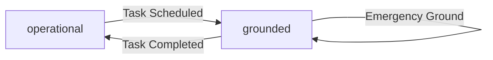
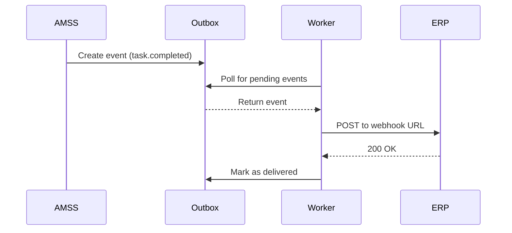

# AMSS User Guide: Fleet Manager

**Version:** 1.0
**Last Updated:** 2024-01-15
**Applies To:** AMSS v1.x
**Audience:** Fleet Managers, Operations Managers, Chief Pilots
**Role:** `tenant_admin`
**Review Date:** Quarterly

---

## Document Overview

This guide is written for **Fleet Managers** and **Operations Managers** who are responsible for monitoring fleet-wide maintenance operations, analyzing costs, ensuring aircraft availability, and integrating AMSS with other business systems. You will learn how to use dashboards to monitor your fleet, import/export data in bulk, and configure webhook integrations.

**What you will learn:**
- How to monitor fleet-wide maintenance status and aircraft availability
- How to analyze maintenance costs and mechanic workload
- How to import aircraft, parts, and programs via CSV
- How to configure webhook integrations for ERP/business systems
- How to monitor webhook delivery status

**Prerequisite reading:**
- [00_ORIENTATION.md](./00_ORIENTATION.md) - Understand basic AMSS concepts

---

## Table of Contents

### Part I: Orientation
1. [Your Role as Fleet Manager](#your-role-as-fleet-manager)
2. [Your Dashboard Overview](#your-dashboard-overview)
3. [Mental Model: Fleet Operations](#mental-model-fleet-operations)

### Part II: Operations Dashboards
4. [Scenario 1: View Fleet-Wide Maintenance Status](#scenario-1-view-fleet-wide-maintenance-status)
5. [Scenario 2: Monitor Aircraft Availability](#scenario-2-monitor-aircraft-availability)
6. [Scenario 3: Review Maintenance Costs](#scenario-3-review-maintenance-costs)
7. [Scenario 4: Analyze Mechanic Workload](#scenario-4-analyze-mechanic-workload)

### Part III: Bulk Operations
8. [Scenario 5: Import Fleet Data via CSV](#scenario-5-import-fleet-data-via-csv)
9. [Scenario 6: Export Maintenance Records](#scenario-6-export-maintenance-records)

### Part IV: Integration Management
10. [Scenario 7: Configure Webhook Notifications](#scenario-7-configure-webhook-notifications)
11. [Scenario 8: Review Webhook Delivery Status](#scenario-8-review-webhook-delivery-status)

### Part V: Reference
12. [Error Messages & Recovery](#error-messages--recovery)
13. [CSV Import Formats](#csv-import-formats)
14. [Webhook Event Reference](#webhook-event-reference)

---

# Part I: Orientation

## Your Role as Fleet Manager

As a **Fleet Manager** (role: `tenant_admin`), you are responsible for the operational efficiency and cost-effectiveness of your aircraft fleet. You monitor high-level metrics, ensure aircraft availability for operations, and integrate AMSS with your organization's broader business systems.

### Primary Responsibilities

1. **Fleet Operations Monitoring**
   - Monitor fleet-wide maintenance status at-a-glance
   - Ensure aircraft availability meets operational needs
   - Track which aircraft are operational vs in maintenance

2. **Cost Management**
   - Analyze maintenance costs by aircraft and program
   - Identify high-cost aircraft or programs
   - Budget forecasting for maintenance expenses

3. **Resource Planning**
   - Monitor mechanic workload distribution
   - Ensure adequate staffing for upcoming maintenance
   - Identify bottlenecks in maintenance operations

4. **Data Management**
   - Import fleet data (aircraft, parts, programs) in bulk via CSV
   - Export maintenance records for accounting/reporting
   - Maintain data integrity across systems

5. **System Integration**
   - Configure webhook integrations with ERP systems
   - Automate data flow to accounting/business intelligence systems
   - Monitor integration health and troubleshoot delivery issues

### What You CAN Do

✅ **Full management within your organization**
- View all aircraft, tasks, programs, parts, compliance data
- Manage organization settings
- Create and manage users within your organization
- Assign roles to users (scheduler, mechanic, auditor)
- Import/export data in bulk
- Configure webhooks for system integrations

✅ **Organization-level operations**
- Monitor fleet-wide dashboards and reports
- Access summary reports (maintenance status, compliance, costs)
- Review audit logs for your organization
- Manage webhook configurations

### What You CANNOT Do

❌ **Cross-organization access** - Can only see/manage your own organization
❌ **System administration** - Cannot create new organizations or manage system settings
❌ **Direct maintenance operations** - Cannot start/complete tasks (that's mechanics' role)
❌ **Maintenance scheduling** - Cannot assign tasks to mechanics (that's planners' role)

### A Day in Your Life

**7:00 AM** - Check fleet dashboard: 15 aircraft operational, 2 in maintenance, 3 tasks due today
**8:30 AM** - Review overnight webhook deliveries to ERP system (all successful)
**10:00 AM** - Analyze maintenance costs for Q1 - aircraft N99999 showing high costs
**11:30 AM** - Import new parts catalog from supplier via CSV upload
**1:00 PM** - Meeting with CFO - present maintenance cost trends and forecast for Q2
**3:00 PM** - Review mechanic workload - team is at 85% capacity, good balance
**4:30 PM** - Export maintenance records for tax documentation

---

## Your Dashboard Overview

When you log in to AMSS with the `tenant_admin` role, you see a **Fleet Operations Dashboard** optimized for monitoring the overall health and efficiency of your fleet.

### Dashboard Widgets

```
╔═══════════════════════════════════════════════════════════════════╗
║                  FLEET OPERATIONS DASHBOARD                       ║
╠═══════════════════════════════════════════════════════════════════╣
║                                                                   ║
║  🛩️  FLEET STATUS                                                ║
║  ┌─────────────────────────────────────────────────────────────┐ ║
║  │ Total Aircraft:        15                                    │ ║
║  │ Operational:           13 (87%) ✅                          │ ║
║  │ In Maintenance:         2 (13%)                             │ ║
║  │ Total Fleet Hours:     45,230 hours                         │ ║
║  │ Hours This Month:      1,245 hours                          │ ║
║  └─────────────────────────────────────────────────────────────┘ ║
║                                                                   ║
║  📊 MAINTENANCE OVERVIEW                                         ║
║  ┌─────────────────────────────────────────────────────────────┐ ║
║  │ Tasks Due Today:        3                                    │ ║
║  │ Tasks This Week:       12                                    │ ║
║  │ Tasks In Progress:      5                                    │ ║
║  │ Overdue Tasks:          0 ✅                                │ ║
║  │ Compliance Rate:       98.7% ✅                             │ ║
║  └─────────────────────────────────────────────────────────────┘ ║
║                                                                   ║
║  💰 COSTS (This Quarter)                                         ║
║  ┌─────────────────────────────────────────────────────────────┐ ║
║  │ Total Maintenance:     $125,450                              │ ║
║  │ Parts Costs:           $78,200 (62%)                        │ ║
║  │ Labor Costs:           $47,250 (38%)                        │ ║
║  │ Cost per Flight Hour:  $100.76                              │ ║
║  │ Budget Utilization:    78% of Q1 budget                     │ ║
║  └─────────────────────────────────────────────────────────────┘ ║
║                                                                   ║
║  👥 MECHANIC WORKLOAD                                            ║
║  ┌─────────────────────────────────────────────────────────────┐ ║
║  │ Team Capacity:         85% (healthy)                         │ ║
║  │ Active Mechanics:      12                                    │ ║
║  │ Avg Tasks/Mechanic:    8.3 tasks/month                      │ ║
║  │ Busiest This Week:     John Doe (5 tasks)                   │ ║
║  └─────────────────────────────────────────────────────────────┘ ║
║                                                                   ║
║  🔗 INTEGRATIONS                                                 ║
║  ┌─────────────────────────────────────────────────────────────┐ ║
║  │ Active Webhooks:       3                                     │ ║
║  │ Delivery Success:      99.2% (last 7 days)                  │ ║
║  │ Failed Deliveries:     2 (retry in progress)                │ ║
║  └─────────────────────────────────────────────────────────────┘ ║
║                                                                   ║
║  📈 QUICK ACTIONS                                                ║
║  ┌─────────────────────────────────────────────────────────────┐ ║
║  │ [Fleet Status Report]  [Cost Analysis]  [Import Data]       │ ║
║  │ [Export Records]       [Webhook Config]  [User Management]  │ ║
║  └─────────────────────────────────────────────────────────────┘ ║
╚═══════════════════════════════════════════════════════════════════╝
```

### Key Metrics Explained

**Operational Aircraft**
- Aircraft with status `operational` (available for flight)
- NOT in maintenance (grounded for scheduled or unscheduled work)
- Target: >80% of fleet operational at any given time

**Compliance Rate**
- Percentage of compliance items signed off across entire fleet
- Formula: (Signed Items / Total Items) × 100
- Target: >95% for aviation operations

**Cost per Flight Hour**
- Total maintenance costs ÷ total flight hours in period
- Industry benchmark: varies by aircraft type ($50-$200/hour typical)
- Useful for budgeting and comparing aircraft efficiency

**Team Capacity**
- Percentage of available mechanic hours utilized
- Formula: (Actual hours worked / Available hours) × 100
- Sweet spot: 75-90% (enough work, not overwhelmed)

**Webhook Delivery Success Rate**
- Percentage of webhook events successfully delivered to external systems
- Formula: (Delivered / Total Attempts) × 100
- Target: >98% (some transient failures normal)

---

## Mental Model: Fleet Operations

Understanding how AMSS organizes fleet-level data helps you interpret dashboards and make informed decisions.

### Fleet Hierarchy

```
ORGANIZATION (Your Company)
    ├─ AIRCRAFT (15 total)
    │   ├─ N12345 (operational)
    │   ├─ N67890 (in_maintenance)
    │   └─ ...
    ├─ PROGRAMS (25 total - applies across fleet)
    │   ├─ 100-Hour Inspection
    │   ├─ Oil Change
    │   └─ ...
    ├─ TASKS (487 this year - specific to aircraft)
    │   ├─ Task #1234 (N12345, 100-Hour Inspection)
    │   ├─ Task #5678 (N67890, Oil Change)
    │   └─ ...
    ├─ USERS (20 total)
    │   ├─ John Doe (mechanic)
    │   ├─ Alice Smith (scheduler)
    │   └─ ...
    └─ WEBHOOKS (3 integrations)
        ├─ ERP System (task.completed events)
        ├─ Accounting System (parts.used events)
        └─ BI Dashboard (all events)
```

### Aircraft Availability Model

Aircraft can be in one of two states:



**Rules:**
- **operational**: Aircraft available for flight operations
- **grounded**: Aircraft in maintenance (scheduled or unscheduled)
- When a task transitions to `in_progress`, aircraft MUST be grounded
- When task completes, aircraft can return to operational (planner decision)

**Fleet Availability Formula:**
```
Fleet Availability = (Operational Aircraft / Total Aircraft) × 100
```

### Cost Accounting Model

AMSS tracks costs at multiple levels:

```
ORGANIZATION LEVEL (Total Maintenance Cost)
    ├─ AIRCRAFT LEVEL (Cost per Aircraft)
    │   ├─ N12345: $45,200 this year
    │   ├─ N67890: $38,100 this year
    │   └─ ...
    ├─ PROGRAM LEVEL (Cost per Maintenance Type)
    │   ├─ 100-Hour Inspections: $78,000 (all aircraft)
    │   ├─ Oil Changes: $12,500 (all aircraft)
    │   └─ ...
    └─ COST CATEGORIES
        ├─ Parts: 62% ($78,200)
        └─ Labor: 38% ($47,250)
```

**Cost Calculations:**
- **Parts Cost**: Sum of `unit_cost × quantity_used` for all parts
- **Labor Cost**: Estimated based on task duration × mechanic hourly rate
- **Total Aircraft Cost**: All tasks for specific aircraft
- **Total Program Cost**: All tasks of specific type across fleet

### Webhook Event Flow



**Key Concepts:**
- **Outbox Pattern**: Events stored in database before delivery (durability)
- **Background Worker**: Asynchronous delivery (doesn't block user operations)
- **Retry Logic**: Failed deliveries retried with exponential backoff
- **Secret Signature**: HMAC signature for webhook security

---

# Part II: Operations Dashboards

## Scenario 1: View Fleet-Wide Maintenance Status

**GOAL:** Get a real-time overview of your entire fleet's maintenance status to make operational decisions.

**WHEN TO USE:**
- Daily morning check before scheduling flights
- Weekly operations meeting with management
- Monthly fleet review with maintenance team
- Emergency planning (sudden aircraft needs)

**PRE-CONDITIONS:**
- [ ] You have `tenant_admin` or `admin` role
- [ ] Your organization has aircraft in the system
- [ ] Tasks have been created (either manually or auto-generated)

---

### HAPPY PATH: Morning Fleet Status Check

**Scenario Context:** It's Monday morning, and you need to brief the operations team on fleet availability.

---

**Step 1: Access Fleet Dashboard**

ACTION: Log in and navigate to Fleet Dashboard (default landing page for `tenant_admin`)

SYSTEM RESPONSE:
```
╔═══════════════════════════════════════════════════════════════════╗
║                    FLEET MAINTENANCE STATUS                       ║
╠═══════════════════════════════════════════════════════════════════╣
║  Organization: AeroMaintain LLC                                  ║
║  Report Date:  2024-01-15 08:00 UTC (Real-time)                 ║
║                                                                   ║
║  FLEET OVERVIEW:                                                 ║
║  ┌─────────────────────────────────────────────────────────────┐ ║
║  │ Total Aircraft:        15                                    │ ║
║  │ ✅ Operational:        13 (87%)                             │ ║
║  │ 🔧 In Maintenance:      2 (13%)                             │ ║
║  │                                                              │ ║
║  │ Aircraft in Maintenance:                                     │ ║
║  │   • N67890 (100-Hour Inspection, due complete: 3 PM today)  │ ║
║  │   • N11111 (Engine Overhaul, due complete: Jan 18)          │ ║
║  └─────────────────────────────────────────────────────────────┘ ║
║                                                                   ║
║  TASKS OVERVIEW:                                                 ║
║  ┌─────────────────────────────────────────────────────────────┐ ║
║  │ Due Today:             3 tasks                               │ ║
║  │   • N12345: Oil Change (scheduled 10 AM - 11 AM)            │ ║
║  │   • N99999: Tire Rotation (scheduled 2 PM - 3 PM)           │ ║
║  │   • N67890: 100-Hour Inspection (in progress, due 3 PM)     │ ║
║  │                                                              │ ║
║  │ Due This Week:        12 tasks                              │ ║
║  │ Currently In Progress: 2 tasks                              │ ║
║  │ ⚠️  Overdue:            0 tasks ✅                           │ ║
║  └─────────────────────────────────────────────────────────────┘ ║
║                                                                   ║
║  CAPACITY FORECAST:                                              ║
║  ┌─────────────────────────────────────────────────────────────┐ ║
║  │ Expected Availability This Week:                             │ ║
║  │   Mon: 13/15 operational (87%)                              │ ║
║  │   Tue: 14/15 operational (93%) - N67890 back in service     │ ║
║  │   Wed: 13/15 operational (87%) - N12345 in for 100-hour     │ ║
║  │   Thu: 13/15 operational (87%)                              │ ║
║  │   Fri: 14/15 operational (93%)                              │ ║
║  └─────────────────────────────────────────────────────────────┘ ║
║                                                                   ║
║  [Export Report]  [Drill Down by Aircraft]  [View Schedule]     ║
╚═══════════════════════════════════════════════════════════════════╝
```

---

**Step 2: Interpret Fleet Status**

✅ **HEALTHY INDICATORS:**

1. **87% Operational**: Strong availability (target: >80%)
   - 13 of 15 aircraft ready for flight operations
   - Typical for fleet size - always some aircraft in maintenance

2. **Zero Overdue Tasks**: Excellent compliance
   - All maintenance completed on schedule
   - No airworthiness risks

3. **Predictable This Week**: Stable availability
   - 87-93% operational throughout week
   - Can confidently schedule flights

⚠️ **ATTENTION ITEMS:**

1. **N67890 Due at 3 PM Today**
   - Monitor progress throughout day
   - If delay expected, notify flight scheduling NOW
   - Consider backup aircraft for evening flights

2. **N11111 Long-Term Down (Until Jan 18)**
   - Engine overhaul is major maintenance (expected)
   - Verify no flights scheduled for N11111 this week
   - Plan for return-to-service inspection

---

**Step 3: Drill Down to Aircraft Details**

ACTION: Click **"Drill Down by Aircraft"** or click on specific aircraft (e.g., N67890)

SYSTEM RESPONSE:
```
╔═══════════════════════════════════════════════════════════════════╗
║                  AIRCRAFT N67890 - DETAILED VIEW                  ║
╠═══════════════════════════════════════════════════════════════════╣
║  Aircraft:      N67890 (Piper PA-28 Cherokee)                    ║
║  Status:        in_maintenance 🔧                                ║
║  Total Hours:   2,345.6 hours                                    ║
║  Current Task:  100-Hour Inspection (Task #5678)                 ║
║                                                                   ║
║  CURRENT MAINTENANCE:                                            ║
║  ┌─────────────────────────────────────────────────────────────┐ ║
║  │ Task ID:        #5678                                        │ ║
║  │ Type:           100-Hour Inspection                          │ ║
║  │ Status:         in_progress                                  │ ║
║  │ Mechanic:       Jane Smith                                   │ ║
║  │ Started:        2024-01-15 08:00 UTC                        │ ║
║  │ Due Complete:   2024-01-15 15:00 UTC (7 hours remaining)    │ ║
║  │ Progress:       6 of 12 compliance items signed off (50%)   │ ║
║  │                                                              │ ║
║  │ Expected Completion: ✅ On track                            │ ║
║  └─────────────────────────────────────────────────────────────┘ ║
║                                                                   ║
║  UPCOMING MAINTENANCE:                                           ║
║  ┌─────────────────────────────────────────────────────────────┐ ║
║  │ • Oil Change - Due: 2024-01-22 (next week)                  │ ║
║  │ • Annual Inspection - Due: 2024-03-15 (2 months)            │ ║
║  └─────────────────────────────────────────────────────────────┘ ║
║                                                                   ║
║  MAINTENANCE HISTORY (Last 30 Days):                             ║
║  ┌─────────────────────────────────────────────────────────────┐ ║
║  │ • 2024-01-01: Oil Change (completed, 1.5 hours)             │ ║
║  │ • 2023-12-20: Tire Rotation (completed, 0.8 hours)          │ ║
║  │ • 2023-12-15: Pre-buy Inspection (completed, 3.2 hours)     │ ║
║  └─────────────────────────────────────────────────────────────┘ ║
║                                                                   ║
║  [View All History]  [View Costs]  [Export Aircraft Report]     ║
╚═══════════════════════════════════════════════════════════════════╝
```

**Decision Point:**
- ✅ Task is 50% complete with 7 hours remaining (on track)
- ✅ Can confidently tell operations: "N67890 available by 4 PM today"
- 📅 Note: Oil change due next week - coordinate with flight schedule

---

### COMMON FAILURES

| Symptom | Cause | Recovery |
|---------|-------|----------|
| **"No aircraft found"** | Organization has no aircraft registered | Import aircraft via CSV (Scenario 5) or contact admin |
| **"All aircraft 'in_maintenance'"** | Bulk status change or data error | Investigate with planners; check if tasks were mass-assigned |
| **"Capacity forecast shows 0%"** | No upcoming tasks scheduled | Normal for new system; background worker will generate tasks as aircraft hours increase |
| **"Task progress stuck at 0%"** | Mechanic hasn't started compliance items | Contact mechanic to begin inspections |
| **"Operational % lower than expected"** | More aircraft in maintenance than planned | Review overdue tasks (Scenario 2); may need to adjust maintenance schedule |

---

### VERIFICATION

✅ **How to confirm status is accurate:**

1. **Aircraft Counts Match**: Operational + In Maintenance = Total Aircraft
2. **Status Matches Tasks**: Aircraft with `in_progress` tasks should be `in_maintenance`
3. **Forecast Reasonable**: Week-ahead forecast aligns with scheduled tasks
4. **Zero Overdue** (Ideal): If overdue tasks exist, investigate immediately
5. **Cross-Check with Operations**: Fleet availability matches flight schedule needs

---

### RELATED SCENARIOS

→ **Deep Dive**: [Scenario 2: Monitor Aircraft Availability](#scenario-2-monitor-aircraft-availability)
→ **Costs**: [Scenario 3: Review Maintenance Costs](#scenario-3-review-maintenance-costs)
→ **Mechanics**: [Scenario 4: Analyze Mechanic Workload](#scenario-4-analyze-mechanic-workload)

---

## Scenario 2: Monitor Aircraft Availability

**GOAL:** Track which specific aircraft are available for flight operations vs in maintenance, and plan for future availability.

**WHEN TO USE:**
- Flight scheduling (which aircraft can be assigned to routes)
- Responding to sudden maintenance needs (substitute aircraft)
- Monthly operations planning
- Customer inquiries about specific aircraft availability

**PRE-CONDITIONS:**
- [ ] You have `tenant_admin` or `admin` role
- [ ] Aircraft statuses are kept current by planners/mechanics
- [ ] You understand operational vs in_maintenance status

---

### HAPPY PATH: Check Availability for Flight Scheduling

**Scenario Context:** Flight operations needs 3 aircraft for charter flights tomorrow. You need to confirm which aircraft are available.

---

**Step 1: View Aircraft Availability List**

ACTION: Navigate to **Aircraft** → **Availability View**

API CALL:
```bash
GET /api/v1/aircraft?org_id={org-uuid}&status=operational
```

SYSTEM RESPONSE:
```
╔═══════════════════════════════════════════════════════════════════╗
║                   AIRCRAFT AVAILABILITY LIST                      ║
╠═══════════════════════════════════════════════════════════════════╣
║  Organization: AeroMaintain LLC                                  ║
║  Current Time: 2024-01-15 14:00 UTC                             ║
║                                                                   ║
║  ✅ OPERATIONAL AIRCRAFT (13 available)                          ║
║  ┌─────────────────────────────────────────────────────────────┐ ║
║  │ Reg      Type          Hours   Next Mx Due   Availability   │ ║
║  ├─────────────────────────────────────────────────────────────┤ ║
║  │ N12345   Cessna 172S  2,523   Jan 16 (tmrw)  ⚠️  Tomorrow   │ ║
║  │ N22222   Cessna 172S  1,890   Jan 25         ✅ Available   │ ║
║  │ N33333   Cessna 172S  3,120   Jan 18         ✅ Available   │ ║
║  │ N44444   Piper PA-28  2,010   Jan 22         ✅ Available   │ ║
║  │ N55555   Piper PA-28  1,675   Jan 30         ✅ Available   │ ║
║  │ N66666   Piper PA-28  2,234   Jan 17         ⚠️  Jan 17     │ ║
║  │ N77777   Cessna 172S  1,450   Feb 05         ✅ Available   │ ║
║  │ N88888   Cessna 172S  2,890   Jan 20         ✅ Available   │ ║
║  │ N99999   Beech Bonanza 1,120   Jan 28         ✅ Available   │ ║
║  │ N10101   Beech Bonanza  980   Feb 10         ✅ Available   │ ║
║  │ N20202   Cessna 172S  2,145   Jan 19         ✅ Available   │ ║
║  │ N30303   Piper PA-28  1,788   Jan 24         ✅ Available   │ ║
║  │ N40404   Cessna 172S  3,456   Jan 21         ✅ Available   │ ║
║  └─────────────────────────────────────────────────────────────┘ ║
║                                                                   ║
║  🔧 IN MAINTENANCE (2 aircraft)                                  ║
║  ┌─────────────────────────────────────────────────────────────┐ ║
║  │ Reg      Type          Task              Est. Return        │ ║
║  ├─────────────────────────────────────────────────────────────┤ ║
║  │ N67890   Piper PA-28  100-Hour Insp     Jan 15 (today 3PM) │ ║
║  │ N11111   Beech Bonanza Engine Overhaul  Jan 18 (3 days)    │ ║
║  └─────────────────────────────────────────────────────────────┘ ║
║                                                                   ║
║  [Filter by Type]  [Export to CSV]  [Schedule View]             ║
╚═══════════════════════════════════════════════════════════════════╝
```

---

**Step 2: Analyze Availability for Flight Operations**

✅ **FULLY AVAILABLE (11 aircraft):**
- These aircraft have no maintenance due in the next 7 days
- Can be confidently scheduled for charter flights

**Recommended for Tomorrow's 3 Charters:**
1. **N22222** (Cessna 172S) - Next maintenance Jan 25 (10 days out)
2. **N44444** (Piper PA-28) - Next maintenance Jan 22 (7 days out)
3. **N99999** (Beechcraft Bonanza) - Next maintenance Jan 28 (13 days out)

⚠️ **MARGINAL AVAILABILITY (2 aircraft):**
- **N12345**: Maintenance due tomorrow (Jan 16)
  - ❌ **DO NOT** schedule for multi-day trips
  - ✅ OK for local flights returning today

- **N66666**: Maintenance due Jan 17 (2 days)
  - ⚠️ Use only if absolutely necessary
  - Brief pilot on maintenance requirement

🔧 **UNAVAILABLE (2 aircraft):**
- **N67890**: In maintenance until 3 PM today
- **N11111**: In maintenance until Jan 18 (engine overhaul)

---

**Step 3: Check Future Availability (Week-Ahead View)**

ACTION: Click **"Schedule View"** to see calendar view

SYSTEM RESPONSE:
```
╔═══════════════════════════════════════════════════════════════════╗
║                 AIRCRAFT AVAILABILITY CALENDAR                    ║
╠═══════════════════════════════════════════════════════════════════╣
║  Week of Jan 15-21, 2024                                         ║
║                                                                   ║
║         Mon 15  Tue 16  Wed 17  Thu 18  Fri 19  Sat 20  Sun 21  ║
║  ┌────┬────────┬───────┬───────┬───────┬───────┬───────┬───────┐ ║
║  │N123│   ✅   │  🔧   │   ✅  │   ✅  │   ✅  │   ✅  │   ✅  │ ║
║  │N678│   🔧   │   ✅  │   ✅  │   ✅  │   ✅  │   ✅  │   ✅  │ ║
║  │N111│   🔧   │   🔧  │   🔧  │   ✅  │   ✅  │   ✅  │   ✅  │ ║
║  │N222│   ✅   │   ✅  │   ✅  │   ✅  │   ✅  │   ✅  │   ✅  │ ║
║  │N333│   ✅   │   ✅  │   ✅  │   ✅  │   ✅  │   ✅  │   ✅  │ ║
║  │N444│   ✅   │   ✅  │   ✅  │   ✅  │   ✅  │   ✅  │   ✅  │ ║
║  │N555│   ✅   │   ✅  │   ✅  │   ✅  │   ✅  │   ✅  │   ✅  │ ║
║  │N666│   ✅   │   ✅  │  🔧   │   ✅  │   ✅  │   ✅  │   ✅  │ ║
║  │... │  ...   │  ...  │  ...  │  ...  │  ...  │  ...  │  ...  │ ║
║  └────┴────────┴───────┴───────┴───────┴───────┴───────┴───────┘ ║
║                                                                   ║
║  Summary by Day:                                                 ║
║  Mon: 13/15 operational (87%)                                    ║
║  Tue: 13/15 operational (87%) - N12345 in for 100-hour          ║
║  Wed: 13/15 operational (87%) - N666 in for inspection          ║
║  Thu: 14/15 operational (93%) - N11111 back from engine overhaul ║
║  Fri-Sun: 14/15 operational (93%)                               ║
╚═══════════════════════════════════════════════════════════════════╝
```

**Fleet Planning Decision:**
- **Good week for operations**: 87-93% availability
- **Peak capacity**: Thu-Sun with 14 aircraft available
- **Plan accordingly**: Schedule heavy charter days on Thu-Sun

---

### COMMON FAILURES

| Symptom | Cause | Recovery |
|---------|-------|----------|
| **"Aircraft shows operational but has active task"** | Planner forgot to ground aircraft when starting task | Contact planner to update aircraft status; verify task is actually in progress |
| **"Aircraft shows in_maintenance but no active task"** | Task completed but aircraft not returned to service | Contact planner to return aircraft to operational status |
| **"Next Mx Due date in past"** | Task overdue - potential airworthiness issue | Immediate escalation; aircraft may be unairworthy for flight |
| **"Availability calendar shows 0% all week"** | All aircraft have overlapping maintenance | Review maintenance schedule with planner; stagger maintenance to maintain availability |
| **"Est. Return time keeps changing"** | Task running behind schedule | Normal for complex maintenance; get updated ETA from mechanic |

---

### VERIFICATION

✅ **How to confirm availability data is accurate:**

1. **Status Matches Tasks**: Aircraft with `in_progress` tasks must be `in_maintenance`
2. **Next Mx Due Calculated**: Based on aircraft hours + program intervals
3. **Calendar Consistent**: Day-by-day view matches aircraft list view
4. **Est. Return Reasonable**: Based on task `end_time` (not mechanic guess)
5. **Flight Schedule Aligned**: No flights scheduled for aircraft in maintenance

---

### RELATED SCENARIOS

→ **Fleet Status**: [Scenario 1: View Fleet-Wide Maintenance Status](#scenario-1-view-fleet-wide-maintenance-status)
→ **Planner Guide**: [02_MAINTENANCE_PLANNER.md](./02_MAINTENANCE_PLANNER.md) - How planners ground/return aircraft
→ **Mechanic Guide**: [03_MECHANIC_TECHNICIAN.md](./03_MECHANIC_TECHNICIAN.md) - Task execution timeline

---

## Scenario 3: Review Maintenance Costs

**GOAL:** Analyze maintenance costs by aircraft, program type, and time period to support budgeting and identify high-cost outliers.

**WHEN TO USE:**
- Monthly/quarterly cost review for CFO
- Budget planning for next fiscal year
- Investigating high-cost aircraft (consider sale/retirement)
- Comparing aircraft efficiency (cost per flight hour)

**PRE-CONDITIONS:**
- [ ] You have `tenant_admin` or `admin` role
- [ ] Parts have cost data (`unit_cost` field populated)
- [ ] Tasks have been completed (costs accumulate from parts used)

---

### HAPPY PATH: Quarterly Cost Review for CFO

**Scenario Context:** It's end of Q1 2024. CFO wants maintenance cost breakdown for board meeting.

---

**Step 1: Generate Quarterly Cost Report**

ACTION: Navigate to **Reports** → **Maintenance Costs**

FILTERS:
- Date Range: 2024-01-01 to 2024-03-31 (Q1)
- Organization: AeroMaintain LLC

API CALL:
```bash
GET /api/v1/reports/maintenance-costs?org_id={org-uuid}&from=2024-01-01&to=2024-03-31
```

SYSTEM RESPONSE:
```
╔═══════════════════════════════════════════════════════════════════╗
║              MAINTENANCE COST REPORT - Q1 2024                    ║
╠═══════════════════════════════════════════════════════════════════╣
║  Organization: AeroMaintain LLC                                  ║
║  Period:       2024-01-01 to 2024-03-31 (90 days)               ║
║  Report Date:  2024-04-01                                        ║
║                                                                   ║
║  💰 TOTAL COSTS                                                  ║
║  ┌─────────────────────────────────────────────────────────────┐ ║
║  │ Total Maintenance Cost:    $125,450                          │ ║
║  │                                                              │ ║
║  │ Parts Costs:               $78,200 (62%)                    │ ║
║  │ Labor Costs (estimated):   $47,250 (38%)                    │ ║
║  │                                                              │ ║
║  │ Total Flight Hours (Q1):   1,245 hours                      │ ║
║  │ Cost per Flight Hour:      $100.76                          │ ║
║  └─────────────────────────────────────────────────────────────┘ ║
║                                                                   ║
║  📊 COST BY AIRCRAFT (Top 5)                                     ║
║  ┌─────────────────────────────────────────────────────────────┐ ║
║  │ Aircraft    Total Cost  Parts    Labor    $/Hour   Status  │ ║
║  ├─────────────────────────────────────────────────────────────┤ ║
║  │ N99999      $18,450     $12,200  $6,250   $185.23  ⚠️ HIGH  │ ║
║  │ N11111      $15,680     $10,100  $5,580   $156.80  High    │ ║
║  │ N67890      $9,820      $6,100   $3,720   $98.20   Normal  │ ║
║  │ N12345      $9,450      $5,800   $3,650   $94.50   Normal  │ ║
║  │ N33333      $8,910      $5,500   $3,410   $89.10   Normal  │ ║
║  │ ...         ...         ...      ...      ...      ...     │ ║
║  │ FLEET AVG   $8,363      $5,213   $3,150   $100.76  -       │ ║
║  └─────────────────────────────────────────────────────────────┘ ║
║                                                                   ║
║  ⚠️  N99999 is 121% above fleet average - investigate          ║
║                                                                   ║
║  📈 COST BY PROGRAM TYPE                                         ║
║  ┌─────────────────────────────────────────────────────────────┐ ║
║  │ Program Type         Count  Total Cost  Avg Cost/Task       │ ║
║  ├─────────────────────────────────────────────────────────────┤ ║
║  │ Inspection           45     $56,250     $1,250              │ ║
║  │ Repair               32     $38,400     $1,200              │ ║
║  │ Overhaul             8      $30,800     $3,850              │ ║
║  │ TOTAL                85     $125,450    $1,476 avg          │ ║
║  └─────────────────────────────────────────────────────────────┘ ║
║                                                                   ║
║  📅 COST TREND (Monthly)                                         ║
║  ┌─────────────────────────────────────────────────────────────┐ ║
║  │ January:    $42,100  (high - annual inspections due)        │ ║
║  │ February:   $38,750                                         │ ║
║  │ March:      $44,600  (high - engine overhaul for N11111)    │ ║
║  │ AVERAGE:    $41,817 /month                                  │ ║
║  └─────────────────────────────────────────────────────────────┘ ║
║                                                                   ║
║  [Drill Down N99999]  [Export to Excel]  [Compare to Budget]    ║
╚═══════════════════════════════════════════════════════════════════╝
```

---

**Step 2: Investigate High-Cost Aircraft (N99999)**

⚠️ **RED FLAG**: N99999 cost $18,450 in Q1 (121% above $8,363 fleet average)

ACTION: Click **"Drill Down N99999"**

SYSTEM RESPONSE:
```
╔═══════════════════════════════════════════════════════════════════╗
║               N99999 - DETAILED COST BREAKDOWN                    ║
╠═══════════════════════════════════════════════════════════════════╣
║  Aircraft:     N99999 (Beechcraft Bonanza)                       ║
║  Period:       Q1 2024 (90 days)                                 ║
║  Total Cost:   $18,450                                           ║
║  Flight Hours: 99.6 hours                                        ║
║  $/Hour:       $185.23 (vs fleet avg $100.76)                   ║
║                                                                   ║
║  COST BY TASK:                                                   ║
║  ┌─────────────────────────────────────────────────────────────┐ ║
║  │ Date       Task Type         Parts    Labor    Total        │ ║
║  ├─────────────────────────────────────────────────────────────┤ ║
║  │ Jan 05     Annual Inspection $1,200   $800     $2,000       │ ║
║  │ Jan 12     Oil Change        $85      $120     $205         │ ║
║  │ Jan 28     Fuel Leak Repair  $3,450   $1,200   $4,650 ⚠️    │ ║
║  │ Feb 10     Prop Overhaul     $6,200   $2,800   $9,000 ⚠️    │ ║
║  │ Feb 24     100-Hour Insp     $950     $750     $1,700       │ ║
║  │ Mar 15     Oil Change        $85      $120     $205         │ ║
║  │ Mar 22     Tire Replacement  $520     $170     $690         │ ║
║  │ TOTAL      -                 $12,490  $5,960   $18,450      │ ║
║  └─────────────────────────────────────────────────────────────┘ ║
║                                                                   ║
║  🔍 ANALYSIS:                                                    ║
║  ┌─────────────────────────────────────────────────────────────┐ ║
║  │ Two major unscheduled repairs drove high costs:              │ ║
║  │                                                              │ ║
║  │ 1. Fuel Leak Repair ($4,650)                                │ ║
║  │    - Unscheduled maintenance                                 │ ║
║  │    - Required fuel tank resealing                            │ ║
║  │                                                              │ ║
║  │ 2. Propeller Overhaul ($9,000)                              │ ║
║  │    - Scheduled maintenance (due at 2,000 hours)             │ ║
║  │    - Major expense (expected every 2,000 hours)             │ ║
║  │                                                              │ ║
║  │ Routine maintenance costs are NORMAL for this aircraft type.│ ║
║  └─────────────────────────────────────────────────────────────┘ ║
║                                                                   ║
║  RECOMMENDATION:                                                 ║
║  ┌─────────────────────────────────────────────────────────────┐ ║
║  │ • Prop overhaul was scheduled - budget as capital expense   │ ║
║  │ • Fuel leak was one-time repair - not recurring concern     │ ║
║  │ • Expect costs to normalize in Q2 (~$2,500/quarter)         │ ║
║  │ • No action needed - aircraft is healthy                    │ ║
║  └─────────────────────────────────────────────────────────────┘ ║
╚═══════════════════════════════════════════════════════════════════╝
```

**Conclusion for CFO:**
- Q1 was higher than typical due to one-time propeller overhaul ($9,000)
- Fuel leak repair ($4,650) was unscheduled but now resolved
- Expected Q2-Q4 costs: ~$2,500/quarter (normalized)
- No need to retire aircraft - costs are within normal range for Bonanza

---

**Step 3: Compare to Budget**

ACTION: Click **"Compare to Budget"**

SYSTEM RESPONSE:
```
╔═══════════════════════════════════════════════════════════════════╗
║                 BUDGET vs ACTUAL (Q1 2024)                        ║
╠═══════════════════════════════════════════════════════════════════╣
║  Category            Budget      Actual      Variance    Status  ║
║  ┌─────────────────────────────────────────────────────────────┐ ║
║  │ Parts             $80,000     $78,200     -$1,800 ✅        │ ║
║  │ Labor             $50,000     $47,250     -$2,750 ✅        │ ║
║  │ TOTAL             $130,000    $125,450    -$4,550 ✅        │ ║
║  │                                                              │ ║
║  │ Budget Utilization: 96.5% (under budget by 3.5%)           │ ║
║  └─────────────────────────────────────────────────────────────┘ ║
║                                                                   ║
║  ✅ Q1 Performance: EXCELLENT                                    ║
║  - Under budget despite major prop overhaul                      ║
║  - Parts costs well-controlled                                   ║
║  - Labor efficiency strong (38% of total vs 40% budgeted)       ║
╚═══════════════════════════════════════════════════════════════════╝
```

---

### COMMON FAILURES

| Symptom | Cause | Recovery |
|---------|-------|----------|
| **"All costs show $0"** | Parts don't have `unit_cost` populated | Import parts with cost data (Scenario 5); update part definitions |
| **"Labor cost is 0"** | Labor not tracked (parts-only costing) | Normal for some systems; labor can be estimated based on task duration |
| **"Cost per hour extremely high (>$500)"** | Low flight hours in period or major overhaul | Check if aircraft had limited use or scheduled overhaul - may be temporary |
| **"Cannot compare to budget"** | Budget not configured in system | Budget tracking may be external to AMSS; export to Excel for manual comparison |
| **"Parts cost > 90% of total"** | Labor not tracked or very short tasks | Some organizations track parts only; labor estimated externally |

---

### VERIFICATION

✅ **How to confirm cost data is accurate:**

1. **Math Checks**: Parts + Labor = Total for each aircraft
2. **Realistic $/Hour**: Typical range $50-$200/hour depending on aircraft type
3. **Fleet Average**: Sum of all aircraft ÷ fleet size = reported average
4. **Spot Check**: Randomly verify a task's parts costs match actual parts used × unit cost
5. **Compare to Prior Period**: Q1 2024 costs similar to Q1 2023 (unless major changes)

---

### RELATED SCENARIOS

→ **Fleet Status**: [Scenario 1: View Fleet-Wide Maintenance Status](#scenario-1-view-fleet-wide-maintenance-status)
→ **Export Data**: [Scenario 6: Export Maintenance Records](#scenario-6-export-maintenance-records) - Export for accounting
→ **Compliance**: [04_COMPLIANCE_OFFICER.md](./04_COMPLIANCE_OFFICER.md) - Audit cost data

---

## Scenario 4: Analyze Mechanic Workload

**GOAL:** Monitor mechanic team capacity, identify overworked or underutilized mechanics, and ensure balanced workload distribution.

**WHEN TO USE:**
- Monthly resource planning
- Investigating task delays (mechanic overloaded?)
- Hiring decisions (do we need more mechanics?)
- Performance reviews (fair workload distribution?)

**PRE-CONDITIONS:**
- [ ] You have `tenant_admin` or `admin` role
- [ ] Organization has mechanics with assigned tasks
- [ ] Tasks have `assigned_mechanic_id` field populated

---

### HAPPY PATH: Monthly Workload Review

**Scenario Context:** It's end of January. You want to ensure mechanic team is balanced and no one is overwhelmed.

---

**Step 1: View Team Workload Dashboard**

ACTION: Navigate to **Team** → **Workload Analysis**

FILTERS:
- Date Range: 2024-01-01 to 2024-01-31 (January)
- Organization: AeroMaintain LLC

SYSTEM RESPONSE:
```
╔═══════════════════════════════════════════════════════════════════╗
║               MECHANIC WORKLOAD ANALYSIS - JAN 2024               ║
╠═══════════════════════════════════════════════════════════════════╣
║  Organization: AeroMaintain LLC                                  ║
║  Period:       January 2024 (31 days)                            ║
║                                                                   ║
║  👥 TEAM SUMMARY                                                 ║
║  ┌─────────────────────────────────────────────────────────────┐ ║
║  │ Total Mechanics:          12                                 │ ║
║  │ Tasks Completed:          85                                 │ ║
║  │ Avg Tasks/Mechanic:       7.1 tasks                         │ ║
║  │ Team Capacity:            85% (healthy)                      │ ║
║  │ Total Labor Hours:        680 hours                          │ ║
║  │ Avg Hours/Mechanic:       56.7 hours/month                  │ ║
║  └─────────────────────────────────────────────────────────────┘ ║
║                                                                   ║
║  📊 WORKLOAD BY MECHANIC                                         ║
║  ┌─────────────────────────────────────────────────────────────┐ ║
║  │ Name            Tasks  Hours  Capacity  Status              │ ║
║  ├─────────────────────────────────────────────────────────────┤ ║
║  │ John Doe        12     96     120% ⚠️   OVERLOADED          │ ║
║  │ Jane Smith      10     80     100%      FULL                │ ║
║  │ Bob Johnson     9      72     90%       HEALTHY             │ ║
║  │ Alice Williams  8      64     80%       HEALTHY             │ ║
║  │ Mike Davis      8      64     80%       HEALTHY             │ ║
║  │ Sarah Brown     7      56     70%       HEALTHY             │ ║
║  │ Tom Wilson      7      56     70%       HEALTHY             │ ║
║  │ Lisa Garcia     6      48     60%       HEALTHY             │ ║
║  │ Chris Martinez  6      48     60%       HEALTHY             │ ║
║  │ Pat Anderson    5      40     50%       HEALTHY             │ ║
║  │ Sam Taylor      4      32     40%       UNDERUTILIZED ⚠️    │ ║
║  │ Jordan Lee      3      24     30%       UNDERUTILIZED ⚠️    │ ║
║  └─────────────────────────────────────────────────────────────┘ ║
║                                                                   ║
║  ⚠️  ATTENTION ITEMS:                                            ║
║  ┌─────────────────────────────────────────────────────────────┐ ║
║  │ • John Doe at 120% capacity - risk of burnout/quality issues│ ║
║  │ • Sam Taylor at 40% - new hire or transitioning role?       │ ║
║  │ • Jordan Lee at 30% - part-time or specialized role?        │ ║
║  └─────────────────────────────────────────────────────────────┘ ║
║                                                                   ║
║  [View Individual Details]  [Rebalance Workload]  [Export]      ║
╚═══════════════════════════════════════════════════════════════════╝
```

---

**Step 2: Investigate Overloaded Mechanic (John Doe)**

⚠️ **CONCERN**: John Doe at 120% capacity (12 tasks, 96 hours vs 80-hour target)

ACTION: Click on **"John Doe"** to drill down

SYSTEM RESPONSE:
```
╔═══════════════════════════════════════════════════════════════════╗
║                  JOHN DOE - WORKLOAD DETAILS                      ║
╠═══════════════════════════════════════════════════════════════════╣
║  Mechanic:     John Doe                                          ║
║  Certificate:  A&P #123456789                                    ║
║  Period:       January 2024                                      ║
║                                                                   ║
║  WORKLOAD SUMMARY:                                               ║
║  ┌─────────────────────────────────────────────────────────────┐ ║
║  │ Tasks Completed:      12                                     │ ║
║  │ Total Hours:          96 hours                               │ ║
║  │ Target Hours:         80 hours/month (full-time)            │ ║
║  │ Capacity:             120% ⚠️  OVERLOADED                    │ ║
║  │ Avg Task Duration:    8.0 hours (fleet avg: 8.0 hours)      │ ║
║  └─────────────────────────────────────────────────────────────┘ ║
║                                                                   ║
║  TASK BREAKDOWN:                                                 ║
║  ┌─────────────────────────────────────────────────────────────┐ ║
║  │ Date    Aircraft  Task Type         Hours  Status           │ ║
║  ├─────────────────────────────────────────────────────────────┤ ║
║  │ Jan 02  N12345    100-Hour Insp     8.0    completed        │ ║
║  │ Jan 05  N67890    Oil Change        1.5    completed        │ ║
║  │ Jan 08  N33333    Annual Insp       12.0   completed        │ ║
║  │ Jan 12  N44444    Brake Repair      4.5    completed        │ ║
║  │ Jan 15  N55555    100-Hour Insp     8.0    completed        │ ║
║  │ Jan 18  N66666    Tire Rotation     1.0    completed        │ ║
║  │ Jan 20  N77777    Oil Change        1.5    completed        │ ║
║  │ Jan 22  N88888    Engine Overhaul   24.0   completed ⚠️     │ ║
║  │ Jan 26  N99999    100-Hour Insp     8.0    completed        │ ║
║  │ Jan 28  N10101    Fuel System Check 6.5    completed        │ ║
║  │ Jan 30  N20202    Oil Change        1.5    completed        │ ║
║  │ Jan 31  N30303    Pre-buy Insp      10.0   completed        │ ║
║  └─────────────────────────────────────────────────────────────┘ ║
║                                                                   ║
║  🔍 ANALYSIS:                                                    ║
║  ┌─────────────────────────────────────────────────────────────┐ ║
║  │ Root Cause: Engine Overhaul (24 hours) drove overload       │ ║
║  │                                                              │ ║
║  │ • Jan 22: N88888 engine overhaul consumed 3 days            │ ║
║  │ • Complex task requiring senior mechanic (John Doe)         │ ║
║  │ • Other tasks were routine maintenance (normal workload)    │ ║
║  │                                                              │ ║
║  │ Recommendation:                                              │ ║
║  │ • ONE-TIME overload due to major maintenance                │ ║
║  │ • Feb workload should normalize (~8 tasks, 64 hours)        │ ║
║  │ • Monitor for burnout - offer comp time if needed           │ ║
║  │ • Consider cross-training other mechanics for overhauls     │ ║
║  └─────────────────────────────────────────────────────────────┘ ║
╚═══════════════════════════════════════════════════════════════════╝
```

**Decision:**
- ✅ Overload was one-time (engine overhaul)
- ✅ John Doe is senior mechanic (appropriate for complex task)
- ⚠️ Monitor February workload - should normalize
- 📝 Note for HR: Consider comp time or bonus for extra hours

---

**Step 3: Investigate Underutilized Mechanic (Jordan Lee)**

⚠️ **CONCERN**: Jordan Lee at 30% capacity (3 tasks, 24 hours vs 80-hour target)

ACTION: Click on **"Jordan Lee"** to drill down

SYSTEM RESPONSE:
```
╔═══════════════════════════════════════════════════════════════════╗
║                  JORDAN LEE - WORKLOAD DETAILS                    ║
╠═══════════════════════════════════════════════════════════════════╣
║  Mechanic:     Jordan Lee                                        ║
║  Certificate:  A&P #987654321                                    ║
║  Hire Date:    2024-01-08 (NEW HIRE - 3 weeks)                  ║
║  Period:       January 2024                                      ║
║                                                                   ║
║  WORKLOAD SUMMARY:                                               ║
║  ┌─────────────────────────────────────────────────────────────┐ ║
║  │ Tasks Completed:      3                                      │ ║
║  │ Total Hours:          24 hours                               │ ║
║  │ Working Days in Jan:  15 days (started Jan 8)               │ ║
║  │ Effective Capacity:   50% (24h ÷ 48h available)             │ ║
║  │ Status:               TRAINING PERIOD ✅                     │ ║
║  └─────────────────────────────────────────────────────────────┘ ║
║                                                                   ║
║  TASK BREAKDOWN:                                                 ║
║  ┌─────────────────────────────────────────────────────────────┐ ║
║  │ Date    Aircraft  Task Type         Hours  Status           │ ║
║  ├─────────────────────────────────────────────────────────────┤ ║
║  │ Jan 10  N12345    Oil Change        8.0    completed ⚠️     │ ║
║  │ Jan 15  N67890    Tire Rotation     8.0    completed ⚠️     │ ║
║  │ Jan 22  N33333    Oil Change        8.0    completed        │ ║
║  └─────────────────────────────────────────────────────────────┘ ║
║                                                                   ║
║  🔍 ANALYSIS:                                                    ║
║  ┌─────────────────────────────────────────────────────────────┐ ║
║  │ Status: NEW HIRE IN TRAINING                                │ ║
║  │                                                              │ ║
║  │ • Hired Jan 8 - only 15 working days in January             │ ║
║  │ • Assigned simple tasks (oil changes, tire rotation)        │ ║
║  │ • Taking longer than experienced mechanics (8h vs 1.5h)     │ ║
║  │ • Normal for training period - learning procedures          │ ║
║  │                                                              │ ║
║  │ Recommendation:                                              │ ║
║  │ • Continue training on routine maintenance                   │ ║
║  │ • Expect 100-hour inspection assignments in Feb/Mar         │ ║
║  │ • Monitor speed improvement - should reach 1.5h/oil change  │ ║
║  │ • No action needed - on track for 80% capacity by March     │ ║
║  └─────────────────────────────────────────────────────────────┘ ║
╚═══════════════════════════════════════════════════════════════════╝
```

**Decision:**
- ✅ Low workload explained by new hire status
- ✅ Appropriate task assignment (simple tasks during training)
- 📈 Expect capacity to increase to 80% by March
- 📝 Continue monitoring progress

---

### COMMON FAILURES

| Symptom | Cause | Recovery |
|---------|-------|----------|
| **"All mechanics show 0% workload"** | Tasks not assigned to mechanics | Contact planners to assign tasks to mechanics |
| **"Capacity shows 300%"** | Target hours configured wrong (e.g., 20h instead of 80h) | Update mechanic profile with correct full-time hours |
| **"Mechanic not in list"** | User doesn't have `mechanic` role | Contact admin to assign mechanic role |
| **"Hours don't match reality"** | Task duration estimates wrong | Task duration based on `end_time - start_time`; verify task times are accurate |
| **"Workload unbalanced but we're short-staffed"** | Not enough mechanics for workload | Consider hiring; prioritize critical tasks; defer non-essential maintenance |

---

### VERIFICATION

✅ **How to confirm workload data is accurate:**

1. **Math Checks**: Sum of all mechanics' hours = total labor hours
2. **Avg Tasks**: Total tasks ÷ number of mechanics = avg tasks/mechanic
3. **Capacity Calculation**: (Actual hours / Target hours) × 100 = capacity %
4. **Spot Check**: Randomly verify a mechanic's task count matches manual count
5. **Compare to Timesheets**: If external time tracking exists, cross-reference

---

### RELATED SCENARIOS

→ **Fleet Status**: [Scenario 1: View Fleet-Wide Maintenance Status](#scenario-1-view-fleet-wide-maintenance-status)
→ **Planner Guide**: [02_MAINTENANCE_PLANNER.md Scenario 8](./02_MAINTENANCE_PLANNER.md#scenario-8-assign-tasks-to-mechanics) - Task assignment
→ **HR/Management**: Use workload data for performance reviews, hiring decisions

---

# Part III: Bulk Operations

## Scenario 5: Import Fleet Data via CSV

**GOAL:** Import aircraft, parts, or maintenance programs in bulk using CSV files, saving time compared to manual entry.

**WHEN TO USE:**
- Initial system setup (importing existing fleet)
- Adding new aircraft from manufacturer/dealer
- Importing parts catalog from supplier
- Bulk updates to maintenance programs

**PRE-CONDITIONS:**
- [ ] You have `tenant_admin` or `admin` role
- [ ] You have CSV file prepared in correct format
- [ ] You understand import validation process

---

### HAPPY PATH: Import New Aircraft Fleet via CSV

**Scenario Context:** Your organization acquired 5 new Cessna 172s. You want to import them all at once instead of manually creating each.

---

**Step 1: Prepare CSV File**

CSV FORMAT (aircraft.csv):
```csv
registration,type,serial_number,manufacturer,model,year_manufactured,current_hours,current_cycles,status
N50505,Cessna 172S,172S12345,Cessna,172S,2018,245.5,450,operational
N60606,Cessna 172S,172S12346,Cessna,172S,2018,312.8,520,operational
N70707,Cessna 172S,172S12347,Cessna,172S,2019,189.2,380,operational
N80808,Cessna 172S,172S12348,Cessna,172S,2019,456.1,670,operational
N90909,Cessna 172S,172S12349,Cessna,172S,2020,98.4,210,operational
```

**FIELD DESCRIPTIONS:**
- `registration` (required): Aircraft tail number (e.g., N12345)
- `type` (required): Aircraft type
- `serial_number` (required): Manufacturer serial number
- `manufacturer` (required): Aircraft manufacturer
- `model` (required): Aircraft model
- `year_manufactured` (optional): Year built
- `current_hours` (required): Total time in service (hours)
- `current_cycles` (required): Total takeoff/landing cycles
- `status` (required): `operational` or `in_maintenance`

---

**Step 2: Upload CSV File**

ACTION: Navigate to **Data Management** → **Import Data**

SYSTEM RESPONSE:
```
╔═══════════════════════════════════════════════════════════════════╗
║                        IMPORT DATA - UPLOAD                       ║
╠═══════════════════════════════════════════════════════════════════╣
║                                                                   ║
║  Step 1: Select Import Type                                      ║
║  ┌─────────────────────────────────────────────────────────────┐ ║
║  │ Import Type:  [ ▼ Aircraft ]                                │ ║
║  │               ( ) Parts                                      │ ║
║  │               ( ) Programs                                   │ ║
║  └─────────────────────────────────────────────────────────────┘ ║
║                                                                   ║
║  Step 2: Upload CSV File                                         ║
║  ┌─────────────────────────────────────────────────────────────┐ ║
║  │ [Choose File] aircraft.csv                                   │ ║
║  │                                                              │ ║
║  │ File Requirements:                                           │ ║
║  │ • CSV format (UTF-8 encoding)                               │ ║
║  │ • First row must be header                                   │ ║
║  │ • Max file size: 10 MB                                      │ ║
║  │ • Max rows: 1,000                                           │ ║
║  └─────────────────────────────────────────────────────────────┘ ║
║                                                                   ║
║  Step 3: Upload                                                  ║
║  ┌─────────────────────────────────────────────────────────────┐ ║
║  │ [Upload and Validate]                                        │ ║
║  └─────────────────────────────────────────────────────────────┘ ║
║                                                                   ║
║  📄 Download Template CSV Files:                                 ║
║  [Aircraft Template]  [Parts Template]  [Programs Template]      ║
╚═══════════════════════════════════════════════════════════════════╝
```

ACTION:
1. Select **"Aircraft"** from dropdown
2. Click **"Choose File"** → select `aircraft.csv`
3. Click **"Upload and Validate"**

API CALL:
```bash
POST /api/v1/imports
Content-Type: multipart/form-data

type=aircraft
file=aircraft.csv
```

SYSTEM RESPONSE:
```json
{
  "id": "import-uuid-1234",
  "org_id": "org-uuid",
  "type": "aircraft",
  "status": "validating",
  "file_name": "aircraft.csv",
  "created_by": "user-uuid",
  "created_at": "2024-01-15T10:00:00Z"
}
```

SCREEN UPDATE:
```
╔═══════════════════════════════════════════════════════════════════╗
║                   IMPORT #1234 - VALIDATING                       ║
╠═══════════════════════════════════════════════════════════════════╣
║  Status:       validating... ⏳                                  ║
║  Type:         Aircraft                                          ║
║  File Name:    aircraft.csv                                      ║
║  Uploaded:     2024-01-15 10:00:00 UTC                          ║
║                                                                   ║
║  [Refresh Status]                                                ║
╚═══════════════════════════════════════════════════════════════════╝
```

---

**Step 3: Review Validation Results**

ACTION: Wait 5-10 seconds, then click **"Refresh Status"** or auto-refresh

API CALL:
```bash
GET /api/v1/imports/import-uuid-1234
```

SYSTEM RESPONSE:
```json
{
  "id": "import-uuid-1234",
  "status": "completed",
  "summary": {
    "total_rows": 5,
    "valid_rows": 5,
    "invalid_rows": 0,
    "applied_rows": 5
  }
}
```

SCREEN UPDATE:
```
╔═══════════════════════════════════════════════════════════════════╗
║                   IMPORT #1234 - COMPLETED ✅                     ║
╠═══════════════════════════════════════════════════════════════════╣
║  Status:       completed ✅                                       ║
║  Type:         Aircraft                                          ║
║  File Name:    aircraft.csv                                      ║
║  Completed:    2024-01-15 10:00:15 UTC (15 seconds)             ║
║                                                                   ║
║  RESULTS:                                                        ║
║  ┌─────────────────────────────────────────────────────────────┐ ║
║  │ Total Rows:      5                                           │ ║
║  │ ✅ Valid:        5 (100%)                                    │ ║
║  │ ❌ Invalid:      0                                           │ ║
║  │ ✅ Applied:      5 (all aircraft created)                    │ ║
║  └─────────────────────────────────────────────────────────────┘ ║
║                                                                   ║
║  AIRCRAFT CREATED:                                               ║
║  ┌─────────────────────────────────────────────────────────────┐ ║
║  │ ✅ N50505 (Cessna 172S, 245.5 hours)                        │ ║
║  │ ✅ N60606 (Cessna 172S, 312.8 hours)                        │ ║
║  │ ✅ N70707 (Cessna 172S, 189.2 hours)                        │ ║
║  │ ✅ N80808 (Cessna 172S, 456.1 hours)                        │ ║
║  │ ✅ N90909 (Cessna 172S, 98.4 hours)                         │ ║
║  └─────────────────────────────────────────────────────────────┘ ║
║                                                                   ║
║  [View Aircraft List]  [Import More Data]  [Close]              ║
╚═══════════════════════════════════════════════════════════════════╝
```

---

**Step 4: Verify Aircraft Were Created**

ACTION: Click **"View Aircraft List"** or navigate to **Fleet** → **Aircraft**

SYSTEM RESPONSE: Shows fleet list now includes 5 new aircraft (N50505 through N90909)

✅ **SUCCESS:** All 5 aircraft imported successfully in 15 seconds vs ~30 minutes manual entry

---

### ALTERNATE PATH: Import with Validation Errors

**Scenario:** CSV file has data errors

CSV WITH ERRORS:
```csv
registration,type,serial_number,manufacturer,model,year_manufactured,current_hours,current_cycles,status
N50505,Cessna 172S,172S12345,Cessna,172S,2018,245.5,450,operational
N12345,Cessna 172S,172S12346,Cessna,172S,2018,312.8,520,operational
N70707,Cessna 172S,,Cessna,172S,2019,189.2,380,operational
N80808,Cessna 172S,172S12348,Cessna,172S,2019,-50,670,operational
N90909,Cessna 172S,172S12349,Cessna,172S,2020,98.4,210,invalid_status
```

ERRORS:
- Row 2: N12345 already exists (duplicate)
- Row 3: Missing serial_number (required field)
- Row 4: current_hours is negative (invalid)
- Row 5: status is "invalid_status" (must be "operational" or "in_maintenance")

SYSTEM RESPONSE:
```
╔═══════════════════════════════════════════════════════════════════╗
║                   IMPORT #1235 - FAILED ❌                        ║
╠═══════════════════════════════════════════════════════════════════╣
║  Status:       failed ❌                                          ║
║  Type:         Aircraft                                          ║
║  File Name:    aircraft.csv                                      ║
║  Completed:    2024-01-15 10:05:10 UTC                          ║
║                                                                   ║
║  RESULTS:                                                        ║
║  ┌─────────────────────────────────────────────────────────────┐ ║
║  │ Total Rows:      5                                           │ ║
║  │ ✅ Valid:        1 (20%)                                     │ ║
║  │ ❌ Invalid:      4 (80%)                                     │ ║
║  │ ✅ Applied:      0 (import aborted due to errors)            │ ║
║  └─────────────────────────────────────────────────────────────┘ ║
║                                                                   ║
║  ERRORS:                                                         ║
║  ┌─────────────────────────────────────────────────────────────┐ ║
║  │ Row 2 (N12345):                                              │ ║
║  │   • registration "N12345" already exists                     │ ║
║  │                                                              │ ║
║  │ Row 3 (N70707):                                              │ ║
║  │   • serial_number is required                                │ ║
║  │                                                              │ ║
║  │ Row 4 (N80808):                                              │ ║
║  │   • current_hours must be >= 0 (got: -50)                   │ ║
║  │                                                              │ ║
║  │ Row 5 (N90909):                                              │ ║
║  │   • status must be "operational" or "in_maintenance"         │ ║
║  └─────────────────────────────────────────────────────────────┘ ║
║                                                                   ║
║  [Download Error Report]  [Fix and Re-Upload]  [Close]          ║
╚═══════════════════════════════════════════════════════════════════╝
```

**Recovery:**
1. Click **"Download Error Report"** (CSV with error column added)
2. Fix errors in Excel/text editor
3. Re-upload corrected CSV

---

### COMMON FAILURES

| Symptom | Cause | Recovery |
|---------|-------|----------|
| **"File too large"** | CSV exceeds 10 MB | Split into multiple files (1,000 rows each); import separately |
| **"Invalid CSV format"** | File not UTF-8 or has invalid characters | Re-save as UTF-8 CSV in Excel: File → Save As → CSV UTF-8 |
| **"All rows failed validation"** | Wrong CSV template (parts template used for aircraft) | Download correct template; re-map columns |
| **"Partial import (3 of 5 rows)"** | Some rows valid, some invalid | Review error report; fix invalid rows and re-import |
| **"Import stuck in 'validating'"** | Background worker down or overloaded | Wait 2-3 minutes; if still stuck, contact system admin |

---

### VERIFICATION

✅ **How to confirm import was successful:**

1. **Status = "completed"**: Import finished without errors
2. **Applied Rows = Total Rows**: All rows imported
3. **Aircraft in Fleet List**: Navigate to Aircraft page, verify count increased by import size
4. **Spot Check**: Randomly verify 2-3 aircraft have correct data (hours, serial number, etc.)
5. **Audit Log**: Check audit logs for "aircraft.created" events

---

### RELATED SCENARIOS

→ **Export Data**: [Scenario 6: Export Maintenance Records](#scenario-6-export-maintenance-records)
→ **CSV Formats**: [CSV Import Formats](#csv-import-formats) - Complete field reference

---

## Scenario 6: Export Maintenance Records

**GOAL:** Export maintenance data (tasks, compliance, parts, audit logs) to CSV or PDF for external use (accounting, tax, reports).

**WHEN TO USE:**
- Monthly accounting reports (parts costs)
- Annual tax documentation (maintenance expenses)
- Insurance claims (maintenance history for specific aircraft)
- Regulatory submissions (FAA/EASA data requests)
- Business intelligence (import into BI tools)

**PRE-CONDITIONS:**
- [ ] You have `tenant_admin` or `admin` role
- [ ] Data exists in the system for the requested period
- [ ] You know what data to export (tasks, parts, audit logs, etc.)

---

### HAPPY PATH: Export Q1 Maintenance Records for Accounting

**Scenario Context:** Accounting needs Q1 maintenance expense data for financial statements.

---

**Step 1: Navigate to Export Interface**

ACTION: Navigate to **Data Management** → **Export Data**

SYSTEM RESPONSE:
```
╔═══════════════════════════════════════════════════════════════════╗
║                        EXPORT DATA                                ║
╠═══════════════════════════════════════════════════════════════════╣
║                                                                   ║
║  Step 1: Select Data Type                                        ║
║  ┌─────────────────────────────────────────────────────────────┐ ║
║  │ Export Type:  [ ▼ Maintenance Tasks ]                        │ ║
║  │               ( ) Parts Usage                                │ ║
║  │               ( ) Compliance Items                            │ ║
║  │               ( ) Audit Logs                                 │ ║
║  │               ( ) Aircraft List                              │ ║
║  └─────────────────────────────────────────────────────────────┘ ║
║                                                                   ║
║  Step 2: Select Date Range                                       ║
║  ┌─────────────────────────────────────────────────────────────┐ ║
║  │ From: [2024-01-01]  To: [2024-03-31] (Q1 2024)              │ ║
║  └─────────────────────────────────────────────────────────────┘ ║
║                                                                   ║
║  Step 3: Select Format                                           ║
║  ┌─────────────────────────────────────────────────────────────┐ ║
║  │ Format:  ( ) CSV  (✓) Excel  ( ) PDF                        │ ║
║  └─────────────────────────────────────────────────────────────┘ ║
║                                                                   ║
║  Step 4: Advanced Filters (Optional)                             ║
║  ┌─────────────────────────────────────────────────────────────┐ ║
║  │ Aircraft:       [All Aircraft ▼]                             │ ║
║  │ Task Status:    [✓] Completed  [ ] Scheduled  [ ] Cancelled │ ║
║  │ Include Costs:  [✓] Yes                                     │ ║
║  └─────────────────────────────────────────────────────────────┘ ║
║                                                                   ║
║  [Generate Export]                                               ║
╚═══════════════════════════════════════════════════════════════════╝
```

---

**Step 2: Configure Export**

ACTION:
1. Select **"Parts Usage"** (for accounting expense tracking)
2. Date Range: 2024-01-01 to 2024-03-31
3. Format: **Excel** (easier for accounting team)
4. Include Costs: **Yes**
5. Click **"Generate Export"**

API CALL:
```bash
GET /api/v1/exports/parts-usage?from=2024-01-01&to=2024-03-31&format=xlsx&include_costs=true
```

SYSTEM RESPONSE: Downloads `parts-usage-q1-2024.xlsx`

---

**Step 3: Review Export Contents**

EXCEL FILE STRUCTURE:
```
Sheet 1: Parts Usage Summary
┌──────────────┬─────────────┬──────────┬────────┬───────────┬────────────┐
│ Date         │ Aircraft    │ Part Name│ Qty    │ Unit Cost │ Total Cost │
├──────────────┼─────────────┼──────────┼────────┼───────────┼────────────┤
│ 2024-01-05   │ N12345      │ Oil Filter│ 1      │ $12.50    │ $12.50     │
│ 2024-01-05   │ N12345      │ Engine Oil│ 6      │ $8.99     │ $53.94     │
│ 2024-01-08   │ N67890      │ Brake Pad │ 2      │ $125.00   │ $250.00    │
│ ...          │ ...         │ ...      │ ...    │ ...       │ ...        │
│ TOTAL Q1     │ -           │ -        │ 1,245  │ -         │ $78,200    │
└──────────────┴─────────────┴──────────┴────────┴───────────┴────────────┘

Sheet 2: Parts by Category
┌──────────────┬────────┬────────────┐
│ Category     │ Qty    │ Total Cost │
├──────────────┼────────┼────────────┤
│ Engine       │ 345    │ $35,600    │
│ Tires        │ 48     │ $12,400    │
│ Brakes       │ 96     │ $15,800    │
│ Avionics     │ 12     │ $8,900     │
│ Other        │ 744    │ $5,500     │
│ TOTAL        │ 1,245  │ $78,200    │
└──────────────┴────────┴────────────┘

Sheet 3: Parts by Aircraft
┌──────────────┬────────┬────────────┐
│ Aircraft     │ Parts  │ Total Cost │
├──────────────┼────────┼────────────┤
│ N12345       │ 92     │ $6,200     │
│ N67890       │ 85     │ $5,800     │
│ N99999       │ 145    │ $12,200    │
│ ...          │ ...    │ ...        │
│ TOTAL        │ 1,245  │ $78,200    │
└──────────────┴────────┴────────────┘
```

---

**Step 4: Send to Accounting**

ACTION: Email `parts-usage-q1-2024.xlsx` to accounting team

EMAIL:
```
To: accounting@aeromaintain.com
Subject: Q1 2024 Maintenance Parts Expenses

Hi Accounting Team,

Attached is the complete parts usage report for Q1 2024.

Summary:
- Total Parts Cost: $78,200
- Total Parts Used: 1,245 parts
- Date Range: January 1 - March 31, 2024

The Excel file includes:
- Sheet 1: Detailed line-item parts usage by date
- Sheet 2: Parts breakdown by category
- Sheet 3: Parts breakdown by aircraft

All costs are actual purchase prices from our parts inventory system.

Let me know if you need any additional breakdown or clarification.

Thanks,
Fleet Manager
```

✅ **ACCOUNTING HAPPY:** All expense data in format they need for financial statements

---

### COMMON FAILURES

| Symptom | Cause | Recovery |
|---------|-------|----------|
| **"No data in date range"** | No completed tasks in period | Verify date range is correct; check that tasks exist |
| **"Export file is empty"** | Filters too restrictive (e.g., aircraft filter excludes all) | Remove filters; try broader date range |
| **"Costs show $0"** | Parts don't have `unit_cost` populated | Update part definitions with costs; re-import parts with cost data |
| **"Export times out"** | Too much data (>100k rows) | Narrow date range; export by quarter instead of year |
| **"Excel file won't open"** | Corrupted download or browser issue | Clear browser cache; try different browser; use CSV format instead |

---

### VERIFICATION

✅ **How to confirm export is complete:**

1. **File Size Reasonable**: Not 0 KB (empty) or unusually small
2. **Row Count Matches**: Spot check row count vs expected (e.g., 85 tasks in Q1 = ~85 rows)
3. **Dates in Range**: First and last row dates fall within export period
4. **Totals Match**: Sum of costs in Excel = dashboard total cost for period
5. **No #REF Errors**: Excel formulas (if any) calculate correctly

---

### RELATED SCENARIOS

→ **Import Data**: [Scenario 5: Import Fleet Data via CSV](#scenario-5-import-fleet-data-via-csv)
→ **Cost Analysis**: [Scenario 3: Review Maintenance Costs](#scenario-3-review-maintenance-costs)
→ **Compliance**: [04_COMPLIANCE_OFFICER.md Scenario 6](./04_COMPLIANCE_OFFICER.md#scenario-6-respond-to-faaeasa-data-request) - Export for regulators

---

# Part IV: Integration Management

## Scenario 7: Configure Webhook Notifications

**GOAL:** Set up webhook integrations to automatically send maintenance events to external systems (ERP, accounting, BI dashboards).

**WHEN TO USE:**
- Integrating AMSS with ERP system (SAP, NetSuite, etc.)
- Sending data to accounting system for expense tracking
- Feeding data to business intelligence dashboards
- Automating notifications to Slack/Teams channels

**PRE-CONDITIONS:**
- [ ] You have `tenant_admin` or `admin` role
- [ ] External system has webhook endpoint URL ready
- [ ] You understand what events you want to send

---

### HAPPY PATH: Configure Webhook for ERP Integration

**Scenario Context:** Your ERP system (NetSuite) needs to be notified whenever a maintenance task is completed so it can update maintenance expenses automatically.

---

**Step 1: Get Webhook URL from ERP Team**

**From ERP/IT Team:**
- Webhook URL: `https://api.netsuite.com/webhooks/amss-maintenance`
- Events Needed: `task.completed`, `part.used`
- Authentication: HMAC signature (secret: `erp-secret-key-2024`)

---

**Step 2: Create Webhook in AMSS**

ACTION: Navigate to **Integrations** → **Webhooks** → **Create Webhook**

SYSTEM RESPONSE:
```
╔═══════════════════════════════════════════════════════════════════╗
║                     CREATE WEBHOOK                                ║
╠═══════════════════════════════════════════════════════════════════╣
║                                                                   ║
║  Webhook Details:                                                ║
║  ┌─────────────────────────────────────────────────────────────┐ ║
║  │ Name (optional):  [NetSuite ERP Integration]                │ ║
║  │                                                              │ ║
║  │ Endpoint URL:     [https://api.netsuite.com/webhooks/amss...]│ ║
║  │                   (must be HTTPS)                            │ ║
║  │                                                              │ ║
║  │ Secret Key:       [erp-secret-key-2024]                     │ ║
║  │                   (for HMAC signature - keep secure!)        │ ║
║  └─────────────────────────────────────────────────────────────┘ ║
║                                                                   ║
║  Event Subscriptions:                                            ║
║  ┌─────────────────────────────────────────────────────────────┐ ║
║  │ Select events to send to this webhook:                      │ ║
║  │                                                              │ ║
║  │ Task Events:                                                 │ ║
║  │   [ ] task.created                                           │ ║
║  │   [ ] task.updated                                           │ ║
║  │   [✓] task.completed                                        │ ║
║  │   [ ] task.cancelled                                         │ ║
║  │                                                              │ ║
║  │ Aircraft Events:                                             │ ║
║  │   [ ] aircraft.created                                       │ ║
║  │   [ ] aircraft.updated                                       │ ║
║  │   [ ] aircraft.status_changed                                │ ║
║  │                                                              │ ║
║  │ Parts Events:                                                │ ║
║  │   [✓] part.used                                             │ ║
║  │   [ ] part.reserved                                          │ ║
║  │   [ ] part.returned                                          │ ║
║  │                                                              │ ║
║  │ Compliance Events:                                           │ ║
║  │   [ ] compliance.signed_off                                  │ ║
║  └─────────────────────────────────────────────────────────────┘ ║
║                                                                   ║
║  [Create Webhook]  [Cancel]                                      ║
╚═══════════════════════════════════════════════════════════════════╝
```

ACTION:
1. Fill in webhook details (URL, secret)
2. Select events: `task.completed`, `part.used`
3. Click **"Create Webhook"**

API CALL:
```bash
POST /api/v1/webhooks
{
  "url": "https://api.netsuite.com/webhooks/amss-maintenance",
  "events": ["task.completed", "part.used"],
  "secret": "erp-secret-key-2024"
}
```

SYSTEM RESPONSE:
```json
{
  "id": "webhook-uuid-1234",
  "org_id": "org-uuid",
  "url": "https://api.netsuite.com/webhooks/amss-maintenance",
  "events": ["task.completed", "part.used"],
  "secret": "erp-secret-key-2024",
  "created_at": "2024-01-15T10:00:00Z"
}
```

SCREEN UPDATE:
```
╔═══════════════════════════════════════════════════════════════════╗
║                  WEBHOOK CREATED ✅                               ║
╠═══════════════════════════════════════════════════════════════════╣
║  Webhook ID:   webhook-uuid-1234                                 ║
║  URL:          https://api.netsuite.com/webhooks/amss-maintenance ║
║  Events:       task.completed, part.used                         ║
║  Status:       Active ✅                                          ║
║  Created:      2024-01-15 10:00:00 UTC                          ║
║                                                                   ║
║  ⚠️  IMPORTANT:                                                  ║
║  • Secret key is stored securely - cannot be retrieved later     ║
║  • Webhooks are sent asynchronously (within 1 minute of event)   ║
║  • Failed deliveries will be retried up to 5 times               ║
║                                                                   ║
║  [Test Webhook]  [View Deliveries]  [Edit]  [Delete]            ║
╚═══════════════════════════════════════════════════════════════════╝
```

---

**Step 3: Test Webhook**

ACTION: Click **"Test Webhook"**

SYSTEM RESPONSE:
```
╔═══════════════════════════════════════════════════════════════════╗
║                  TEST WEBHOOK                                     ║
╠═══════════════════════════════════════════════════════════════════╣
║  Sending test event to:                                          ║
║  https://api.netsuite.com/webhooks/amss-maintenance              ║
║                                                                   ║
║  Test Event Payload:                                             ║
║  {                                                               ║
║    "event": "test",                                              ║
║    "timestamp": "2024-01-15T10:01:00Z",                         ║
║    "org_id": "org-uuid",                                        ║
║    "data": {                                                     ║
║      "message": "Test webhook from AMSS"                         ║
║    }                                                             ║
║  }                                                               ║
║                                                                   ║
║  Status: Sending... ⏳                                           ║
╚═══════════════════════════════════════════════════════════════════╝
```

AFTER 1-2 SECONDS:
```
╔═══════════════════════════════════════════════════════════════════╗
║                  TEST WEBHOOK - SUCCESS ✅                        ║
╠═══════════════════════════════════════════════════════════════════╣
║  Response Code:    200 OK                                        ║
║  Response Body:    {"status": "received"}                        ║
║  Delivery Time:    1.2 seconds                                   ║
║                                                                   ║
║  ✅ Webhook is working correctly!                                ║
║                                                                   ║
║  [Close]                                                         ║
╚═══════════════════════════════════════════════════════════════════╝
```

✅ **SUCCESS:** Webhook configured and tested successfully

---

**Step 4: Verify Automatic Delivery**

**Scenario:** Mechanic completes Task #5678 (Oil Change for N67890)

BEHIND THE SCENES:
1. Mechanic marks task as `completed` at 14:30 UTC
2. AMSS creates outbox event: `task.completed` for Task #5678
3. Background worker picks up event within 1 minute
4. Worker sends HTTP POST to NetSuite webhook URL

WEBHOOK PAYLOAD SENT:
```json
POST https://api.netsuite.com/webhooks/amss-maintenance
Headers:
  Content-Type: application/json
  X-AMSS-Signature: sha256=<HMAC signature>
  X-AMSS-Event: task.completed
  X-AMSS-Delivery-ID: delivery-uuid-5678

Body:
{
  "event": "task.completed",
  "timestamp": "2024-01-15T14:30:15Z",
  "org_id": "org-uuid",
  "data": {
    "task_id": "task-uuid-5678",
    "aircraft": {
      "id": "aircraft-uuid-n67890",
      "registration": "N67890",
      "type": "Piper PA-28"
    },
    "task_type": "inspection",
    "start_time": "2024-01-15T08:00:00Z",
    "end_time": "2024-01-15T14:30:00Z",
    "assigned_mechanic_id": "mechanic-uuid-jane",
    "completed_at": "2024-01-15T14:30:15Z",
    "notes": "Completed oil change. Replaced oil filter.",
    "parts_cost": $66.44,
    "labor_hours": 1.5
  }
}
```

NETSUITE RECEIVES DATA:
- Creates maintenance expense entry in accounting
- Links expense to aircraft N67890
- Updates aircraft maintenance schedule
- No manual data entry required! ✅

---

### COMMON FAILURES

| Symptom | Cause | Recovery |
|---------|-------|----------|
| **"URL must be HTTPS"** | Webhook URL uses HTTP (insecure) | Use HTTPS endpoint; contact external system admin to provide secure URL |
| **"Test failed: connection refused"** | External system endpoint not reachable | Verify URL is correct; check firewall/network allows AMSS to reach endpoint |
| **"Test failed: 401 Unauthorized"** | External system requires authentication AMSS doesn't provide | Coordinate with external team to accept HMAC signature instead |
| **"Deliveries failing after initial success"** | External system changed URL or went down | Check webhook delivery status (Scenario 8); contact external team |
| **"Too many events (thousands/hour)"** | Events firing more often than expected | Filter to specific events (e.g., only `task.completed`, not `task.updated`) |

---

### VERIFICATION

✅ **How to confirm webhook is working:**

1. **Test Succeeds**: Test webhook returns 200 OK
2. **External System Confirms**: ERP team sees test event in their logs
3. **Real Event Delivered**: After mechanic completes task, NetSuite receives event
4. **Signature Valid**: External system verifies HMAC signature matches
5. **No Failed Deliveries**: Check delivery status (Scenario 8) shows 100% success

---

### RELATED SCENARIOS

→ **Delivery Status**: [Scenario 8: Review Webhook Delivery Status](#scenario-8-review-webhook-delivery-status)
→ **Event Reference**: [Webhook Event Reference](#webhook-event-reference)

---

## Scenario 8: Review Webhook Delivery Status

**GOAL:** Monitor webhook delivery health, investigate failed deliveries, and troubleshoot integration issues.

**WHEN TO USE:**
- Weekly integration health check
- Investigating missing data in external system
- Responding to external team: "We didn't receive event X"
- Monitoring after webhook configuration change

**PRE-CONDITIONS:**
- [ ] You have `tenant_admin` or `admin` role
- [ ] Webhooks have been configured (Scenario 7)
- [ ] Events have occurred (tasks completed, parts used, etc.)

---

### HAPPY PATH: Weekly Webhook Health Check

**Scenario Context:** Monday morning, check that all webhook integrations are healthy.

---

**Step 1: View Webhook List**

ACTION: Navigate to **Integrations** → **Webhooks**

SYSTEM RESPONSE:
```
╔═══════════════════════════════════════════════════════════════════╗
║                        WEBHOOK INTEGRATIONS                       ║
╠══════════════════════════════════════════════════════════════════╣
║                                                                   ║
║  Active Webhooks: 3                                              ║
║                                                                   ║
║  ┌─────────────────────────────────────────────────────────────┐ ║
║  │ NAME                  EVENTS         SUCCESS RATE  STATUS    │ ║
║  ├─────────────────────────────────────────────────────────────┤ ║
║  │ NetSuite ERP          2 events      99.8% ✅     Active     │ ║
║  │ QuickBooks Accounting 1 event       100% ✅      Active     │ ║
║  │ Slack Notifications   3 events      85.2% ⚠️     Active     │ ║
║  └─────────────────────────────────────────────────────────────┘ ║
║                                                                   ║
║  [Create Webhook]  [View All Deliveries]                        ║
╚═══════════════════════════════════════════════════════════════════╝
```

⚠️ **ATTENTION**: Slack webhook has 85.2% success rate (below 95% target)

---

**Step 2: Investigate Slack Webhook Failures**

ACTION: Click on **"Slack Notifications"** webhook

SYSTEM RESPONSE:
```
╔═══════════════════════════════════════════════════════════════════╗
║              WEBHOOK: SLACK NOTIFICATIONS                         ║
╠═══════════════════════════════════════════════════════════════════╣
║  Webhook ID:   webhook-uuid-slack                                ║
║  URL:          https://hooks.slack.com/services/T00/B00/xxx      ║
║  Events:       task.completed, task.cancelled, aircraft.grounded ║
║  Created:      2024-01-01 10:00:00 UTC                          ║
║                                                                   ║
║  DELIVERY STATISTICS (Last 7 Days):                              ║
║  ┌─────────────────────────────────────────────────────────────┐ ║
║  │ Total Attempts:       135                                    │ ║
║  │ ✅ Delivered:         115 (85.2%)                           │ ║
║  │ ⚠️  Pending Retry:     15 (11.1%)                           │ ║
║  │ ❌ Failed (permanent): 5 (3.7%)                             │ ║
║  └─────────────────────────────────────────────────────────────┘ ║
║                                                                   ║
║  RECENT FAILURES:                                                ║
║  ┌─────────────────────────────────────────────────────────────┐ ║
║  │ Time                Event            Error                   │ ║
║  ├─────────────────────────────────────────────────────────────┤ ║
║  │ 2024-01-15 02:15    task.completed   429 Too Many Requests  │ ║
║  │ 2024-01-15 02:20    task.completed   429 Too Many Requests  │ ║
║  │ 2024-01-14 14:30    task.completed   429 Too Many Requests  │ ║
║  │ 2024-01-14 14:35    aircraft.grounded 429 Too Many Requests │ ║
║  │ 2024-01-13 10:45    task.cancelled   429 Too Many Requests  │ ║
║  └─────────────────────────────────────────────────────────────┘ ║
║                                                                   ║
║  🔍 ANALYSIS:                                                    ║
║  All failures are "429 Too Many Requests" from Slack API.        ║
║  Slack free tier has rate limit of 1 message/second.            ║
║                                                                   ║
║  RECOMMENDATION:                                                 ║
║  • Upgrade to Slack paid tier (higher rate limits)              ║
║  • OR reduce event frequency (e.g., only send task.cancelled)   ║
║  • OR batch multiple events into single message                  ║
║                                                                   ║
║  [View All Deliveries]  [Disable Webhook]  [Edit Events]        ║
╚═══════════════════════════════════════════════════════════════════╝
```

**Root Cause:** Slack free tier rate limiting (1 msg/sec, we're sending ~3-5/sec during busy periods)

**Decision Options:**
1. **Upgrade Slack Plan** ($6.67/user/month - higher rate limits)
2. **Reduce Events** - Only send critical events (task.cancelled, aircraft.grounded)
3. **Accept 85% Rate** - Pending retries will eventually deliver (just delayed)

---

**Step 3: Review Individual Delivery**

ACTION: Click **"View All Deliveries"** to see specific delivery attempts

SYSTEM RESPONSE:
```
╔═══════════════════════════════════════════════════════════════════╗
║              WEBHOOK DELIVERIES - SLACK                           ║
╠═══════════════════════════════════════════════════════════════════╣
║  Webhook: Slack Notifications                                    ║
║  Showing last 50 deliveries                                      ║
║                                                                   ║
║  ┌─────────────────────────────────────────────────────────────┐ ║
║  │ Time            Event            Attempts  Status    Code    │ ║
║  ├─────────────────────────────────────────────────────────────┤ ║
║  │ Jan 15 14:32    task.completed   1         ✅ delivered 200 │ ║
║  │ Jan 15 14:30    task.completed   1         ✅ delivered 200 │ ║
║  │ Jan 15 14:15    aircraft.grounded 1        ✅ delivered 200 │ ║
║  │ Jan 15 10:30    task.completed   1         ✅ delivered 200 │ ║
║  │ Jan 15 02:20    task.completed   3         ⚠️  pending  429 │ ║
║  │ Jan 15 02:15    task.completed   3         ⚠️  pending  429 │ ║
║  │ Jan 14 14:35    aircraft.grounded 5        ❌ failed   429 │ ║
║  │ Jan 14 14:30    task.completed   5         ❌ failed   429 │ ║
║  │ ...             ...              ...       ...        ...   │ ║
║  └─────────────────────────────────────────────────────────────┘ ║
║                                                                   ║
║  [Export to CSV]  [Filter by Status]                            ║
╚═══════════════════════════════════════════════════════════════════╝
```

**Delivery Attempt Details:**
- **Attempts = 1**: Delivered on first try ✅
- **Attempts = 3**: Failed twice, retrying (exponential backoff)
- **Attempts = 5**: Max retries reached, permanently failed ❌

**Retry Schedule:**
- Attempt 1: Immediate
- Attempt 2: 1 minute later
- Attempt 3: 5 minutes later
- Attempt 4: 15 minutes later
- Attempt 5: 1 hour later
- After 5 failures: Marked as permanently failed

---

**Step 4: Take Action**

**Decision:** Reduce event frequency to avoid Slack rate limits

ACTION: Click **"Edit Events"** → Uncheck `task.completed` (most frequent event)

RESULT:
- Only send `task.cancelled` and `aircraft.grounded` (critical events)
- Expected reduction: 135 events/week → ~20 events/week
- Expected success rate: 85% → 100%

---

### COMMON FAILURES

| Symptom | Cause | Recovery |
|---------|-------|----------|
| **"All deliveries failing (0% success)"** | Webhook URL changed or external system down | Verify URL is still valid; contact external team to check endpoint |
| **"Intermittent failures (50% success)"** | External system experiencing issues | Contact external team; consider pausing webhook until stable |
| **"429 Too Many Requests"** | Rate limiting by external system | Reduce event frequency; batch events; upgrade external system plan |
| **"403 Forbidden"** | Authentication/authorization issue | Verify secret key is correct; check external system access controls |
| **"Deliveries stuck in 'pending'"** | Background worker not running or overloaded | Contact system admin to check worker status |

---

### VERIFICATION

✅ **How to confirm webhooks are healthy:**

1. **Success Rate >95%**: Most deliveries successful on first attempt
2. **No Permanent Failures**: Failed deliveries should be rare (<5%)
3. **External System Confirms**: External team sees data arriving as expected
4. **Response Time <2s**: Webhook endpoints respond quickly
5. **No Stuck Pending**: Pending deliveries should resolve within 1 hour

---

### RELATED SCENARIOS

→ **Configure Webhook**: [Scenario 7: Configure Webhook Notifications](#scenario-7-configure-webhook-notifications)
→ **Event Reference**: [Webhook Event Reference](#webhook-event-reference)

---

# Part V: Reference

## Error Messages & Recovery

### Common Error Messages

| Error Code | Message | Cause | Recovery |
|------------|---------|-------|----------|
| **AUTH-001** | "Unauthorized: tenant_admin role required" | User lacks `tenant_admin` or `admin` role | Contact system admin to assign correct role |
| **VALIDATION-001** | "Invalid CSV format" | CSV file malformed or wrong encoding | Re-save as UTF-8 CSV; check for invalid characters |
| **VALIDATION-002** | "File too large (max 10MB)" | CSV file exceeds size limit | Split into multiple files; import separately |
| **IMPORT-001** | "Duplicate registration" | Aircraft already exists with same registration | Update existing aircraft or use different registration |
| **IMPORT-002** | "Required field missing: serial_number" | CSV row missing required field | Add missing field to CSV; re-upload |
| **WEBHOOK-001** | "URL must be HTTPS" | Webhook URL uses HTTP (insecure) | Use HTTPS endpoint; coordinate with external team |
| **WEBHOOK-002** | "Connection refused" | External system endpoint not reachable | Verify URL; check network/firewall settings |
| **WEBHOOK-003** | "429 Too Many Requests" | Rate limiting by external system | Reduce event frequency; upgrade external system plan |
| **EXPORT-001** | "No data in date range" | No records match export filters | Verify date range; remove restrictive filters |

---

## CSV Import Formats

### Aircraft Import Format

**File:** `aircraft.csv`

**Required Fields:**
- `registration` (string): Aircraft tail number (e.g., N12345)
- `type` (string): Aircraft type/model
- `serial_number` (string): Manufacturer serial number
- `manufacturer` (string): Aircraft manufacturer
- `model` (string): Aircraft model
- `current_hours` (decimal): Total time in service (hours)
- `current_cycles` (integer): Total takeoff/landing cycles
- `status` (string): `operational` or `in_maintenance`

**Optional Fields:**
- `year_manufactured` (integer): Year aircraft was built
- `notes` (string): Additional notes

**Example:**
```csv
registration,type,serial_number,manufacturer,model,year_manufactured,current_hours,current_cycles,status
N12345,Cessna 172S,172S12345,Cessna,172S,2018,245.5,450,operational
N67890,Piper PA-28,PA28-12346,Piper,PA-28,2019,312.8,520,operational
```

---

### Parts Import Format

**File:** `parts.csv`

**Required Fields:**
- `part_number` (string): Part number (unique identifier)
- `name` (string): Part name/description
- `category` (string): Part category (engine, brake, tire, etc.)
- `unit_cost` (decimal): Cost per part
- `quantity` (integer): Quantity in stock

**Optional Fields:**
- `manufacturer` (string): Part manufacturer
- `minimum_quantity` (integer): Reorder threshold

**Example:**
```csv
part_number,name,category,unit_cost,quantity,manufacturer,minimum_quantity
P-OIL-001,Engine Oil (quart),engine,8.99,100,Phillips 66,20
P-FILTER-001,Oil Filter,engine,12.50,50,Champion,10
P-BRAKE-001,Brake Pad Set,brake,125.00,20,Cleveland,5
```

---

### Programs Import Format

**File:** `programs.csv`

**Required Fields:**
- `name` (string): Program name (e.g., "100-Hour Inspection")
- `type` (string): `inspection`, `repair`, or `overhaul`
- `interval_hours` (decimal): Hours between occurrences (null if cycle-based)
- `interval_cycles` (integer): Cycles between occurrences (null if hour-based)
- `estimated_duration_hours` (decimal): Expected time to complete

**Optional Fields:**
- `description` (string): Program description

**Example:**
```csv
name,type,interval_hours,interval_cycles,estimated_duration_hours,description
100-Hour Inspection,inspection,100,,8.0,Required inspection every 100 flight hours
Annual Inspection,inspection,,365,12.0,FAA required annual inspection
Oil Change,inspection,50,,1.5,Engine oil and filter change
```

---

## Webhook Event Reference

### Event Types

**Task Events:**
- `task.created` - New task created (auto-generated from program or manual)
- `task.updated` - Task details changed (notes, assigned mechanic, etc.)
- `task.completed` - Task marked as completed
- `task.cancelled` - Task cancelled (won't be performed)

**Aircraft Events:**
- `aircraft.created` - New aircraft added to fleet
- `aircraft.updated` - Aircraft details changed
- `aircraft.status_changed` - Aircraft status changed (operational ↔ in_maintenance)

**Parts Events:**
- `part.used` - Part consumed in maintenance task
- `part.reserved` - Part reserved for upcoming task
- `part.returned` - Reserved part returned to inventory

**Compliance Events:**
- `compliance.signed_off` - Mechanic signed off compliance item

---

### Webhook Payload Structure

All webhooks follow this structure:

```json
{
  "event": "task.completed",
  "timestamp": "2024-01-15T14:30:15Z",
  "org_id": "org-uuid",
  "data": {
    // Event-specific data
  }
}
```

**Headers:**
- `Content-Type: application/json`
- `X-AMSS-Signature: sha256=<HMAC signature>` (verify authenticity)
- `X-AMSS-Event: task.completed` (event type)
- `X-AMSS-Delivery-ID: uuid` (unique delivery identifier)

---

### Example: task.completed Payload

```json
{
  "event": "task.completed",
  "timestamp": "2024-01-15T14:30:15Z",
  "org_id": "org-uuid",
  "data": {
    "task_id": "task-uuid-5678",
    "aircraft": {
      "id": "aircraft-uuid-n67890",
      "registration": "N67890",
      "type": "Piper PA-28"
    },
    "task_type": "inspection",
    "start_time": "2024-01-15T08:00:00Z",
    "end_time": "2024-01-15T14:30:00Z",
    "assigned_mechanic_id": "mechanic-uuid-jane",
    "completed_at": "2024-01-15T14:30:15Z",
    "notes": "Completed 100-hour inspection. All items pass.",
    "parts_cost": 125.50,
    "labor_hours": 6.5
  }
}
```

---

### Verifying Webhook Signatures

**HMAC Signature Verification (Python example):**
```python
import hmac
import hashlib

def verify_webhook(payload, signature, secret):
    expected = hmac.new(
        secret.encode('utf-8'),
        payload.encode('utf-8'),
        hashlib.sha256
    ).hexdigest()
    return hmac.compare_digest(f"sha256={expected}", signature)

# Usage:
payload = request.body  # Raw request body
signature = request.headers['X-AMSS-Signature']
secret = "your-webhook-secret"

if verify_webhook(payload, signature, secret):
    # Process webhook
    pass
else:
    # Reject as invalid
    pass
```

---

## End of Fleet Manager Guide

**Next Steps:**
- Review [01_SYSTEM_ADMINISTRATOR.md](./01_SYSTEM_ADMINISTRATOR.md) to understand system-wide administration
- Review [02_MAINTENANCE_PLANNER.md](./02_MAINTENANCE_PLANNER.md) to understand how maintenance is scheduled
- Contact your system administrator if you need role assignment or access issues resolved

**Need Help?**
- Technical issues: Contact system administrator
- Integration questions: Contact your IT/ERP team
- Process questions: Review [00_ORIENTATION.md](./00_ORIENTATION.md)

---

**Document Control:**
- **Version**: 1.0
- **Last Updated**: 2024-01-15
- **Next Review**: 2024-04-15 (Quarterly)
- **Owner**: Operations Department
- **Approved By**: [Management Signature]
