# Architecture Diagrams

This file contains diagram source for the current architecture plus planned items (marked).

## Mermaid (Architecture)

```mermaid
flowchart LR
  %% Actors
  user[Web Clients / Admins / Automation] -->|HTTP REST| server
  user -->|gRPC| server
  ext[Webhook Consumers] <-->|HTTP POST| worker

  %% Server
  subgraph S[amss-server]
    server[REST + gRPC API]
    mw[Middleware: Auth - Idempotency - RateLimit - RequestID - Logging]
    handlers[Handlers]
    services[App Services]
    server --> mw --> handlers --> services
  end

  %% Worker
  subgraph W[amss-worker]
    worker[Jobs]
    outbox[Outbox Publisher]
    webhook[Webhook Dispatcher]
    imports[Import Processor]
    program[Program Generator]
    retention[Retention Cleaner (planned)]
    worker --> outbox
    worker --> webhook
    worker --> imports
    worker --> program
    worker -.-> retention
  end

  %% Data Stores
  db[(Postgres)]
  redis[(Redis)]
  otlp[(OTLP Collector)]
  prom[(Prometheus Scraper)]

  %% Server connections
  services --> db
  server --> redis

  %% Worker connections
  outbox --> db
  outbox --> redis
  webhook --> db
  webhook --> ext
  imports --> db
  imports --> redis
  program --> db
  retention -.-> db

  %% Observability
  server -.-> otlp
  worker -.-> otlp
  prom -->|/metrics| server

  %% Planned: HTTP/gRPC/DB OTel instrumentation + CORS + org-policy rate limit
  server -.-> planned[Planned: OTel HTTP/gRPC/DB - CORS - Org-policy rate limits]
```

## PlantUML (Architecture)

```plantuml
@startuml
skinparam componentStyle rectangle
skinparam wrapWidth 200
skinparam maxMessageSize 200

actor "Web Clients / Admins / Automation" as User
actor "Webhook Consumers" as WebhookConsumer

rectangle "amss-server" {
  component "REST + gRPC API" as Api
  component "Middleware:\nAuth / Idempotency / RateLimit / RequestID / Logging" as Mw
  component "Handlers" as Handlers
  component "App Services" as Services
  Api --> Mw --> Handlers --> Services
}

rectangle "amss-worker" {
  component "Outbox Publisher" as Outbox
  component "Webhook Dispatcher" as Dispatcher
  component "Import Processor" as Importer
  component "Program Generator" as ProgramGen
  component "Retention Cleaner (planned)" as Retention
}

database "Postgres" as PG
queue "Redis" as Redis
cloud "OTLP Collector" as OTLP
cloud "Prometheus" as Prom

User --> Api : HTTP REST / gRPC
Services --> PG
Api --> Redis

Outbox --> PG
Outbox --> Redis
Dispatcher --> PG
Dispatcher --> WebhookConsumer
Importer --> PG
Importer --> Redis
ProgramGen --> PG
Retention ..> PG

Api ..> OTLP : traces (planned HTTP/gRPC/DB)
"amss-worker" ..> OTLP : traces
Prom --> Api : /metrics

note right of Api
Planned: CORS middleware,
Org-policy rate limits,
OTel HTTP/gRPC/DB
end note
@enduml
```

## Mermaid (Data Model)

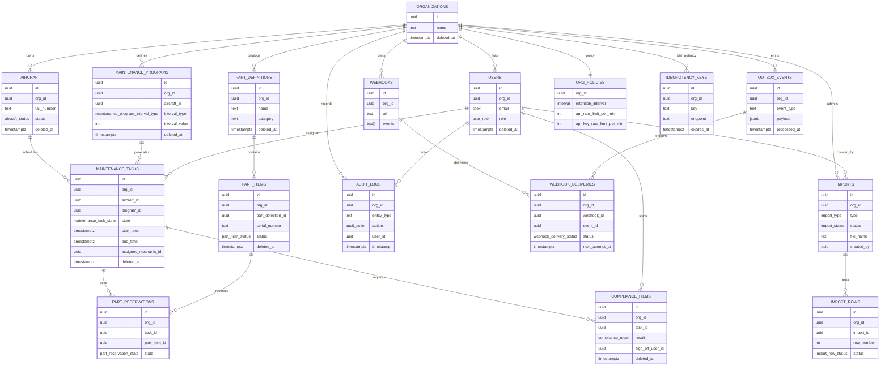

## PlantUML (Data Model)

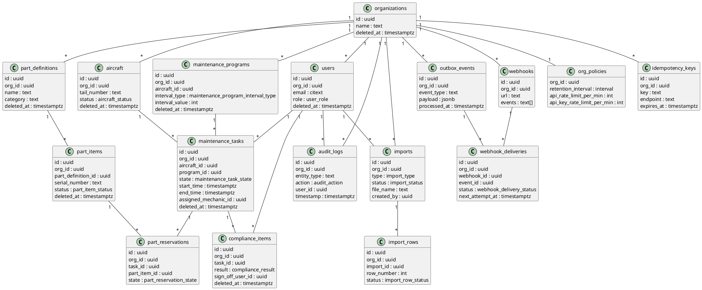

## Mermaid (Error-Path Sequences)

### Auth: invalid or missing token

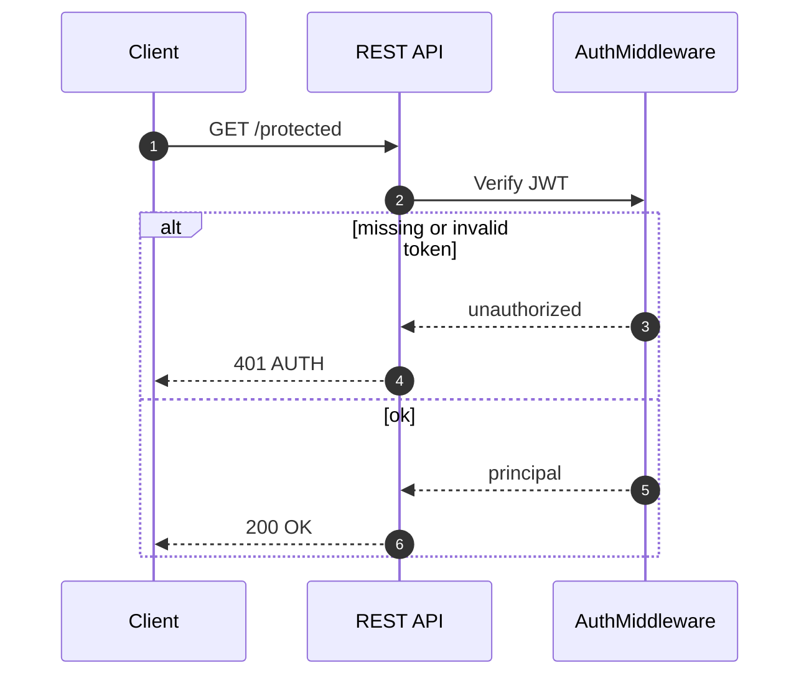

### Idempotency conflict

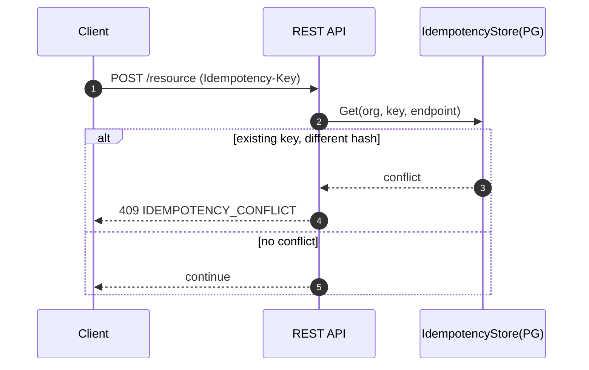

### Rate limit exceeded (org or API key)

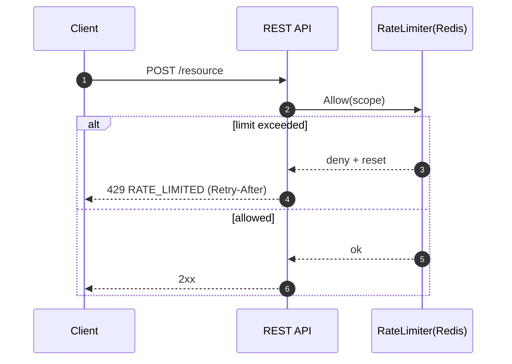

### Webhook delivery failure -> retry/fail

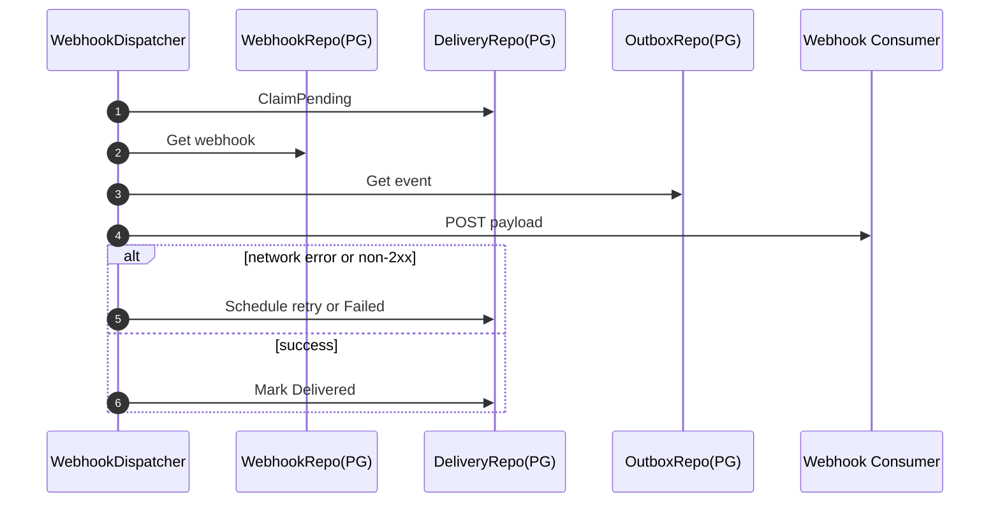

## PlantUML (Error-Path Sequences)

### Auth: invalid or missing token

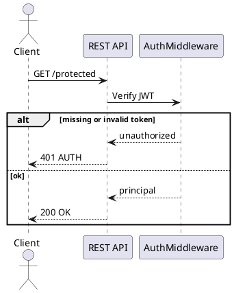

### Idempotency conflict

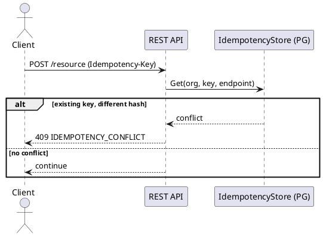

### Rate limit exceeded (org or API key)

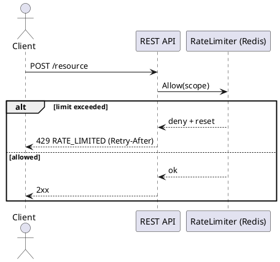

### Webhook delivery failure -> retry/fail

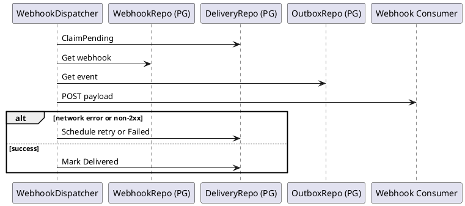

## Mermaid (Sequence Diagrams)

### Auth: login, refresh, logout

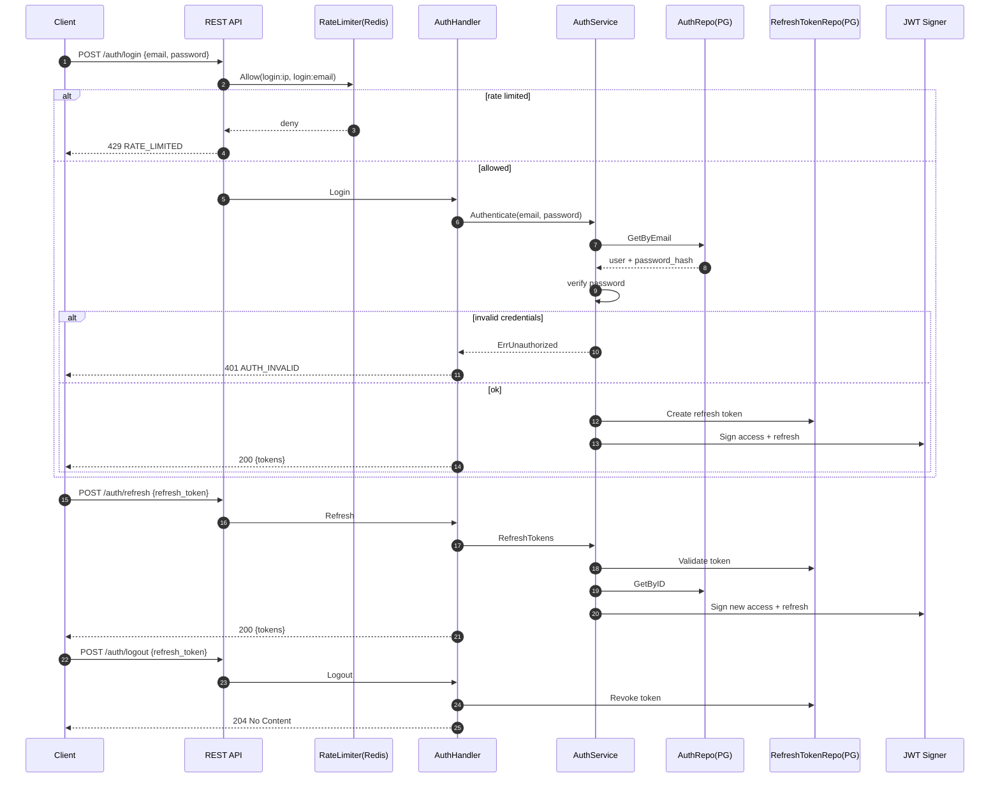

### Create task -> audit -> outbox -> webhook delivery

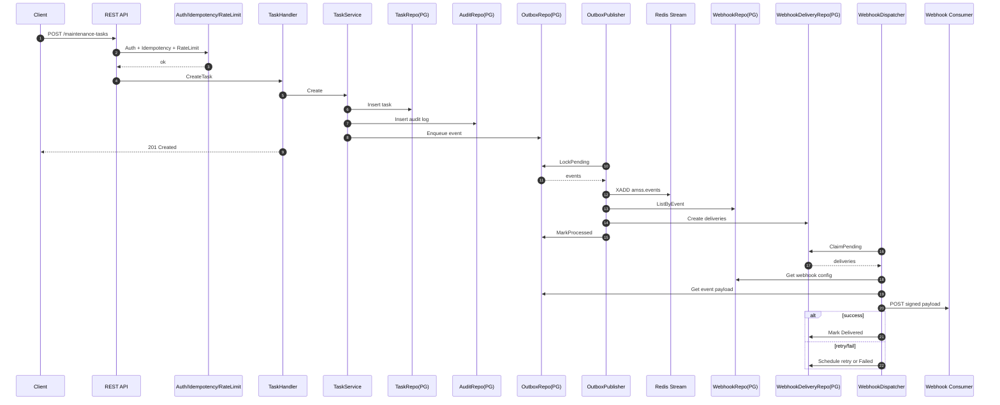

### Import CSV -> validate -> apply -> summary

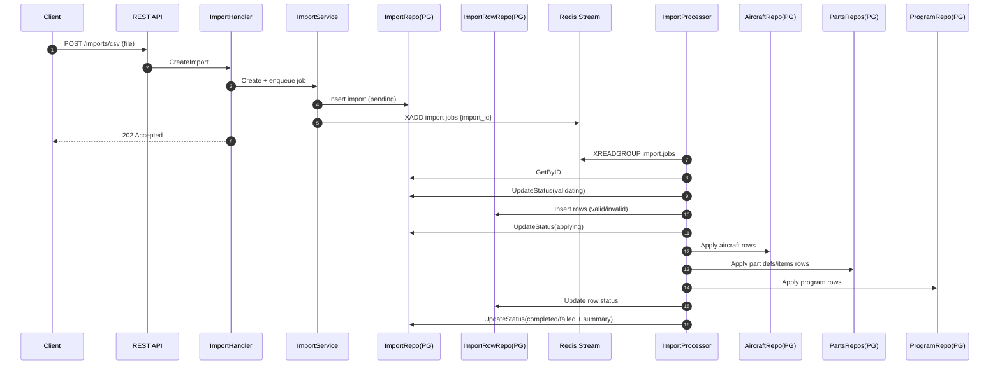

### Program task generation job

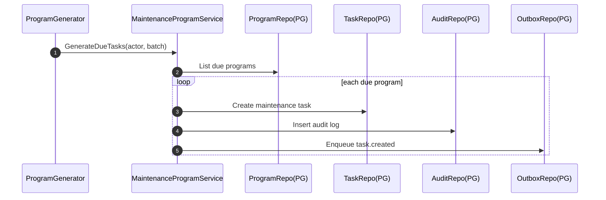

### Middleware: idempotency + rate limit

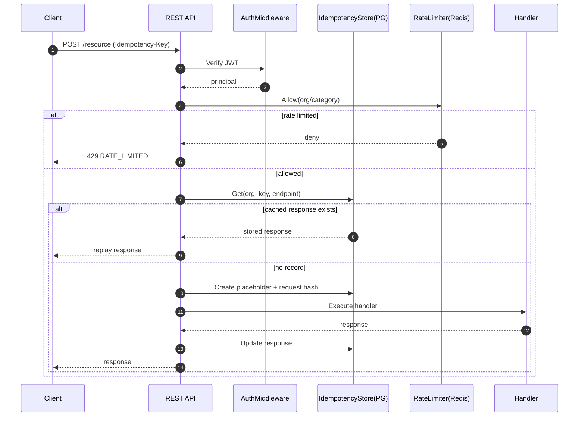

## PlantUML (Sequence Diagrams)

### Auth: login, refresh, logout

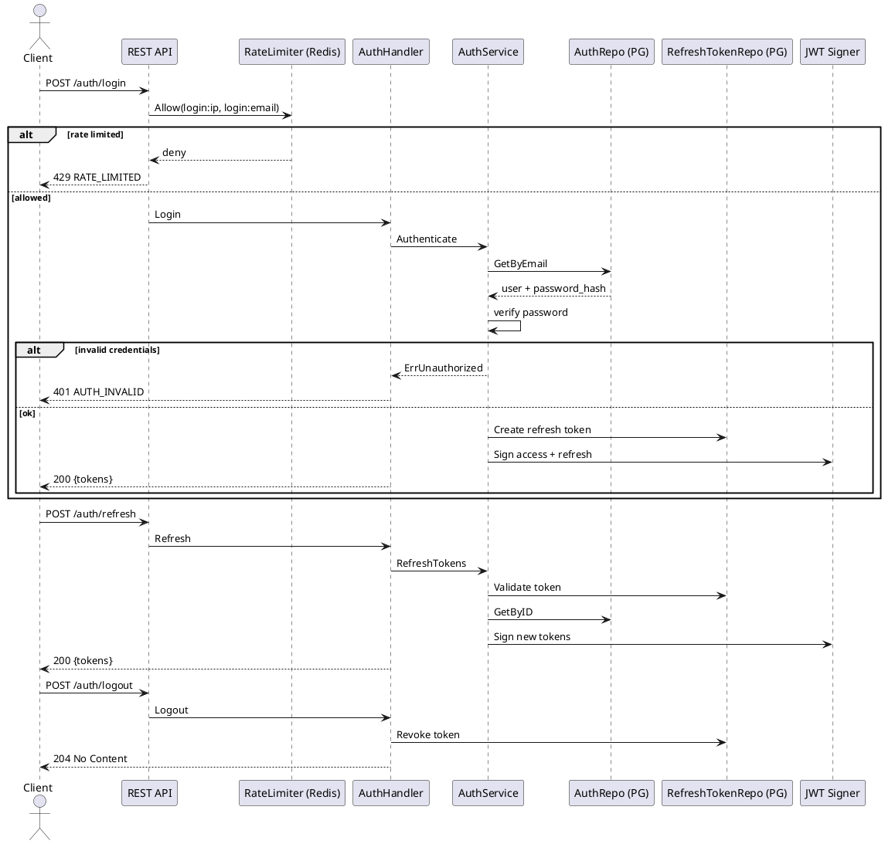

### Create task -> audit -> outbox -> webhook delivery

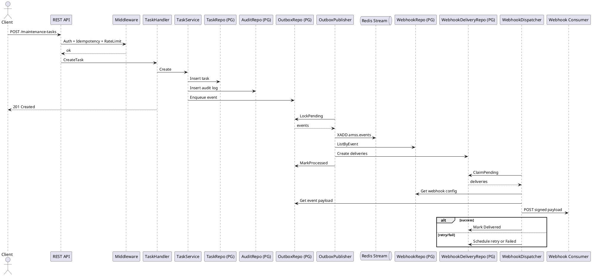

### Import CSV -> validate -> apply -> summary

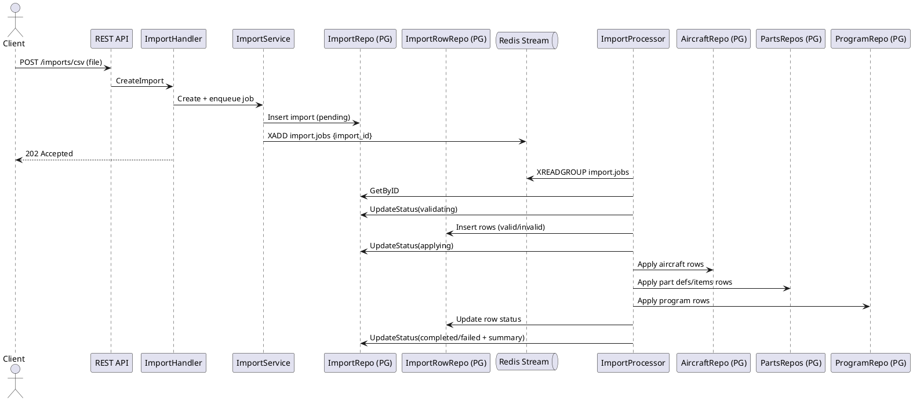

### Program task generation job

```plantuml
@startuml
participant "ProgramGenerator" as Worker
participant "MaintenanceProgramService" as ProgramS
participant "ProgramRepo (PG)" as ProgramR
participant "TaskRepo (PG)" as TaskR
participant "AuditRepo (PG)" as AuditR
participant "OutboxRepo (PG)" as OutboxR

Worker -> ProgramS: GenerateDueTasks(actor, batch)
ProgramS -> ProgramR: List due programs
loop each due program
  ProgramS -> TaskR: Create maintenance task
  ProgramS -> AuditR: Insert audit log
  ProgramS -> OutboxR: Enqueue task.created
end
@enduml
```

### Middleware: idempotency + rate limit

```plantuml
@startuml
actor Client
participant "REST API" as API
participant "AuthMiddleware" as Auth
participant "IdempotencyStore (PG)" as Idem
participant "RateLimiter (Redis)" as RL
participant "Handler" as Handler

Client -> API: POST /resource (Idempotency-Key)
API -> Auth: Verify JWT
Auth --> API: principal
API -> RL: Allow(org/category)
alt rate limited
  RL --> API: deny
  API --> Client: 429 RATE_LIMITED
else allowed
  API -> Idem: Get(org, key, endpoint)
  alt cached response exists
    Idem --> API: stored response
    API --> Client: replay response
  else no record
    API -> Idem: Create placeholder + request hash
    API -> Handler: Execute handler
    Handler --> API: response
    API -> Idem: Update response
    API --> Client: response
  end
end
@enduml
```
